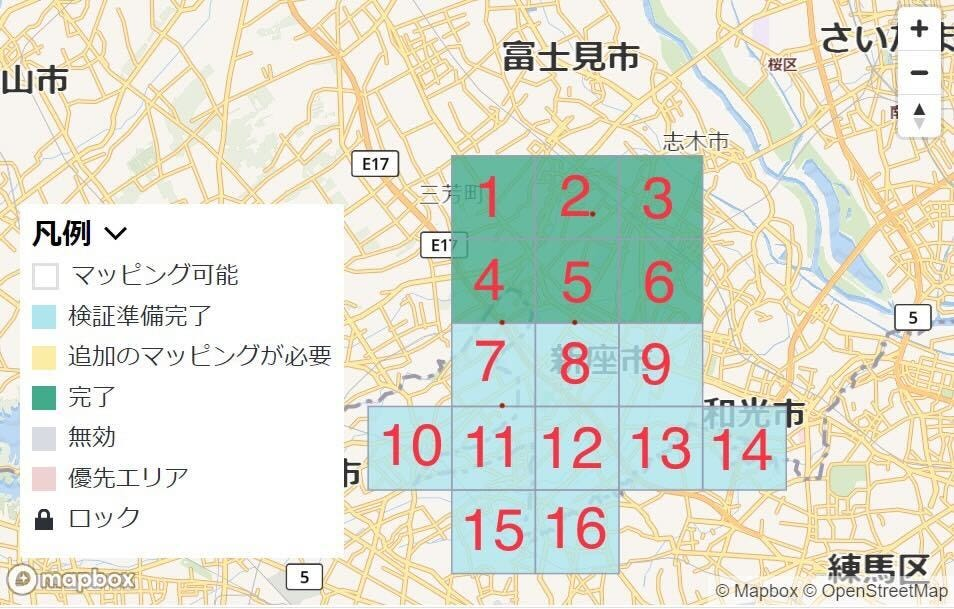
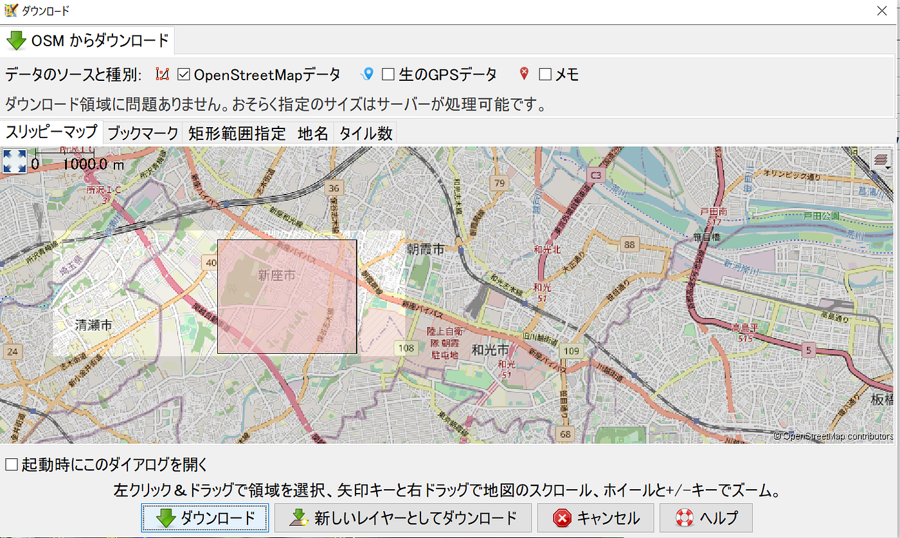
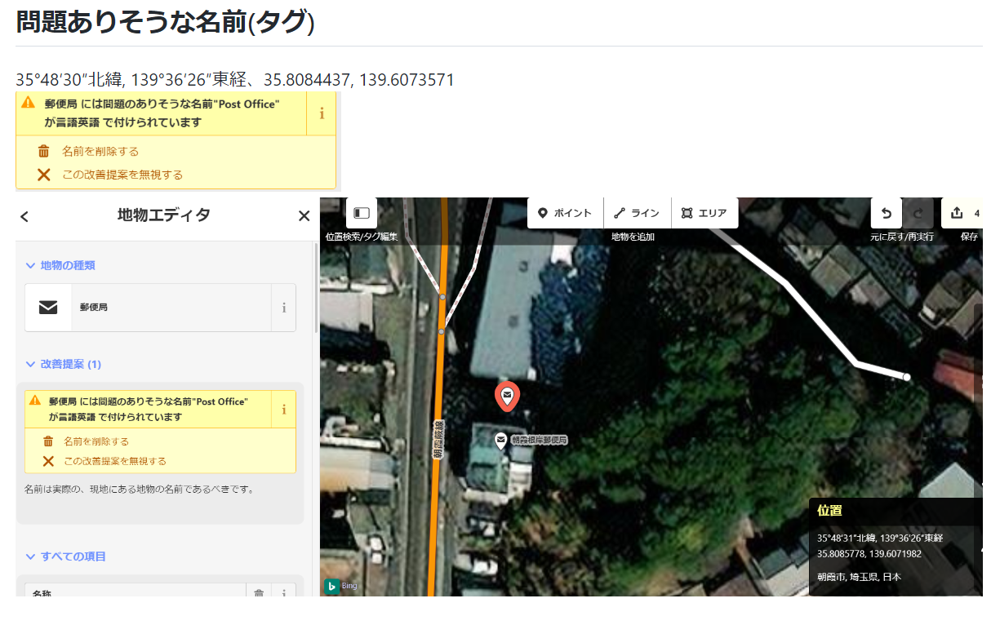
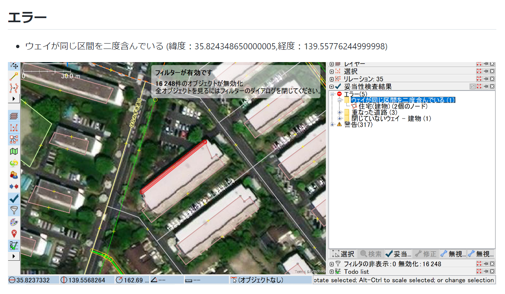

### PLATEAU 建物データをOSMにインポートする際の事前準備

こんにちは！3年の吉田です。

今回は2022年度ゼミ論について書かせていただきます。

> _**テーマ_**

### PLATEAU 建物データをOSMにインポートする際の事前準備

> _**Abstract_**

本研究では、国土交通省主導の日本全国の3D都市モデルの整備・活用・オープンデータ化を目指すプロジェクト[PLATEAU](https://www.mlit.go.jp/plateau/)のLOD1の建物データを誰でも編集可能な地図[OpenStreetMap](https://www.openstreetmap.org/#map=15/35.7449/139.4576) (以下OSM)にインポートする作業の効率化を目的とし、事前準備のマニュアル作成に向けた作業を行った。作業は主に以下の3つである

**1.インポートする際のJava実行環境の調査**

**2.[Tasking Manager**](https://tasks.teachosm.org/projects/1499/tasks/?page=1),**JOSMを用いたOSMの妥当性検証、エラー・警告の修正**

**3.OSMの妥当性検証で表示されたエラー・警告の事例収集**

- 妥当性検証を実施する地域は[JA:MLIT PLATEAU/imports list](https://wiki.openstreetmap.org/wiki/JA:MLIT_PLATEAU/imports_list)を参考とし、**埼玉県新座市**とした。

> _**Introduction_**

2022年10月に行われた[UN/EC Open Source Software for SDG (OSS4SDG) Hakcathon](https://github.com/furuhashilab/README/issues/33#issuecomment-1281762516)にて青山学院大学 地球社会共生学部の[古橋 大地](https://medium.com/@mapconcierge)教授及び[YouthMappersAGU](http://github.com/furuhashilab/youthmappers4agu)が中心となって取り組んだ、[PLATEAU](https://www.mlit.go.jp/plateau/)で公開されている東村山市のLOD1建物データを[OSM](https://www.openstreetmap.org/#map=15/35.7449/139.4576) にインポートする、という作業の内の一つである【妥当性検証】で、表示されたエラー・警告がOSMによる問題なのか、PLATEAUによる問題なのかが判別できないという問題が発生した。我々はこの問題の対処法としてインポート作業の事前準備としてOSMのみの妥当性検証を実施し、修正作業を行うという考えに至った。この一連の作業をマニュアル化・実施することによりインポートする際の妥当性検証で表示されたエラー・警告はPLATEAUのデータによるものであると判別がつき、インポート作業の効率化が見込める。本研究では、マニュアル作成に向けた【OSM妥当性検証時のエラー・警告の事例収集】を[Tasking Manager](https://tasks.teachosm.org/projects/1499/tasks/?page=1)とJOSMを用いて行った。

> _**Method_**

### 1.インポートする際のOS・Java動作環境の調査

インポート時に使用する`citygml-osm`開発者である[林](https://github.com/yuuhayashi)優氏に助言をいただき、OS(Windows)の環境・Javaのバージョンを変えながらpowershellでcitygml-osmを開き、`java -Dfile.encoding=utf-8 -jar citygml-osm-jar-with-dependencies.jar 1st`のコマンドを実行

### 2.[Tasking Manager](https://tasks.teachosm.org/projects/1499/tasks/?page=1)、JOSMを用いたOSMの妥当性検証、エラー・警告の修正

[JA:MLIT PLATEAU/imports list](https://wiki.openstreetmap.org/wiki/JA:MLIT_PLATEAU/imports_list)を参考として妥当性検証を実施する地域は埼玉県新座市とした。

- [Tasking Manager](https://tasks.teachosm.org/projects/1499/tasks/?page=1)では以下の図のように新座市を16分割し、**改善提案機能**を使用して妥当性検証を実施した。筆者の判断で修正できるエラー・警告は修正し、修正が難しい場合は事例収集としてスクリーンショットの撮影・緯度経度の記録を行った。

- JOSMにおける妥当性検証では「ファイル」から「データをダウンロード」を選択し、[Tasking Manager](https://tasks.teachosm.org/projects/1499/tasks/?page=1)で分割したメッシュごとに妥当性検証を行い、エラー・警告の事例収集を行った。

### 3.OSMの妥当性検証で表示されたエラー・警告の事例収集

- [Tasking Manager](https://tasks.teachosm.org/projects/1499/tasks/?page=1)、JOSMでの妥当性検証で筆者では修正不可だったエラー・警告のスクリーンショット・緯度経度を記録。

[JA:JOSM/Validator](https://wiki.openstreetmap.org/wiki/JA:JOSM/Validator)を参考とし、

・「重複したノード」

・「重複したウェイノード」

・「逆転した海岸線」

・「結合されていない海岸線」

・「順序だっていない海岸線」

・「不完全なウェイ」

・「交差しているウェイ」

・「重なり合っている高速道路、ウェイ」

・「同一ウェイ内での交差」

・「類似した名前のウェイ」

・「閉じていないウェイ」

・「タグのつけられていないウェイ」

・「他の高速道路付近のウェイとノード」

・「合致していない外側のウェイの形成」

・「（マルチ）多角形と同様である内側のウェイの形成」

・「Fix.meリクエスト」

やこれらに関するエラー・警告、その他筆者が重要であると判断したエラー・警告のスクリーンショット・緯度経度を記録した。

> _**Results_**

#### 1.インポートする際のJava実行環境の調査

- Java8(LTS)…〇

- Java11(LTS)…〇

- その他のバージョンのJava…×

**`citygml-osm`で利用されている"apache camel v2.25.4"がJava8,Java11にしかサポートされていないため**、Java8,Java11では実行できるが、その他のJavaのバージョンでは動作しないことが分かった。

#### 2.[Tasking Manager](https://tasks.teachosm.org/projects/1499/tasks/?page=1)、JOSMを用いたOSMの妥当性検証、エラー・警告の修正

**Tasking Manager：妥当性検証、エラー・警告の修正完了**

**JOSM：妥当性検証完了**

#### 3.OSMの妥当性検証で表示されたエラー・警告の事例収集

**事例収集完了(スクリーンショット・緯度経度を記録)**

> _**Discussion_**

妥当性検証時の注意点として、**安易に削除しないこと**を肝に銘じること。削除すべきか迷ったら一度保留にして上級者に相当するか、任せるのが良い。

また、妥当性検証処理を行った時の具体的な対処法があいまいであったため、**エラー・警告に対する対処法をフローチャートなどで図化し、やり方の明瞭化も行っていく。**

> _**Conclusion_**

OSMの妥当性検証だけで1メッシュ平均約80個、多いところで100個以上のエラー・警告が出ていることに加え、直角化されていない・本来の位置より大幅にずれてマッピングされている地域も多くあったことからOSM上でのエラー・警告の数はPLATEAU側のエラー・警告数よりも多いと考えられる。

上記のことからPLATEAU建物データをOSMにインポートする作業における事前準備の重要性が理解できるであろう。

> _**今後の流れ_**

**1.収集した事例をリスト化**

**2.先生を中心とした上級者に見てもらい、対処例を収集**

**3.エラー・警告に対するフローチャートを作製**

**4.OSM妥当性検証のマニュアル作成(Qiita,OSM Wikiに投稿)**

> _**発表資料_**

#### スライド

#### GitHubリポジトリ

[GitHub - furuhashilab/2022gsc_WataruYoshida
吉田航の2022年度ゼミ論用レポジトリ 地球社会共生学部 地球社会共生学科 3年A組188番 学籍番号：1A120189 氏名：吉田航 指導教員：古橋 大地教授 ©Furuhashi Laboratory/Wataru Yoshida…github.co](https://github.com/furuhashilab/2022gsc_WataruYoshida)

> _**グラレコ_**

> _**参考文献リスト_**

[古橋ゼミ論2022年度参考文献・参考資料リスト
Templete ID,大分類,中分類,小分類,著者,発行年,最終更新日,タイトル,雑誌名,雑誌号数,該当ページ,出版社,ISBN,URL,URL4archives,閲覧日,MEMO1,MEMO2 論文,査読つき 論文,査読なし 書籍…docs.google.com](https://docs.google.com/spreadsheets/d/1bUDO1UqJTgc-q76QGpKIyrGXEI5ZO3UcGV184AxnVFg/edit?usp=sharing)
