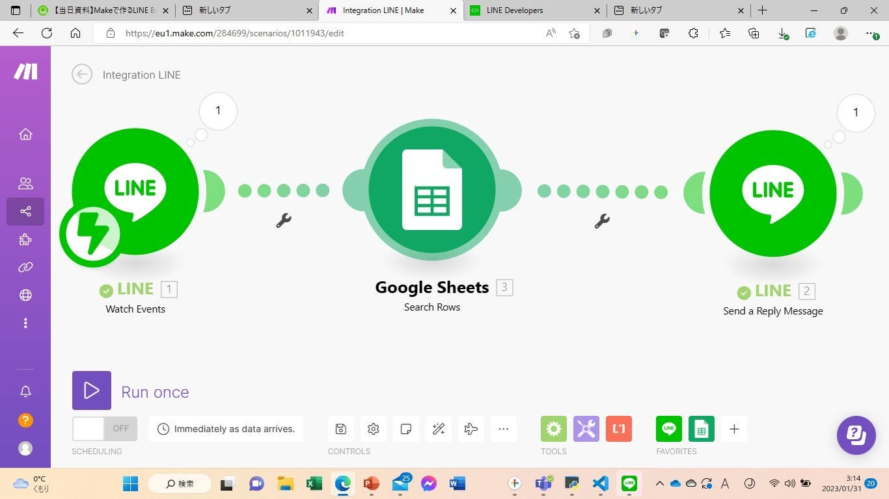
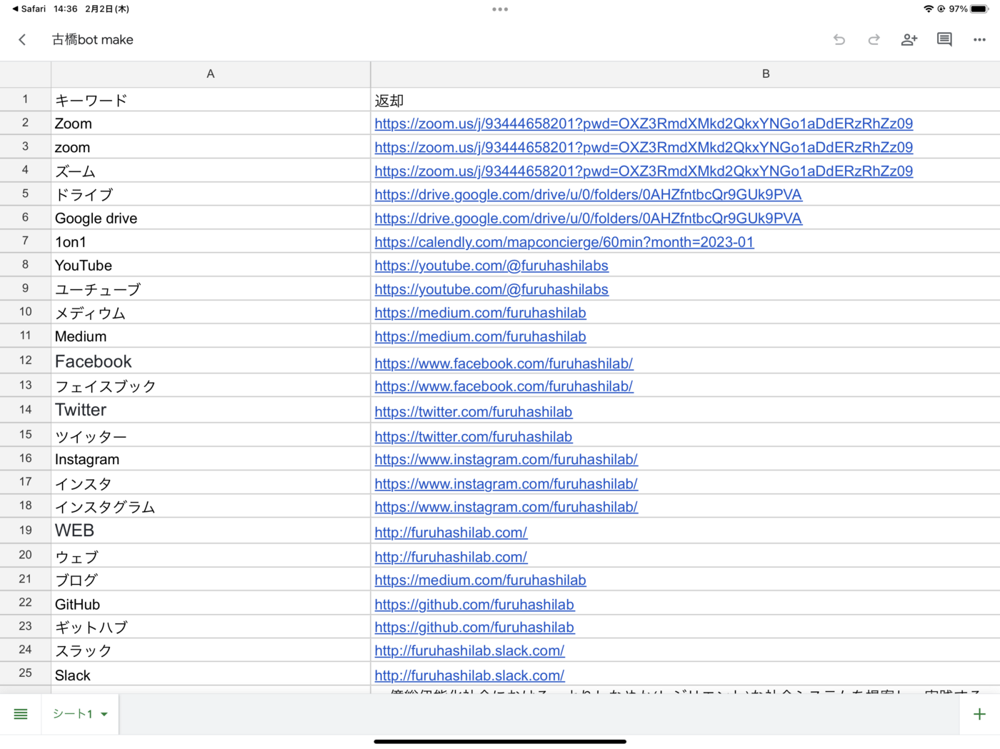
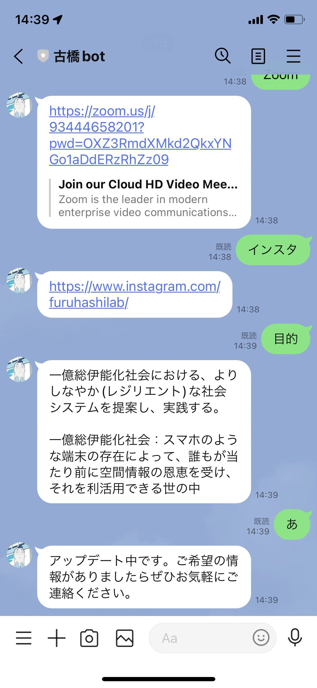
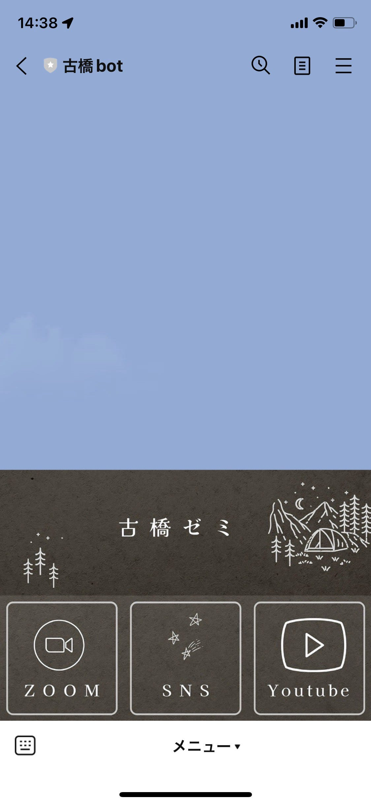
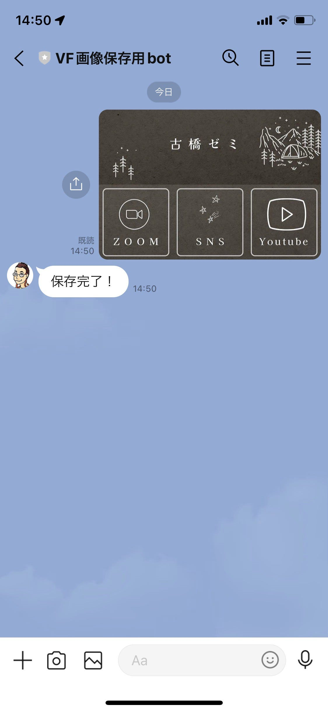
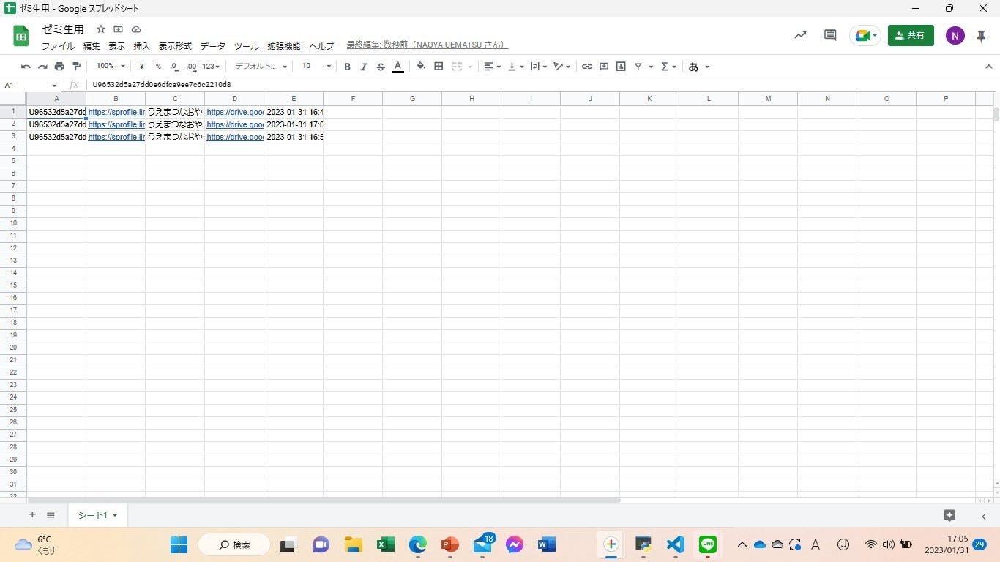
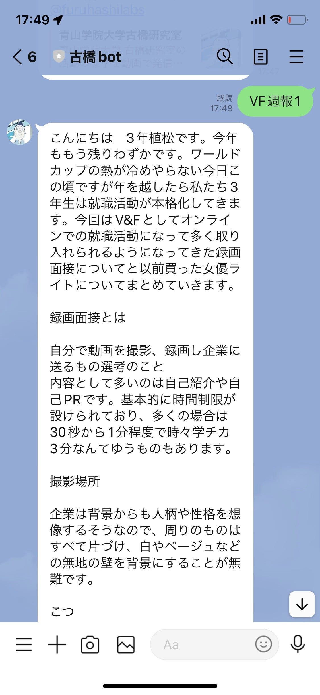
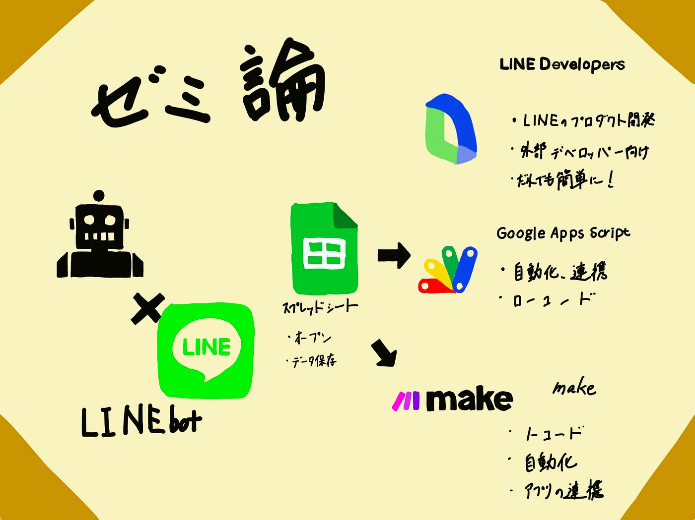

### 古橋ゼミ公式 LINE bot

こんにちは三年植松です。今回は私のゼミ論最終発表についての報告です。

> _Abustract_

本研究は古橋ゼミ公式のLINEbotを作成し、ゼミ生、古橋ゼミに興味を持ってくれれいる人に向けた快適な情報取得サービスの役割を提供することが目的です。

> _Introduction_

今回私が取り組んだのはLINEで使える古橋ゼミ公式bot作りです。LINE botとはLINE上にて自動でユーザーと会話し、ユーザーを助けてくれるプログラムのことです。一般的なメリットとしてコニュニケーションの活性化、ユーザーが気軽に意見を伝えてくれるようになる、ユーザーのニーズがわかりやすくなる、ユーザーが問い合わせをする心理的負担を軽減できる、多数のアクティブユーザーにリーチが可能であるというメリットが挙げられます。またそのようなLINE botを古橋研究室で作る意義としてはゼミ生を始め、ゼミに興味を持ってくれている人が便利になるという点が挙げられます。

> _Method_

今回LINE botを開発するにあたり大きく3つのプログラムを活用しました。

**LINE Developers**

一つ目はLINE Developersです。これはLINEが提供しているさまざまな「プロダクト」を使って開発を行う、外部のデベロッパー向けのポータルサイトです。

**Make**

二つ目はMakeです。Make (formerly Integromat)とは、ノーコードで異なるWebサービスやアプリケーションを連携させ、タスクの自動化の行うツールです。

**Google Apps Script**

三つ目はGoogle Apps Scriptです。これはGoogleが提供する各種サービスの自動化、連携を行うためのローコード開発ツール。

**古橋bot**

今回開発にMakeを使用したのは誰もが編集できるLINE botにしたかったからです。

Google スプレッドシートを仲介して返信するから仕組みで作ったため、スプレッドシートのURLを知っている人なら誰でもLINE botに語彙を追加できるようになっています。

語彙画面

また公式LINE独自のシステムであるリッチメニューも作成しました。

**VF画像保存用bot**

今回はもう一つLINE上で送った画像をGoogleドライブに保存するシステムを持ったLINEbotを作りました。なぜこのbotを作ったのかというと撮った写真をGoogleドライブに保存し、共有する際スマートフォンであるとやりにくいからです。

実際の画面

これはGASを使ってローコード開発しました。

送られた画像はドライブに保存されることに加え、スプレッドシートに記録されます。

> _Results_

古橋bot

VF画像保存用bot

> _Discussion_

二つのbotの機能を一つのbotにまとめなかったのはLINE Developersで設定できるwebhookURLが一つだけだったからです。この課題を解決するためにはより高度なプログラミング技術が必要になります。

**新規性**

新規性という観点ではスプレッドシート経由にしたことにより、誰でもアクセスできるため新しいデータ保存の形になるのではないかと考えています。

> _Conclusion_

このLINE bot開発を通して私自身ノーコード、ローコードを使用した開発ノウハウ、ノーコードプログラムに関する興味、可能性、最低限のプログラミング知識の三点を学ことができました。また今後の展望としては今後の展望

- 語彙を増やす

- 文字判定の強化

- 機能の追加（動画の保存、応募書類などを扱えるようにする）

- 2つのbot機能を合わせ持ったようなbot開発

の四点を考えています。

グラレコ

