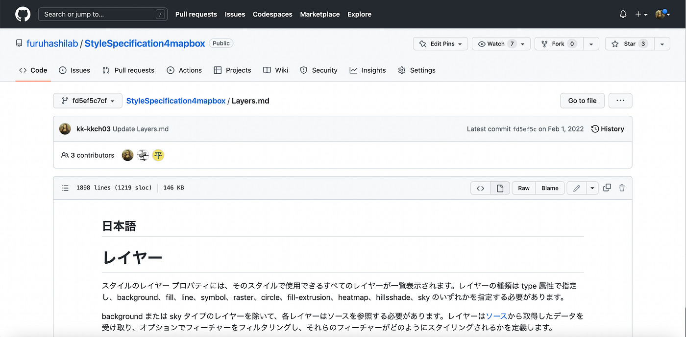
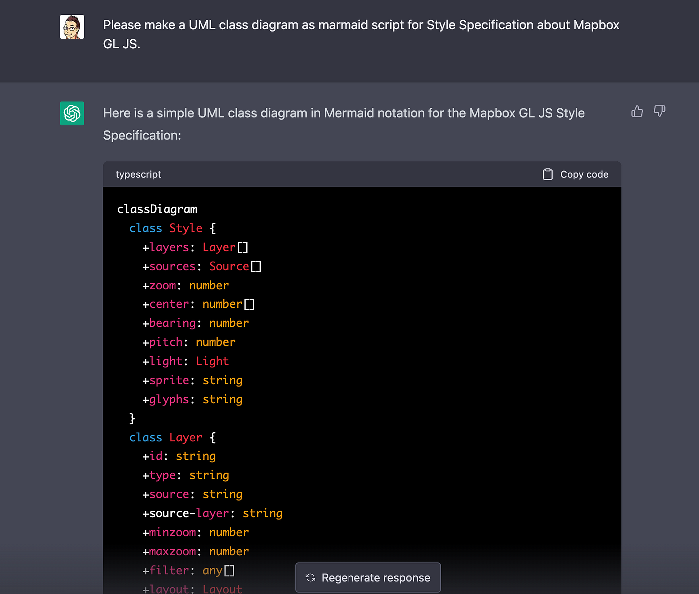
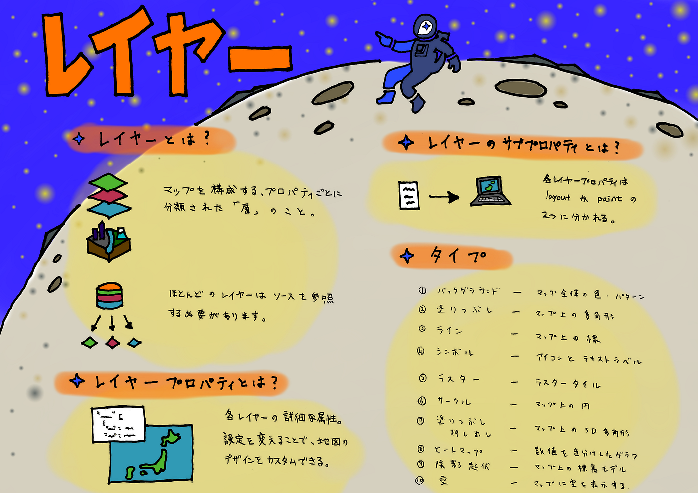
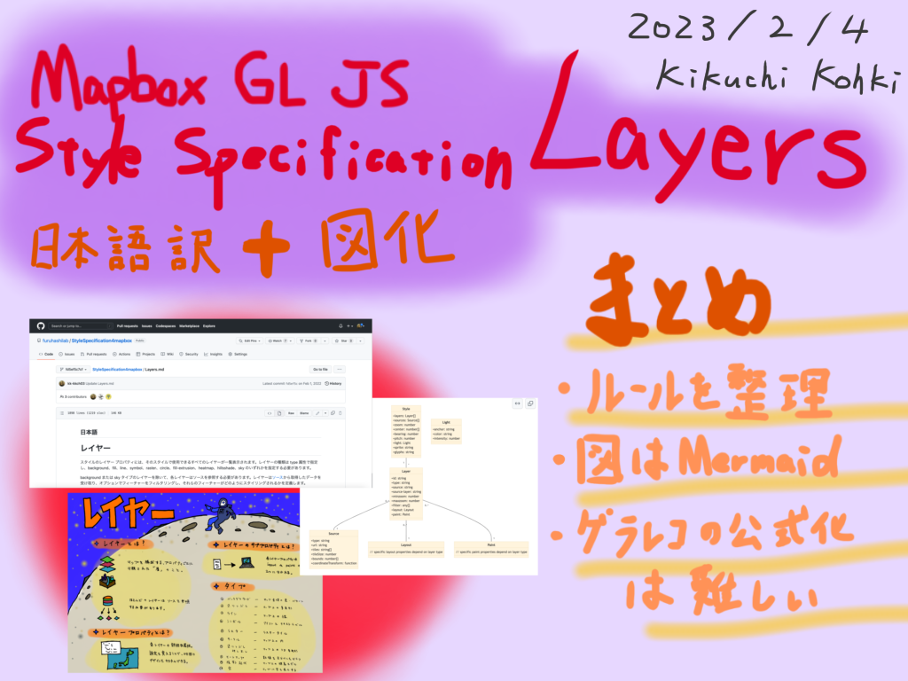

### 完成！「Mapbox GL JS Style Specification Layers」日本語版

こんにちは！

4年の菊池です。

昨年から取り組んでいた「Mapbox GL JS Style Specification Layers」の日本語訳ですが、ついに完成しました。

これからその翻訳ルールと図化について書いていきたいと思います。

### 翻訳ルール

翻訳する上でのルールを定めたので紹介します。

① Google翻訳を使用（不備があれば修正する）

② 原文と同様にリンクも貼る

③ 開発時に使用するワードは原文のまま、バッククォートをつける

④ 翻訳できないワードがあった場合は以下の通り

- 固有名詞は原文のまま

- 普通名詞はカタカナ表記

### UML図について

今回利用したのはChatGPT。

AIが勝手に図化してくれました！

### グラレコについて

古橋ゼミではお馴染みですが、リポジトリを一気に華やかにしてくれるグラレコも今回取り入れました。

### まとめ

「Mapbox GL JS Style Specification」はまだ他項目が残っているので早急な翻訳が必要です。しかし今回で翻訳ルールを整理することができたので、スムーズに作業に入れると思います。

グラレコは視覚的に非常に良いですが、公式のドキュメントのページに入れ込むことは難しそうですね。

今回の研究が、日本の地図開発をより活発にする一助になっていれば幸いです。

Githubリポジトリ

[https://github.com/furuhashilab/2022gsc_Kohki_Kikuchi](https://github.com/furuhashilab/2022gsc_Kohki_Kikuchi)

グラレコ

