### 飾っても良し、塗っても良し。地図記号ガチャ？

こんにちは！

うららです。今回は古橋研究室2023年度卒論の報告をさせていただきます。

### タイトル「ワークショップ用ジオガチャ開発」

### Abstract

本論文は、ワークショップ用にジオガチャ開発を行い、それを提案するものである。昨年2021年度には子供向けのワークショップ用ジオガチャ開発を行ったが、今年度は新たに年齢層を設定せず制作することとする。ジオガチャの「ジオ（geo）」は、複合語の形で用い、地球、土地、土壌、地理、の意を表す単語である（小学館・プログレッシブ英和中辞典）。「ガチャ」はカプセルトイの商標であり、カプセル自動販売機によるミニ玩具を指す場合に使用される。「ジオガチャ」については現在まで先行研究がないため正しい定義が存在していない。本論文では、土地の名産・名所など限定されたテーマにちなんだカプセル自動販売機によるミニ玩具のことを「ジオガチャ」と定義する。

### Introduction

カプセルトイは販売機本体のコイン投入部に硬貨を投入し、レバーを回転させることでカプセルに入った商品を取り出すことが可能である。カプセル自体は半分透明で内容物が見えるものが多いが、中に何が入っているかわからないものもある。使用する硬貨の種類や枚数、カプセル本体のサイズには販売機により種類があるが、本論文では指導教員の古橋先生が所持する48mmのカプセルに限定して開発することとする。

#### Methods

#### 地図記号ガチャ

古橋ゼミならではの、地図に関連するグッズを作成しようと考えたとき思いついたのは「地図記号」である。 地図記号といえば小学生や高校生のときに授業で学んだのが最後に思えるが、古橋ゼミ生ならば今でも身近に感じる人が多いのではないだろうか。

制作過程

１.先行研究（先行開発？）として、地図記号を使用したグッズを調査。

２.モデリングに使用したのは３D 制作アプリBlenderである。

３.3Ⅾプリンターで印刷、使用したものは自宅にあるプリンター「FlashForge」

４.カプセルトイ本体に挿し込むポップ（広告）を作成。使用したアプリは「PowerPoint」。

### １.先行研究（先行開発？）として、地図記号を使用したグッズを調査。

・1948年に創業した、日本を代表する地図情報会社ゼンリンが地図という身近で便利な「道具」を 「柄・デザイン」として捉え、地図の新しい可能性を追求するゼンリンの新たな取り組みとして誕生した「マップデザイン」※１の商品が出ていた。 ※１ [https://www.mapdesigngallery.com/pages/about-map-design](https://www.mapdesigngallery.com/pages/about-map-design)

・ガチャガチャでは、ブシロードが「TAMA-KYU 地図記号キーホルダー」（[https://gacha.o0o0.jp/gp/archives/4577](https://gacha.o0o0.jp/gp/archives/4577) ) を作成していた。

発売は2022年1月で、金額は300円。

こちらの商品のラインナップは ＜１＞果樹園 ＜２＞田 ＜３＞畑 ＜４＞広葉樹林 ＜５＞針葉樹林 ＜６＞ヤシ科樹林 ＜７＞温泉 ＜８＞病院 ＜９＞郵便局 ＜10＞高等学校 ＜11＞博物館 ＜12＞工場 である。 これらはアクリルキーホルダーで記号の辺と辺が繋がっていなくても表現できる。

３Dプリンターで作成するには辺と辺が離れていると表現が困難であることから、本研究で制作するフィギュアでは一筆書きのように繋げる方法が合っていると推測する。

### ２.モデリング

地図記号のうち、＜１＞図書館 ＜２＞裁判所 ＜３＞工場 ＜４＞郵便局 ＜５＞博物館 ＜６＞温泉 ＜７＞重要港 ＜８＞地方港）を採用。

図書館

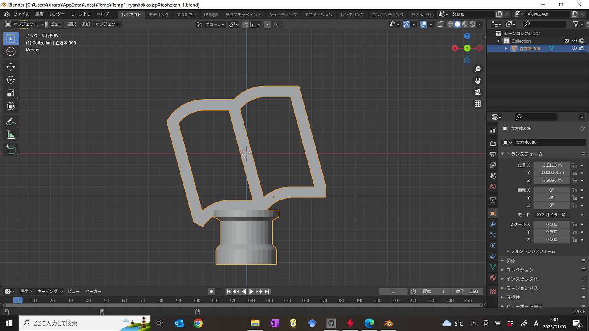

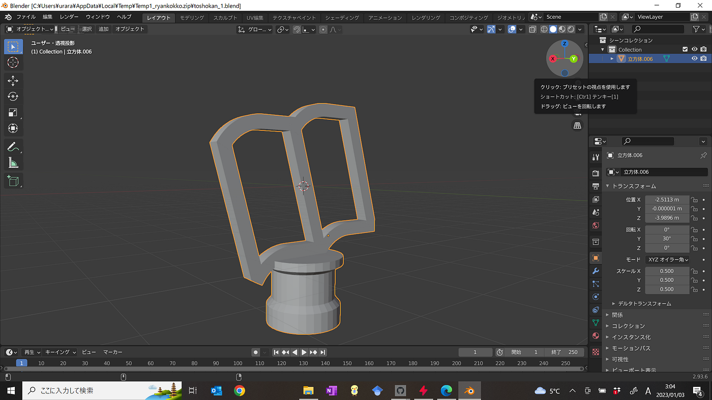

裁判所

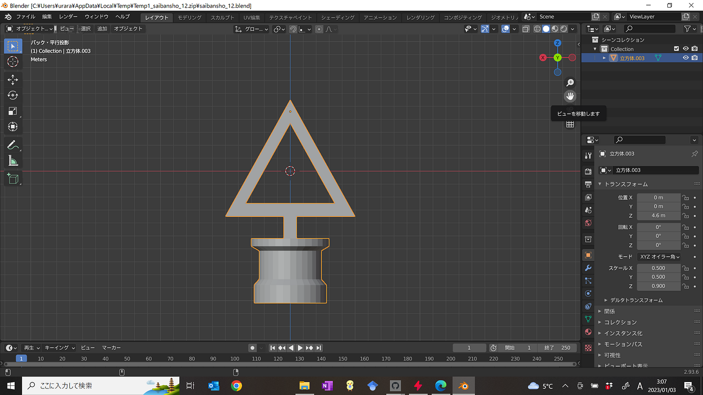

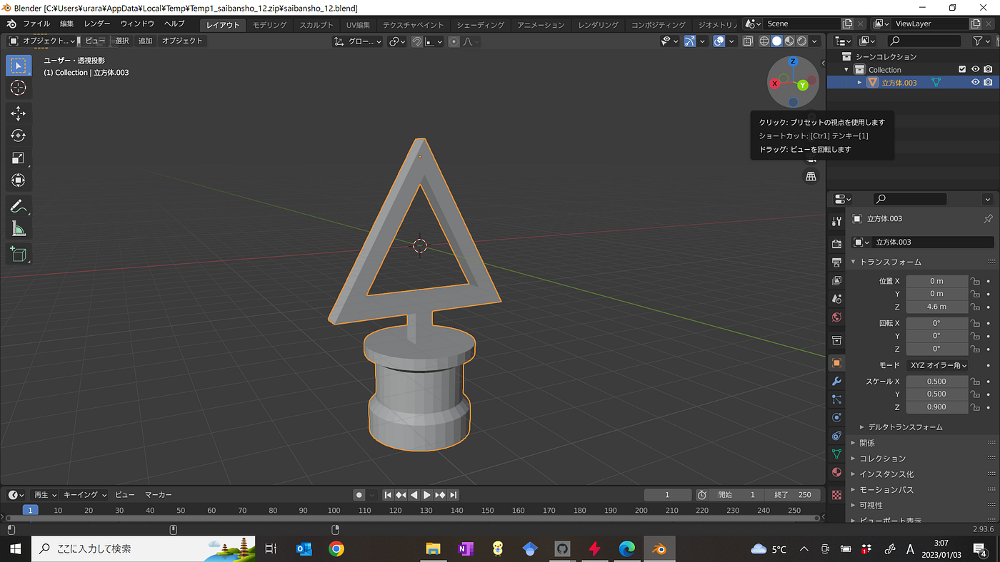

工場

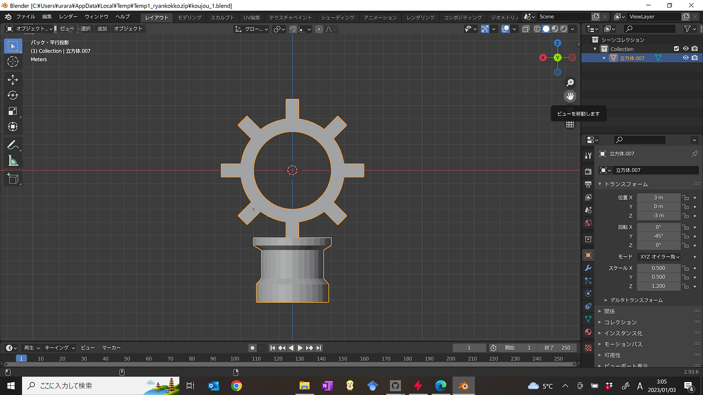

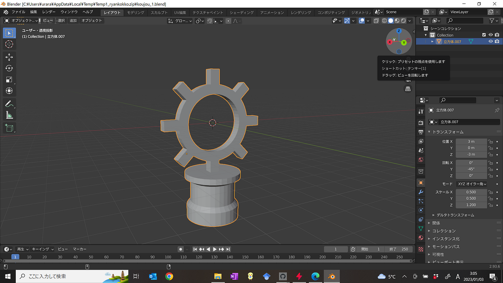

郵便局

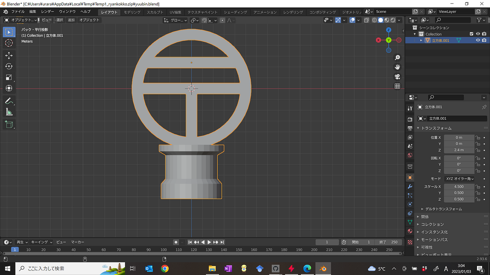

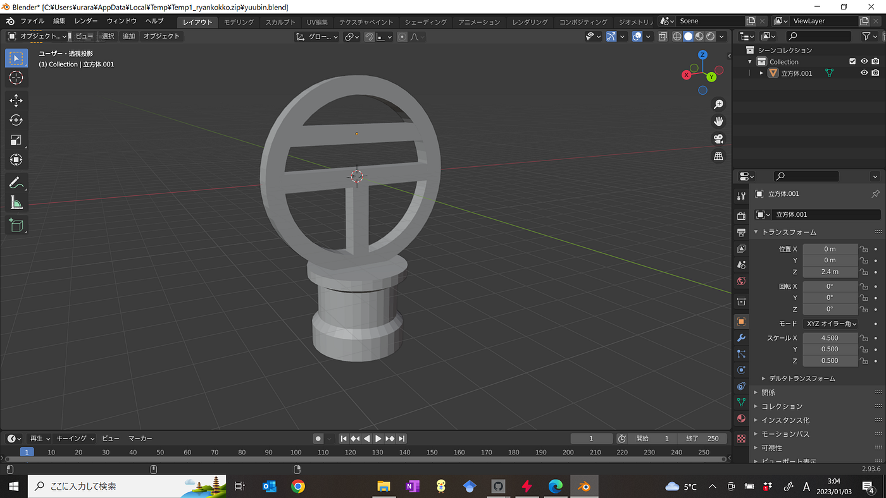

博物館

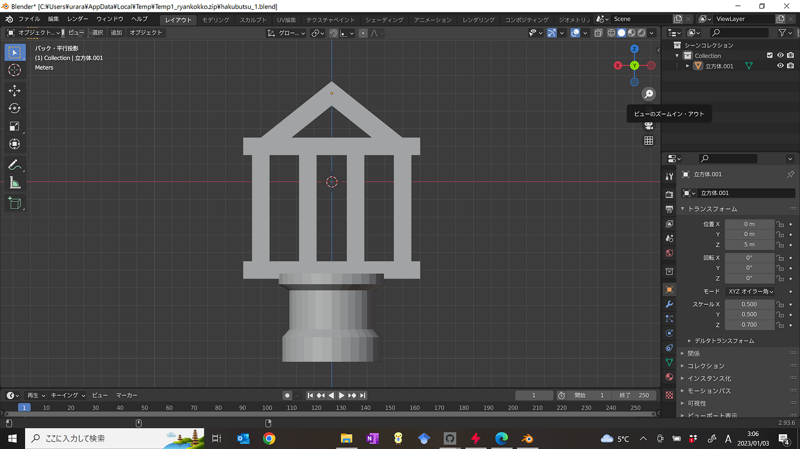

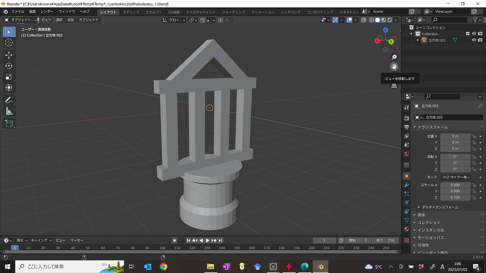

温泉

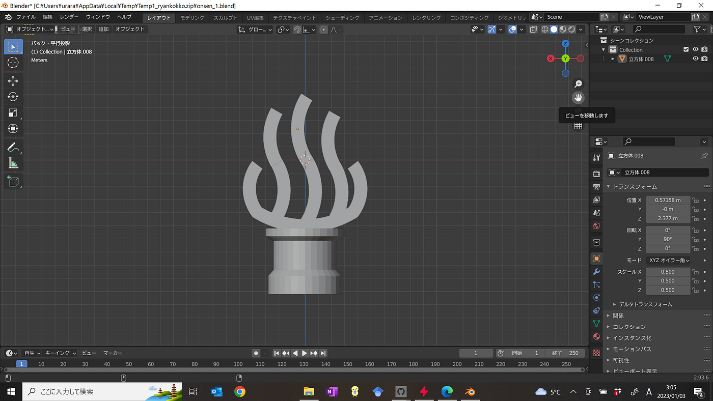

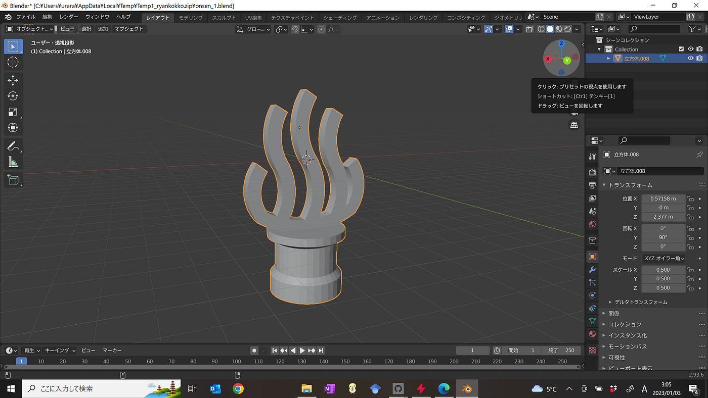

重要港

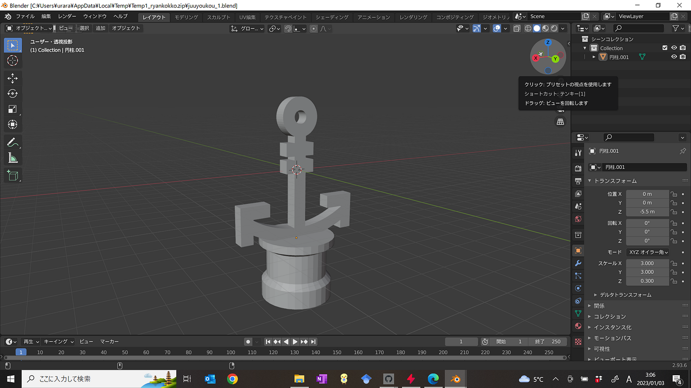

地方港

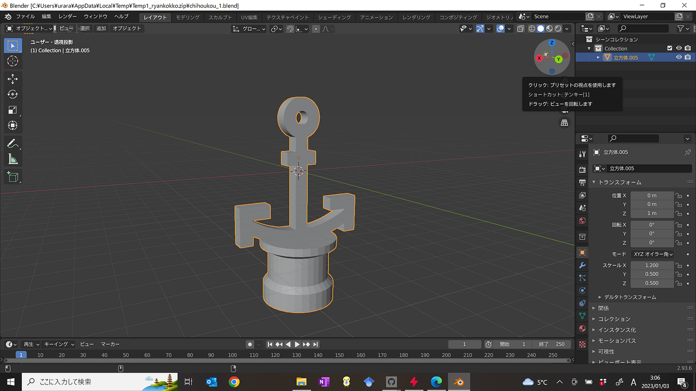

### ３.3Ⅾプリンターで印刷.

使用したものは自宅にあるプリンター「Flash Forge」（研究室にあるものと同じ）

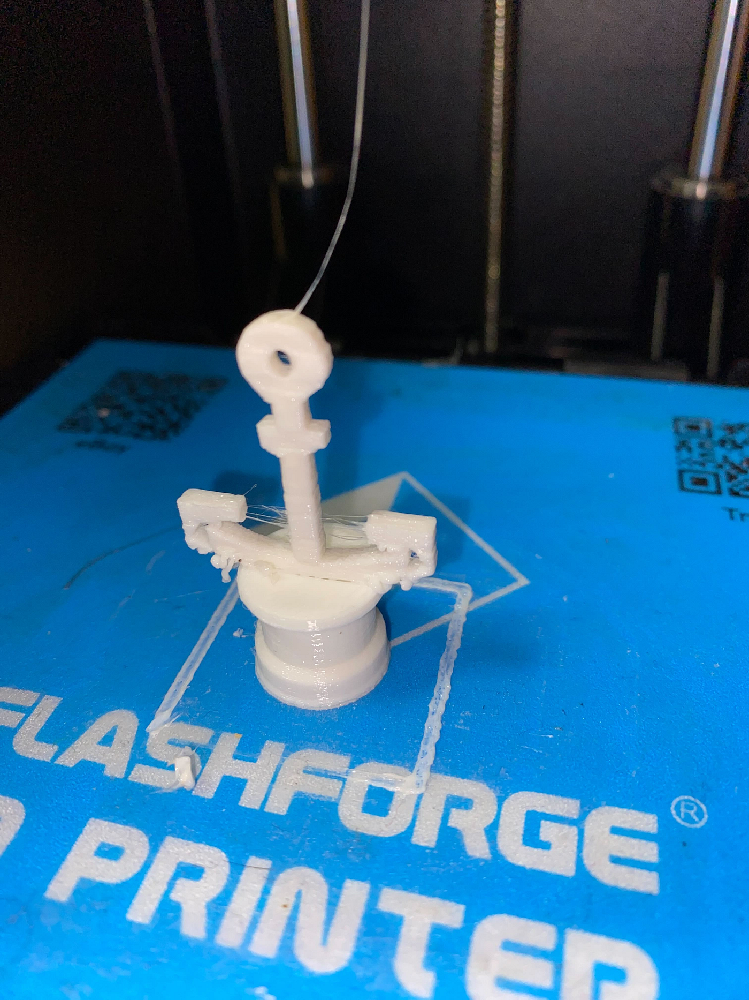

印刷したが、綺麗に印刷できないものが。

そのため印刷の今回のガチャガチャに最終的に採用したものはこれらの地図記号である。 ＜１＞図書館 ＜２＞郵便局 ＜３＞博物館 ＜４＞温泉 ＜５＞裁判所

### ４.カプセルトイ本体に挿し込むポップ（広告）を作成。

加工に使用したのは「PowerPoint」である。

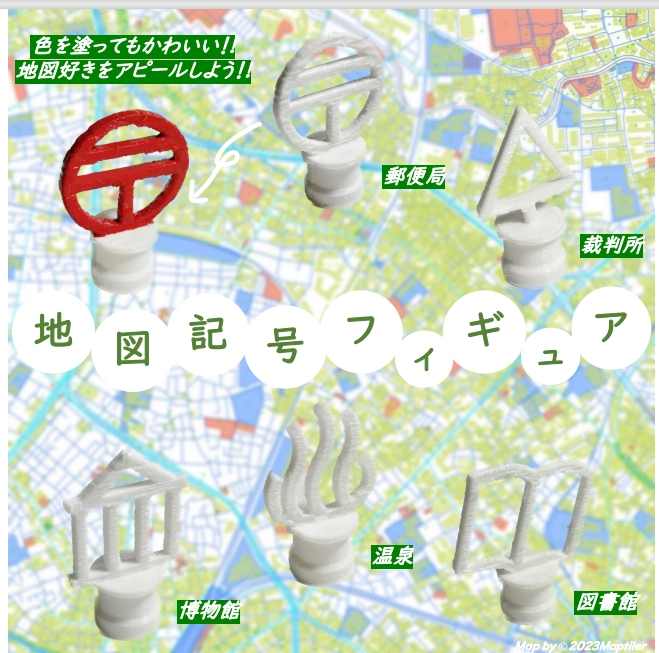

### Results

背景に実際のサイズより撮影用に大きく印刷した地図記号を背景透過し載せる。

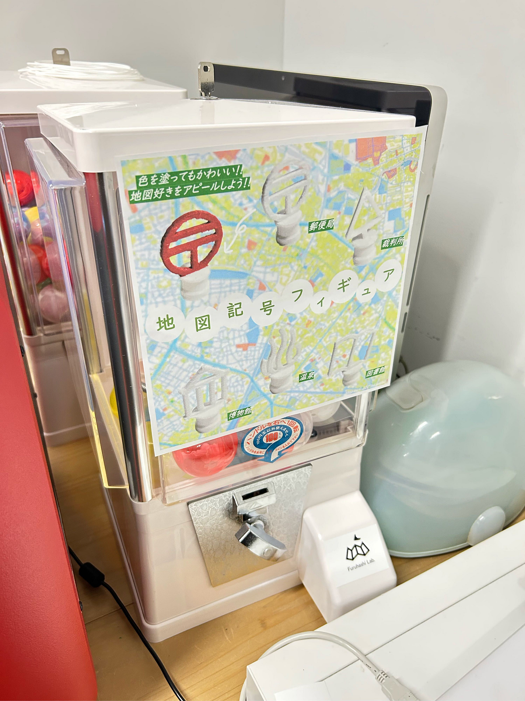

### Discussion

３Dデータを作成する際、いかに大量生産が可能かが重要であった。一つのフィギュアを作成するのにかかった時間は32分ほど。

昨年度ゼミ論のドローンガチャでは印刷時間に加え、部品と部品を接着する手間と時間、接着剤が乾くまでにかかる時間がかかっていた。そのため、今回は自分たちで制作する際の最小限の手間と時間を考えた。

### Conclusion

ライセンスを意識しつつ、どのようなジャンルのワークショップなのか事前に知り制作時間を設けることが必要である。

オープンキャンパスなどで配布する場合は事前に学生生活課に提案と許可を取りに行くのが必須である。

参考文献・参考資料リスト

[https://docs.google.com/spreadsheets/d/1eERcJoA46zhxX6ZHBOXZkkfA8NIYnEtLiJvolGrFSmw/edit?usp=sharing](https://docs.google.com/spreadsheets/d/1eERcJoA46zhxX6ZHBOXZkkfA8NIYnEtLiJvolGrFSmw/edit?usp=sharing)

プロジェクト管理

[https://github.com/orgs/furuhashilab/projects/8](https://github.com/orgs/furuhashilab/projects/8)

スライド

[https://docs.google.com/presentation/d/19KQvd-jfdzQYt_Pn8UP680FkSNh6yOUi60trc15fnWc/edit?usp=sharing](https://docs.google.com/presentation/d/19KQvd-jfdzQYt_Pn8UP680FkSNh6yOUi60trc15fnWc/edit?usp=sharing)
