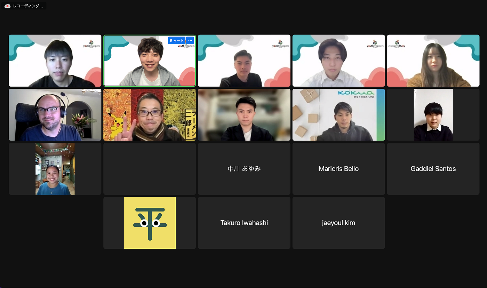
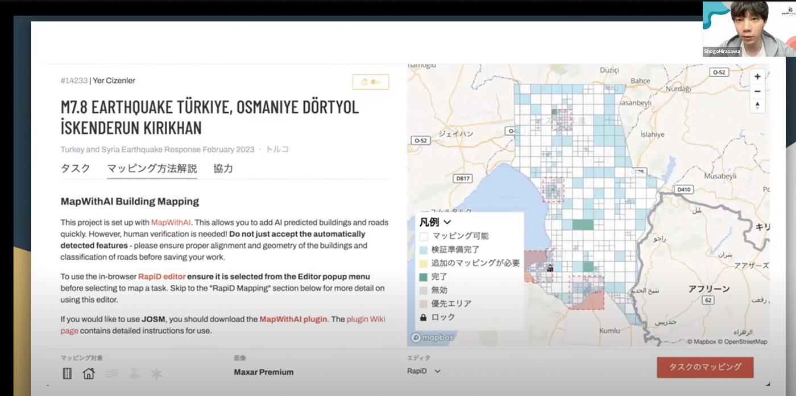
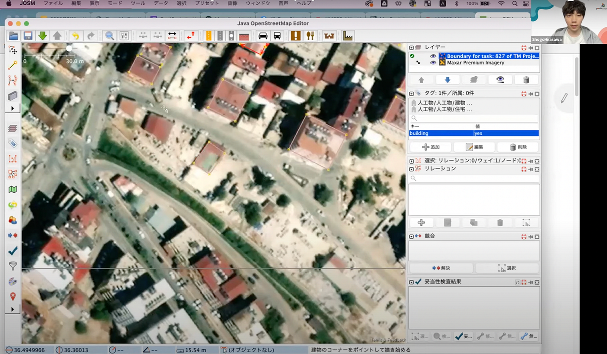
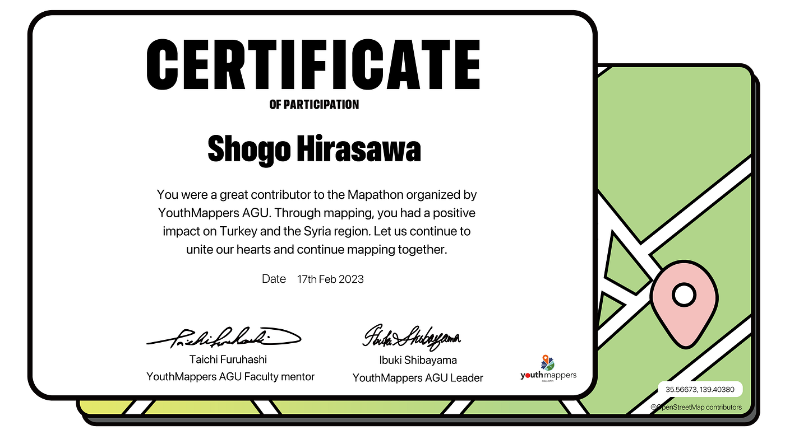

### YouthMappers AGU, Japan held Mapathon in support of Turkey and Syria

YouthMappers AGU, the Japanese branch of YouthMappers, held a mapathon on February 17, 2023 from 19:00–21:00 JST.

Mappers from Japan, the Philippines, Australia, and other Asian, Oceania, and US countries and regions gathered for a very successful Mapathon. The following projects were mapped during this Mapathon.

[HOT Tasking Manager
Tasking Manager is a the tool for coordination of volunteers and organization of groups to map on OpenStreetMap.tasks.hotosm.org](https://tasks.hotosm.org/projects/14233/tasks?fbclid=IwAR3_SdHcsro6wXTFqqpuWrfE-JaanS-Pdv7Mn6olPZSUvlOX0ksxpXZu-nk)

We had a wide range of mappers at this Mapathon, from beginners to advanced, and we used Zoom’s breakout room to set up an area for beginners, and gave a lecture on how to create an account and do some rudimentary mapping. It was a very meaningful mapping event, with participants teaching each other rather than the host giving a one-way lecture.

The Intermediate and Advanced Zoom rooms have been used primarily for mapping activities by JOSM.

Many participants asked for JOSM lectures, confirming the high demand for JOSM through this Mappathon. We would like to organize lectures on JOSM under the auspices of the YouthMappers AGU. If there are any interested groups or mappers, please contact us!

We were able to successfully complete the 2-hour Mapathon and participants received certificates.

I would like to thank all the participants and the members of YouthMappers AGU for their cooperation. And I am proud to have supported Turkey and Syria through the Mapathon.

Let’s continue mapping with one heart and one mind.

**Contact:**
Facebook [https://www.facebook.com/ShogoHirasawaa/](https://www.facebook.com/ShogoHirasawaa/)
Twitter [https://twitter.com/home](https://twitter.com/home)
