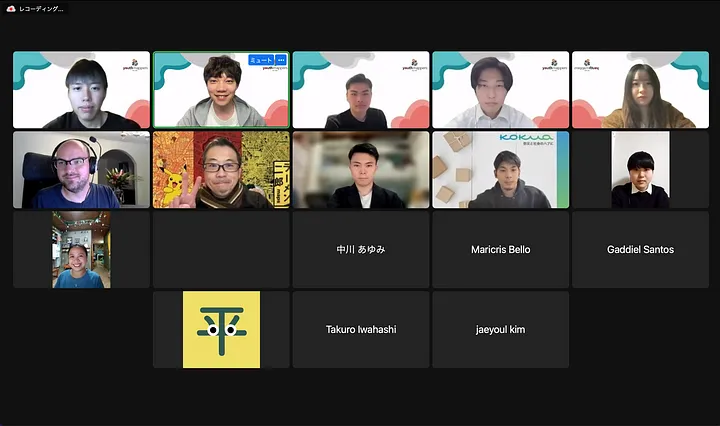
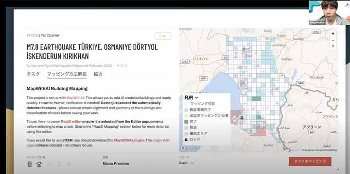
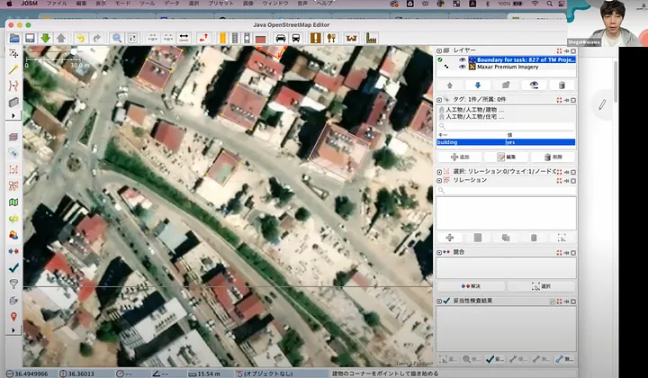
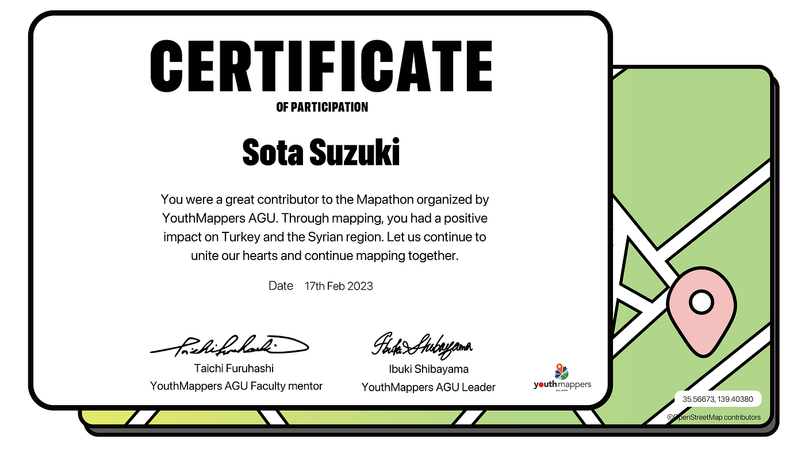

### 日本のYouthMappersAGUが トルコ・シリア支援の マッパソンを開催しました

YouthMappersの日本支部であるYouthMappersAGUは2023年2月17日の19:00–21:00 JSTにマッパソンを主催しました。

日本やフィリピン、オーストラリアといった、アジア、オセアニア、アメリカ地域などから多くのマッパーが集まり、大盛況のマッパソンとなりました。今回のマッパソンでは、以下のプロジェクトをマッピングしました。

[HOT Tasking Manager
Tasking Manager is a the tool for coordination of volunteers and organization of groups to map on OpenStreetMap.tasks.hotosm.org](https://tasks.hotosm.org/projects/14233/tasks?username=caucasus1327&osm_oauth_token=BTpIu1HO-8dGtgD6andK8GpmZl6rc6sOZJaTfMt6ksg&session_token=MTE4MzA2ODA.Y_YE-g.rh9zTNaxGVQM9A-sSTifG9nVroM&picture=https%3A%2F%2Fwww.openstreetmap.org%2Frails%2Factive_storage%2Frepresentations%2Fredirect%2FeyJfcmFpbHMiOnsibWVzc2FnZSI6IkJBaHBBMlppQmc9PSIsImV4cCI6bnVsbCwicHVyIjoiYmxvYl9pZCJ9fQ%3D%3D--e3d4449f04ae35a8258c0c8501a01c514a1f8fe3%2FeyJfcmFpbHMiOnsibWVzc2FnZSI6IkJBaDdCem9MWm05eWJXRjBTU0lJYW5CbkJqb0dSVlE2RkhKbGMybDZaVjkwYjE5c2FXMXBkRnNIYVdscGFRPT0iLCJleHAiOm51bGwsInB1ciI6InZhcmlhdGlvbiJ9fQ%3D%3D--1d22b8d446683a272d1a9ff04340453ca7c374b4%2Fasuka.jpg&redirect_to=%2Fprojects%2F14233%2Ftasks)

今回のマッパソンでは、初心者から上級者まで幅広い層のマッパーが集まりましたが、Zoomのブレイクアウトルームを利用して初心者向けのエリアを設け、アカウントの作り方や初歩的なマッピングのやり方などをレクチャーしました。主催者が一方的にレクチャーするのではなく、参加者がお互いに教え合うという、とても有意義なマッピングイベントとなりました。

中級・上級者向けのブレイクアウトルームでは主にJOSMを利用したマッピングの活動を行いました。

参加者の多くからJOSMの使い方について講義を希望する声が多く、今回のマッパソンを通じてJOSMに対するニーズの高さを確認することができました。そこで、我々YouthMappers AGUが主催で、JOSMに関するレクチャーをいずれ開催したいと考えています。講義に関して興味を持っていただいている団体、マッパーの方々がいらっしゃいましたら、ぜひご連絡ください。

最後になりますが、2時間のマッパソンを無事終了することができ、 ご参加くださった皆様には認定証をお渡しすることができました。

参加者の皆さん、YouthMappers AGUのメンバーの皆さんのご協力に感謝いたします。そして、このマッパソンを通じて、トルコとシリアを支援できたことを誇りに思います。

これからも心を一つにして、マッピングを続けていきましょう。

YouthMappersAGU

[Log in or sign up to view
See posts, photos and more on Facebook.www.facebook.com](https://www.facebook.com/ShogoHirasawaa/)
