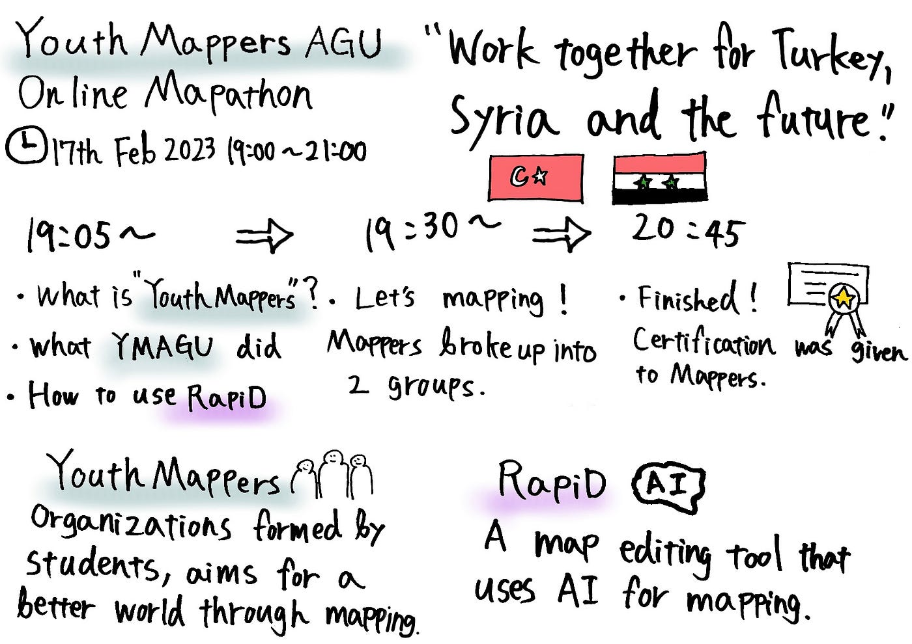

### REPORT: YouthMappersAGU Online Mapathon 2023Feb17

In this mapathon, YMAGU members and foreign mappers worked together in a project through [Tasking manager](https://tasks.hotosm.org/).

Tasking manager is a platform belong to Humanitarian OSM Team, strives to help people who suffer from disaster, war, and so on. It enables us to join mapping from all over the world, this time variety of people has been mapping for victims who live in Turkey and Syria.

([Click to watch recording](https://youtu.be/8_dAquI18xY))

