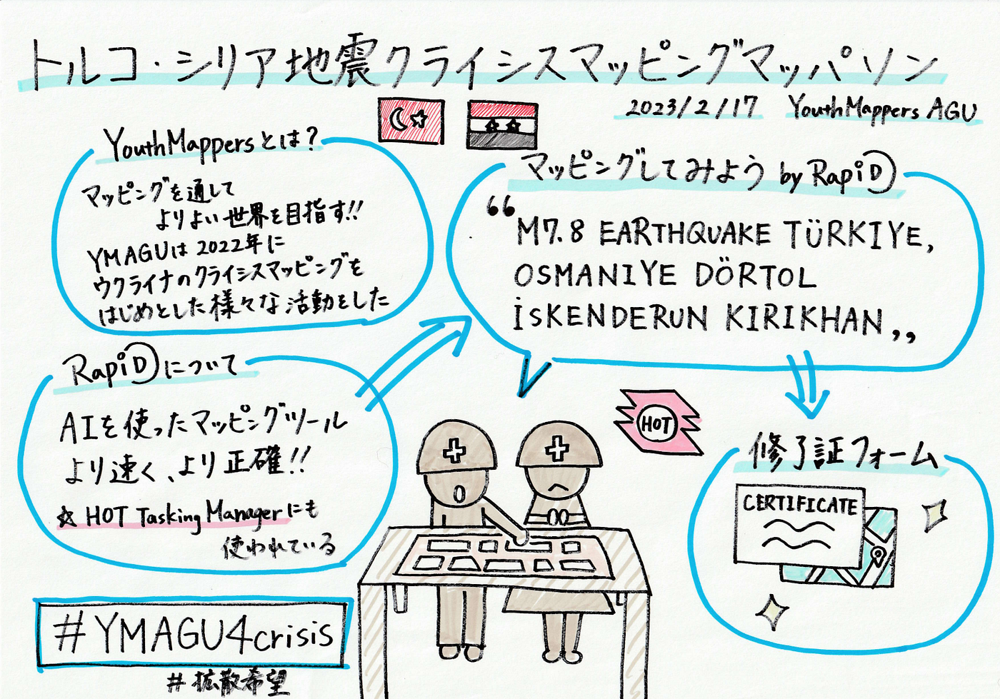

### トルコ・シリア支援マッパソンから得た学び

こんばんは！

２年の上原です。2/17に行われた「トルコ・シリア地震クライシスマッピングマッパソン」についての学びを報告します。先日、深水くんが英語版で書いてくれたので、私は日本語で報告しようと思います。

リアルタイムでは参加できなかったのでアーカイブを視聴しました。マッピングによって、避難ルートや被害の様子を知ることができると学び、クライシスマッピングの重要性を実感しました。動画を見ながら実際に[RapiD](https://mapwith.ai/)を動かしてみましたが、慣れないツールだったので少し難しかったです。

まだ初心者マッパーですが、マッピングツールを使いこなせるように経験を積んでいきたいと思います。クライシスマッピングにも積極的に参加したいです。

（Youtubeでのアーカイブ視聴リンクは[こちら](https://youtu.be/8_dAquI18xY)）

