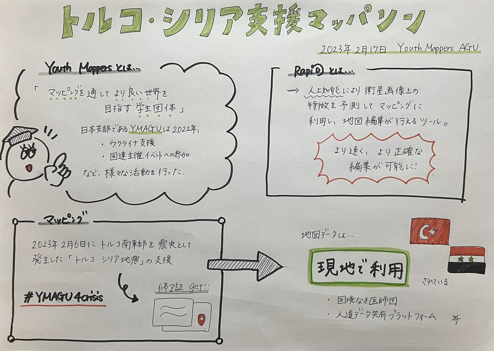

### トルコ・シリア支援マッパソンを視聴しました

こんばんは！

2年の石井です。

2023年2月17日にYouthMappersAGU主催で行われた[「トルコ・シリア支援マッパソン」のアーカイブ動画](https://www.youtube.com/watch?v=8_dAquI18xY)を視聴しました。

今回のマッパソンでは、2023年2月6日に発生したトルコ・シリア地震の支援のため、以下のプロジェクトのマッピングが行われていました。

[#14233: M7.8 Earthquake Türkiye, Osmaniye Dörtyol İskenderun Kırıkhan — HOT Tasking Manager (hotosm.org)](https://tasks.hotosm.org/projects/14233/tasks?username=caucasus1327&osm_oauth_token=BTpIu1HO-8dGtgD6andK8GpmZl6rc6sOZJaTfMt6ksg&session_token=MTE4MzA2ODA.Y_YE-g.rh9zTNaxGVQM9A-sSTifG9nVroM&picture=https%3A%2F%2Fwww.openstreetmap.org%2Frails%2Factive_storage%2Frepresentations%2Fredirect%2FeyJfcmFpbHMiOnsibWVzc2FnZSI6IkJBaHBBMlppQmc9PSIsImV4cCI6bnVsbCwicHVyIjoiYmxvYl9pZCJ9fQ%3D%3D--e3d4449f04ae35a8258c0c8501a01c514a1f8fe3%2FeyJfcmFpbHMiOnsibWVzc2FnZSI6IkJBaDdCem9MWm05eWJXRjBTU0lJYW5CbkJqb0dSVlE2RkhKbGMybDZaVjkwYjE5c2FXMXBkRnNIYVdscGFRPT0iLCJleHAiOm51bGwsInB1ciI6InZhcmlhdGlvbiJ9fQ%3D%3D--1d22b8d446683a272d1a9ff04340453ca7c374b4%2Fasuka.jpg&redirect_to=%2Fprojects%2F14233%2Ftasks)

[RapiD](https://mapwith.ai/?fbclid=IwAR1LAlUls1MQFG-P_Xq-GkDB-C1IRzGCSYqflLRkfVzoqtHcYhWc3wazMo0#14/41.14933/-104.83157)も活用して正確に作成された地図データは現場で使用され、被害状況が分かりにくい現地の状況を把握することに役立てられています。

マッパソンを通して「現地にいなくても災害支援ができるということ」を改めて実感しました。

クライシスマッピングの重要性がもっと社会に浸透することを願い、これからも積極的な参加をしていきたいと思います。

・・・

グラレコ

参考

[pedrito1414さんの日記 | OpenStreetMap](https://www.openstreetmap.org/user/pedrito1414/diary/?fbclid=IwAR3aNUreGV5vJdA_yPsY0W-GxL6r8GxCBJ42gpy8dXr7wcJqBGRfjap_tE4)
