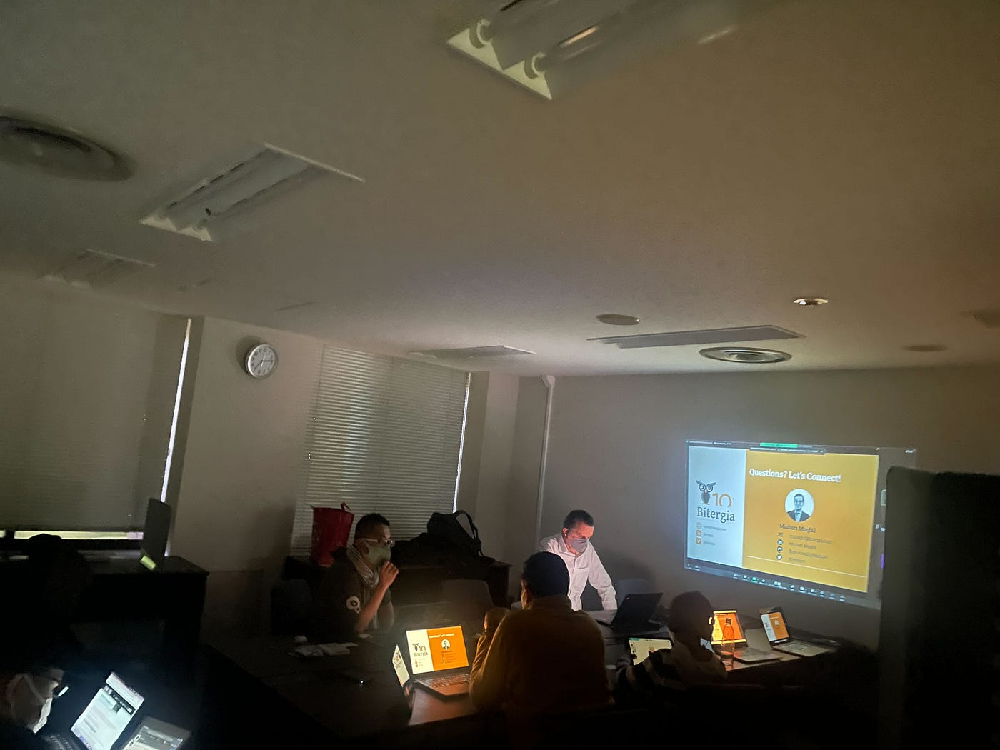

### 国際会議参加レポート

OpenStreetMap Meetup(3/3) 参加レポートby Wataru Yoshida

こんにちは！3年の吉田です🙋‍♂️

2023年3月3日に、[青山学院大学 青山キャンパス](https://www.openstreetmap.org/way/55896463)にて、[OpenStreetMap Thailand](https://www.facebook.com/groups/thaiosm/)代表の[Mishari Muqbil ](https://www.facebook.com/mishari.muqbil)氏とOSM Germanyの[Danijel Schorlemmer](https://www.hotosm.org/people/danijel-schorlemmer/) 氏を招き、**OpenStreetMap Meetup**を開催しました。

また、オンラインでは国連[OpenGIS Initiative](http://unopengis.org/unopengis/main/main.php)、[HOT/Open Map Hub Asia Pacific](https://www.hotosm.org/hubs/asia-pacific-hub)のメンバーがオーディエンスとして参加してくださいました！

わたしたちは国連OpenGIS Initiativeの一員として、**UNVT/UNVT Portableについて、最新情報について**発表しました。

初めての国際会議での発表だったため緊張しましたが、比較的少人数で、青山キャンパス開催というアットホームな雰囲気だったため、初めての登壇にはうってつけの会議だったなと感じました！

自分たちの言いたいことが伝わったか少し不安ではありましたが、Meetup終了後に国連のチームから「学生たちの発表が頼もしかった」とコメントがあり、自信になりました。

また、**[Mishari Muqbil ](https://www.facebook.com/mishari.muqbil)氏**は[OpenStreetMap Thailand](https://www.facebook.com/groups/thaiosm/)代表ならではの、**オープンコミュニティのより良い運営方法**について話してくださいました。[CHAOSS](https://chaoss.community/)におけるマトリックスフレームワークを例にした発表で、非常に勉強になりました。

一方、**[Danijel Schorlemmer](https://www.hotosm.org/people/danijel-schorlemmer/) 氏**は**地震に焦点を当てた災害リスク評価手法**についてお話頂きました。建物のマッピング及び属性のマッピングを行う重要性について再確認できました。

今回のMeetupの様子はこちらのYouTubeにあがっています！

是非ご覧ください！

> _**最後に_**

発表資料作成にあたり、[Shogo Hirasawa](None) さんに多くのアドバイスを頂きました。ありがとうございました。

> _**発表スライド_**

> _**Strava_**

[青学 meetup - 航 吉.'s 0.9 mi walk
航 吉. completed 0.9 mi on Mar 3, 2023.www.strava.com](https://www.strava.com/activities/8690397814)
