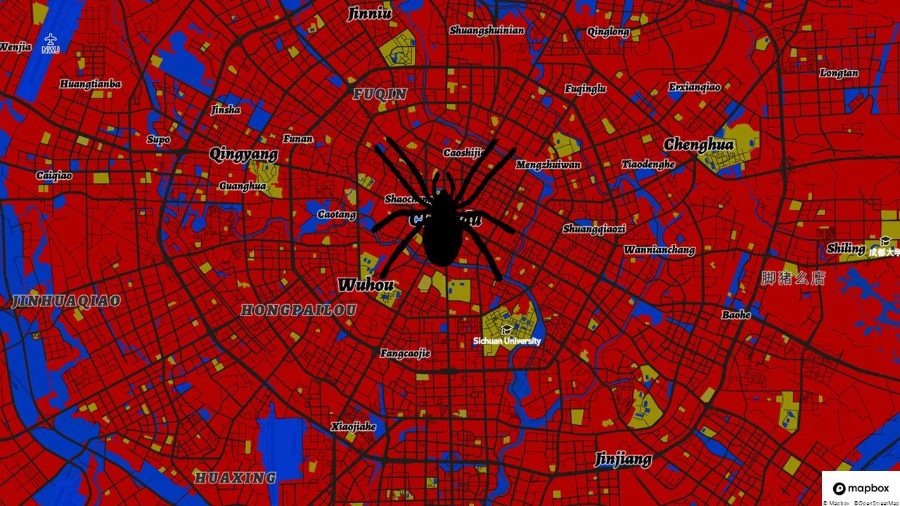
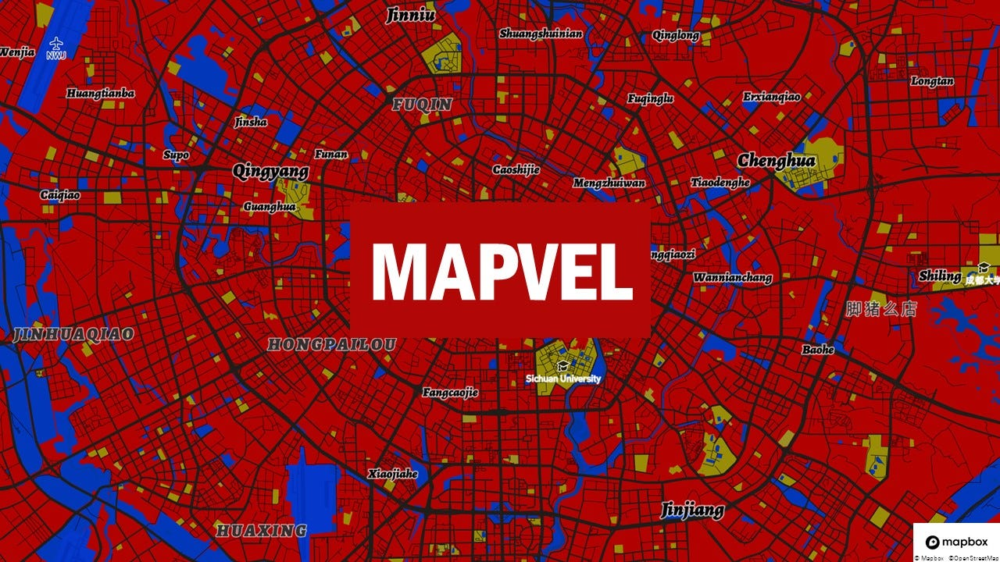
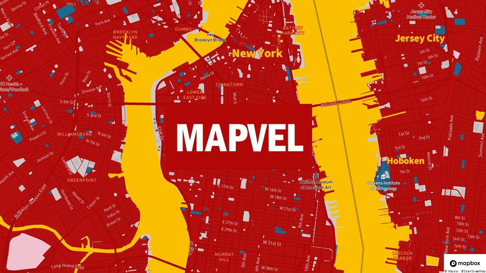
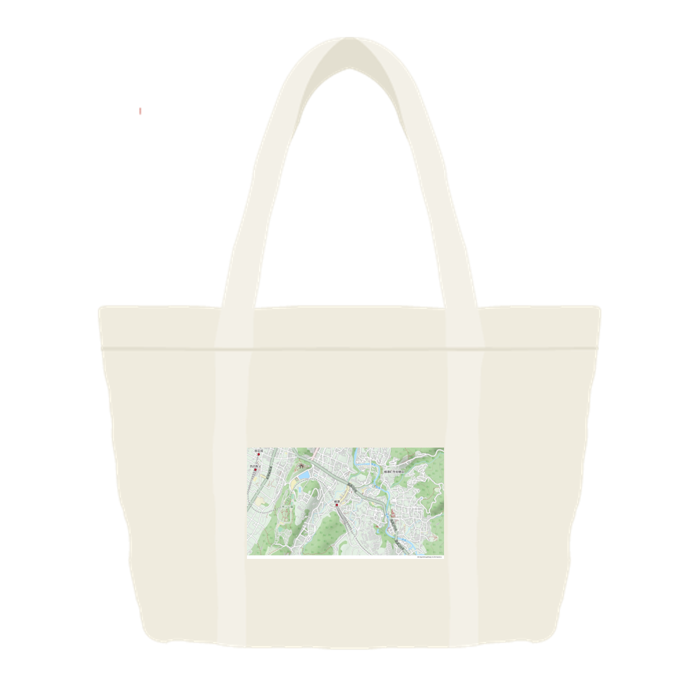
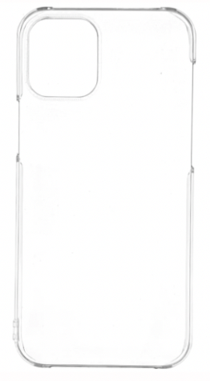
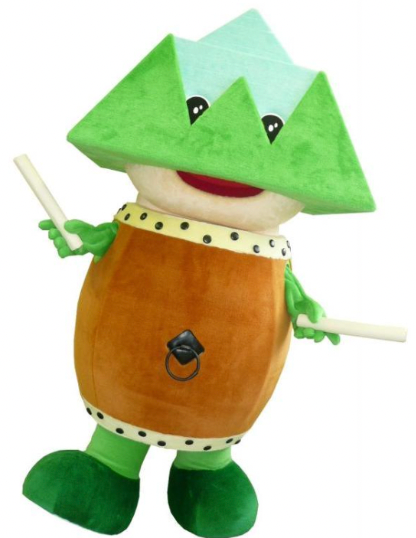
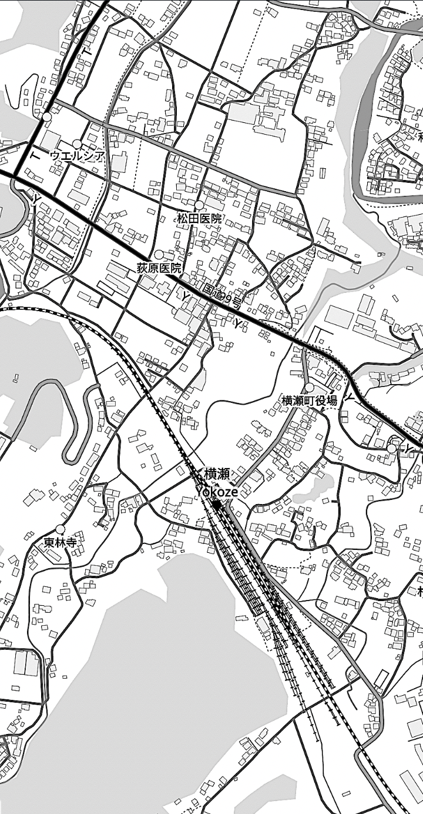
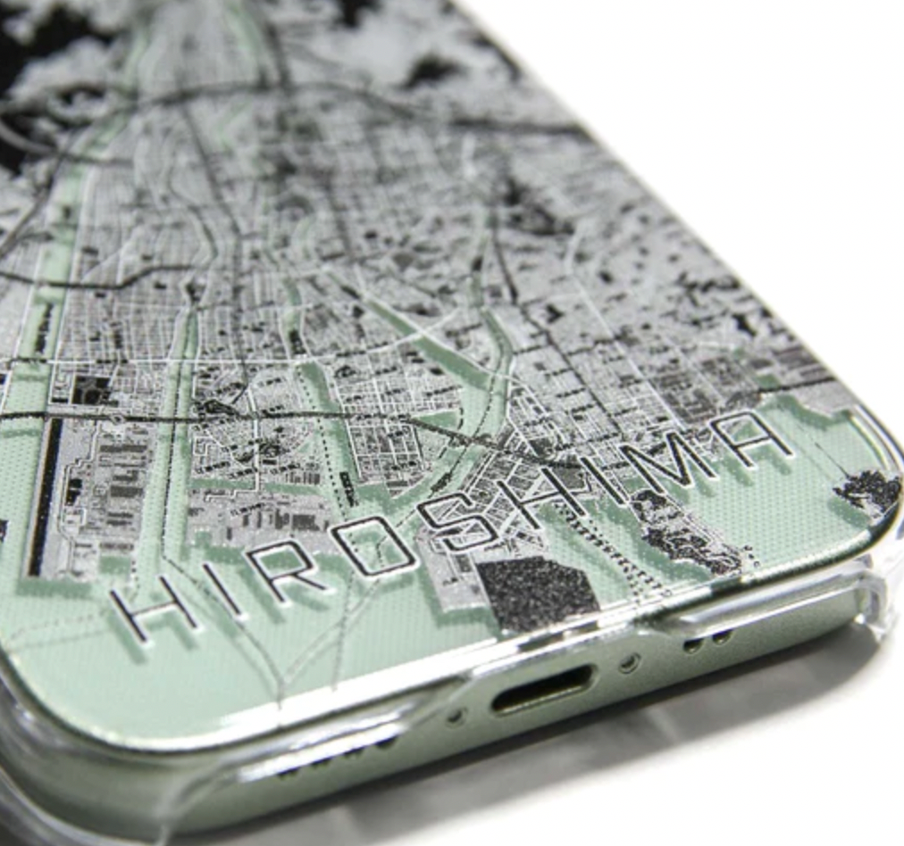
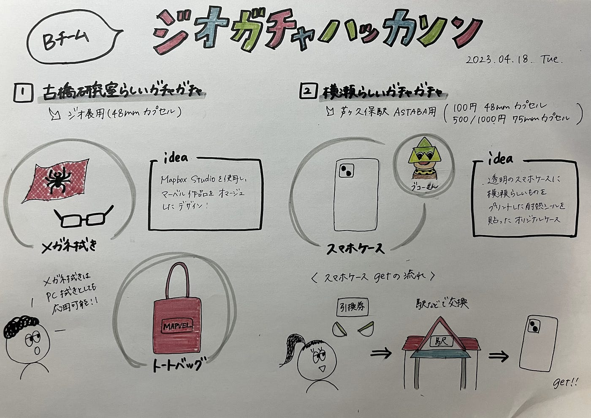

### Bチーム/ジオガチャハッカソン 4/18

今回のジオガチャハッカソンでは、

1. 古橋研究室らしいガチャガチャ → ジオ展用（48mmカプセル）

1. 2.横瀬らしいガチャガチャ → 芦ヶ久保駅 ASTABA用（100円 48mm 、500/1000円 75mm カプセル）

こちらが条件でした！

まず1のジオ展用の48mmカプセルでは、ワタルが前回のフィードバックを受けて改善し、Mapbox Studioを使用し、マーベル作品をオマージュしたデザインを考案しました。

以下のデザインで、「メガネ拭き」「トートバッグ」を想定しています。またメガネ拭きであれば、芦ヶ久保でメガネ拭き（PC拭き）としても応用できると思いました！

芦ヶ久保用のデザインでは、以下のようなものを考案しました！
ただ、小さいプリントではデザイン性がイマイチなため、もっとバッグ全体に地図が印刷されていれば、おしゃれになると思いました！

2.横瀬らしいガチャガチャでは、「横瀬スマホケース」を考案しました！

[https://github.com/furuhashilab/Gachagacha_Hackathon_2023_teamB/issues/1](https://github.com/furuhashilab/Gachagacha_Hackathon_2023_teamB/issues/1)

透明のスマホケースに、横瀬の何かしらをプリントした耐熱シールを貼ることで、オリジナルスマホケースを・・・！

理想的なプロダクトは、以下のようなものです！

ただ、スマホケースは72mmカプセルには入り切らないため、カプセルの中に引換券を忍び込ませ、駅や駅周辺のなんらかの有人のお店で引き換えしてもらう方式が一番現実的だと考えています！

それが不可能な場合、カプセル内に鍵を入れ、該当する隣のボックスの番号の鍵を開けられる方式も可能ですが、費用がかさんでしまうなと思いました！

500–1000円ガチャ考案めちゃめちゃ難しいです・・・・

グラレコはこちらです！

