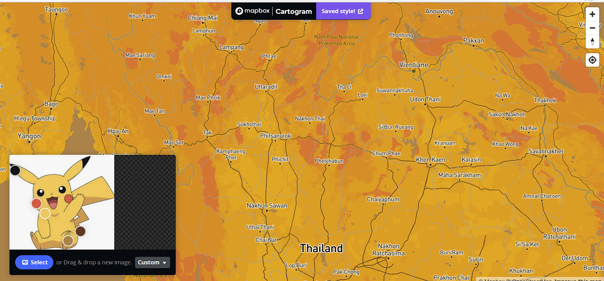
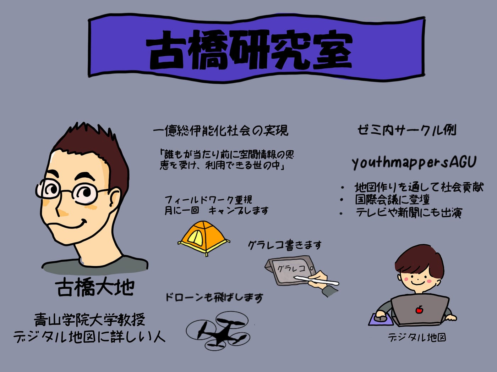
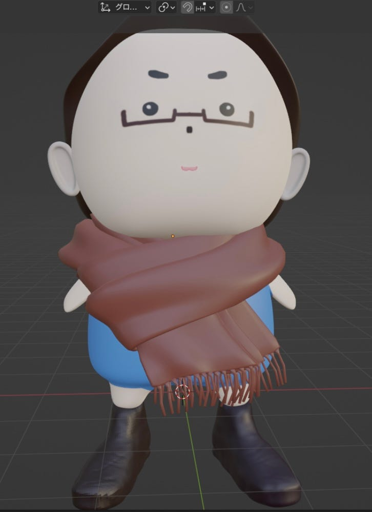
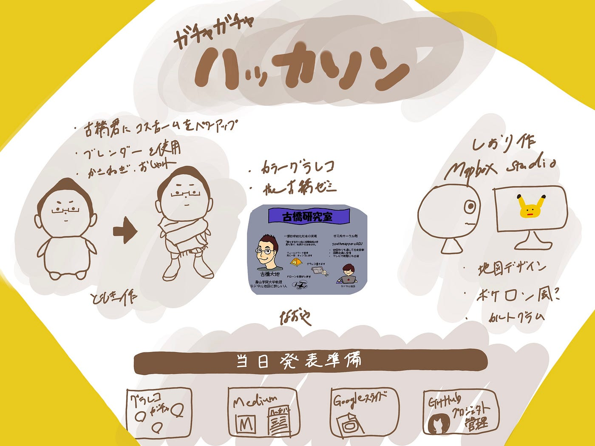

### ガチャガチャハッカソン

こんにちは 4年植松です。新年度の古橋研究室がついに始動しました。昨年以上にコミットし、歴代の先輩方に恥じないような実績を残していけたらと思います。さて古橋研究室今回は新3年生を加えた初のハッカソンです。内容は恒例となってきたガチャガチャハッカソンです。

> テーマ

ジオ展で用いる古橋研究室らしいガチャガチャ （48mmカプセル）

今回は3年生にハッカソンの動き方を知ってもらうことを含め、3、4年の合同チームで挑戦しました。

わたしたちチームはMapbox Stadioを用いた〜風地図デザイン、グラレコを用いたゼミ紹介、ブレンダーを用いた3Dモデル作成です。

> MapboxStudioを用いた地図デザイン

今回3年上原にはMapboxStudioを用いてアニメのキャラ風のデザインに挑戦しました。

作業工程

[Cartogram](https://www.google.com/url?q=https://www.google.com/url?q%3Dhttps://www.mapbox.com/cartogram/%26amp;sa%3DD%26amp;source%3Deditors%26amp;ust%3D1681785753859632%26amp;usg%3DAOvVaw36Xk5b1ugoanw9JAonwcuy&sa=D&source=docs&ust=1681785753865107&usg=AOvVaw0Hd2jW9rPa328lgdh_DiWa)と[Mapbox studio](https://www.google.com/url?q=https://www.google.com/url?q%3Dhttps://www.bing.com/ck/a?!%2526%2526p%253D14ec427eaf9cdd9bJmltdHM9MTY4MTY4OTYwMCZpZ3VpZD0xZDA5YWViZi02ODMwLTY1MTktM2FiYy1iZWI4NjllMjY0NjkmaW5zaWQ9NTE4Mw%2526ptn%253D3%2526hsh%253D3%2526fclid%253D1d09aebf-6830-6519-3abc-beb869e26469%2526psq%253Dmapbpxstudio%2526u%253Da1aHR0cHM6Ly93d3cubWFwYm94LmpwL21hcGJveC1zdHVkaW8%2526ntb%253D1%26amp;sa%3DD%26amp;source%3Deditors%26amp;ust%3D1681785753859986%26amp;usg%3DAOvVaw1YIHq76kRZf87VW3j_aVAX&sa=D&source=docs&ust=1681785753865331&usg=AOvVaw0pZtXhIrx3TM37Uf7ggV-i)を用いて、デザインを行ってもらいましました。現時点では、クロスなどに印刷することを考えていますが、布系の物品であれば何でも対応できるように汎用性の高いアイディアを目指しました。どこの地図を用いるか迷いましたが、半年前に学部留学をしたこともあったためタイを選びました。また、地図のデザインですが、古橋ゼミでは地図理解のツールとして[『ポケモン GO』](https://www.google.com/url?q=https://www.google.com/url?q%3Dhttps://www.bing.com/ck/a?!%2526%2526p%253D671249f16b5dbcc3JmltdHM9MTY4MTY4OTYwMCZpZ3VpZD0xZDA5YWViZi02ODMwLTY1MTktM2FiYy1iZWI4NjllMjY0NjkmaW5zaWQ9NTIwNw%2526ptn%253D3%2526hsh%253D3%2526fclid%253D1d09aebf-6830-6519-3abc-beb869e26469%2526psq%253D%2525e3%252583%25259d%2525e3%252582%2525b1%2525e3%252583%2525a2%2525e3%252583%2525b3go%2526u%253Da1aHR0cHM6Ly93d3cucG9rZW1vbmdvLmpwLw%2526ntb%253D1%26amp;sa%3DD%26amp;source%3Deditors%26amp;ust%3D1681785753860430%26amp;usg%3DAOvVaw17V8BtBoIjbQVVYN6tVhFS&sa=D&source=docs&ust=1681785753865581&usg=AOvVaw3ILqtueESubDdlDF0e52Zw)を利用していることから、ポケモン風のデザイン４種（ピカチュウ、ニャオハ、ホゲータ、クワッス）を作成しました。

懸念点としてジオ展における〜風デザインのライセンスに関する規約が不明な点が挙げられます。

> グラレコを用いたゼミ紹介

4年植松はグラレコを用いたゼミ紹介回にチャレンジしました。

古橋先生は例年ジオ展ではゼミでの活動内容やゼミ生の卒業論文の説明などをしていたことからゼミの内容がわかるかつ、ポップなデサインのものに仕上げるようにしました。背景の色は印刷する素材となるベースの色に応じて変化させようと考えています。

> ブレンダーを用いた3Dモデル作成

3年深水にはブレンダーを用いた3Dモデル作成に挑戦してもらいました。

古橋健教室らしいガチャガチャということで、先輩方が既に作っていた「ふるはしくん」の冬バージョンを、[Blender](https://www.google.com/url?q=https://www.google.com/url?q%3Dhttps://blender.jp/%26amp;sa%3DD%26amp;source%3Deditors%26amp;ust%3D1681786308983816%26amp;usg%3DAOvVaw0hSAFN1iNRFSa78m-TOgJk&sa=D&source=docs&ust=1681786308986967&usg=AOvVaw3HqRqFWgNNSgZriPeB7dNT)を使って作りました。活動する上で重要となる足には靴を履かせて、冬仕様なのでマフラーを付けました。素材は[Booths](https://www.google.com/url?q=https://www.google.com/url?q%3Dhttps://booth.pm/%26amp;sa%3DD%26amp;source%3Deditors%26amp;ust%3D1681786308984083%26amp;usg%3DAOvVaw0wqXtlEcKnqPO0ftv2seIY&sa=D&source=docs&ust=1681786308987132&usg=AOvVaw0eI5fc_unyAS-lMqPI2Pde)から購入しました。YouTube上にある研究室の動画の中には教授がマフラーをしているものがいくつかあるので、現実味を帯びさせることができたと思います。

懸念点として靴の素材については商用利用の許可が出ているのですが、マフラーについては現時点(2023/04/18 1:08)製作者からの返答がないため、商用利用ができない可能性があります。

グラレコ

