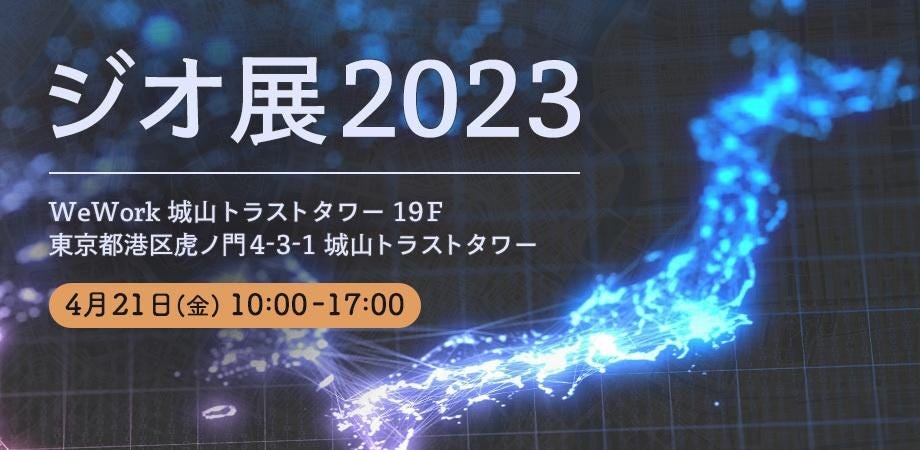
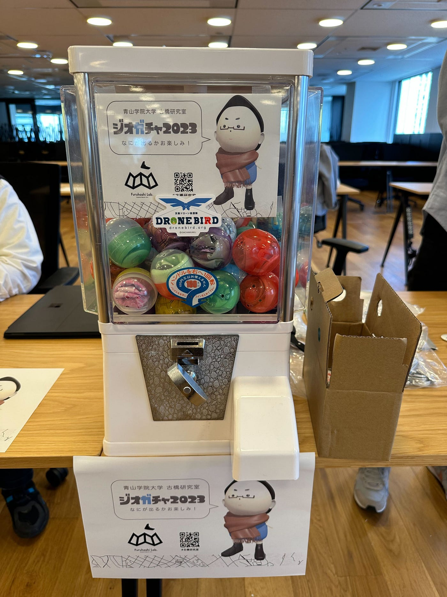
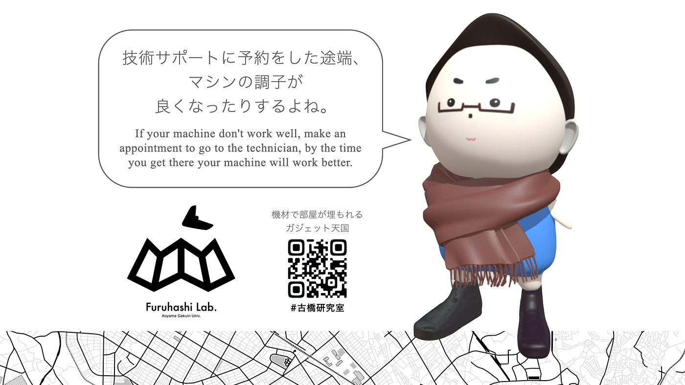
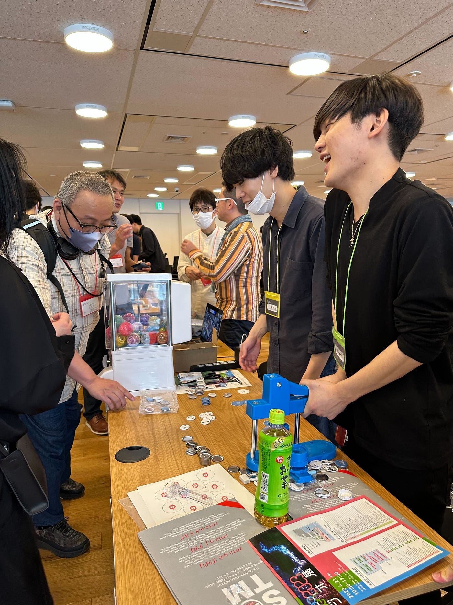
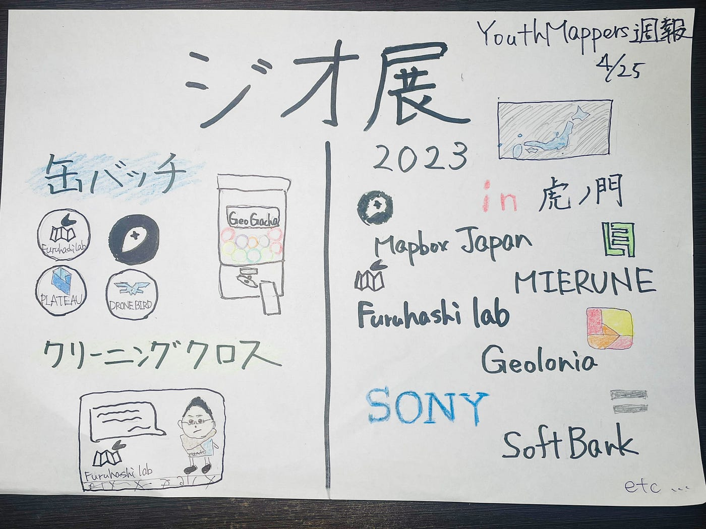

### ジオ展に参加しました！

#### **YouthMappers週報4/25**

こんにちは！

新しく4年生になりました吉田です！

今年度の週報を書くのはこれが初めてですが、

もうすでにゼミ活動は始まっておりました！

特に先週は怒涛の一週間でした、、

今回は4/21に開催された[ジオ展](https://www.geoten.org/)に「古橋研究室」として参加しました！

今回、私たちはこのジオ展に向け、[ガチャガチャハッカソン](https://github.com/furuhashilab/geogacha)に取り組んでおり、当日も成果物をガチャガチャとして実際に来場者に提供しました！

また、ジオ展当日も交代交代で缶バッチを作っていました！

普段では出会うことができないような企業の方々とお話しする機会は、大変貴重で楽しかったです！

ライバル企業、他業界関係なく、会話し吸収することの重要さがわかりました。

今後も規模を大きくしつつ、ジオ展が続いていければいいな、と感じるような非常に楽しいイベントでした！

皆さん、お疲れ様でした！

> _**グラレコ_**

