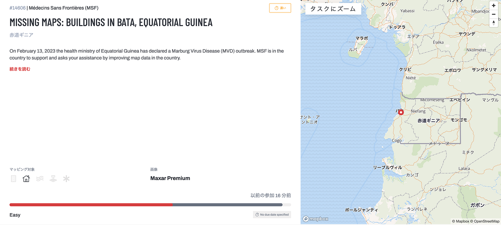
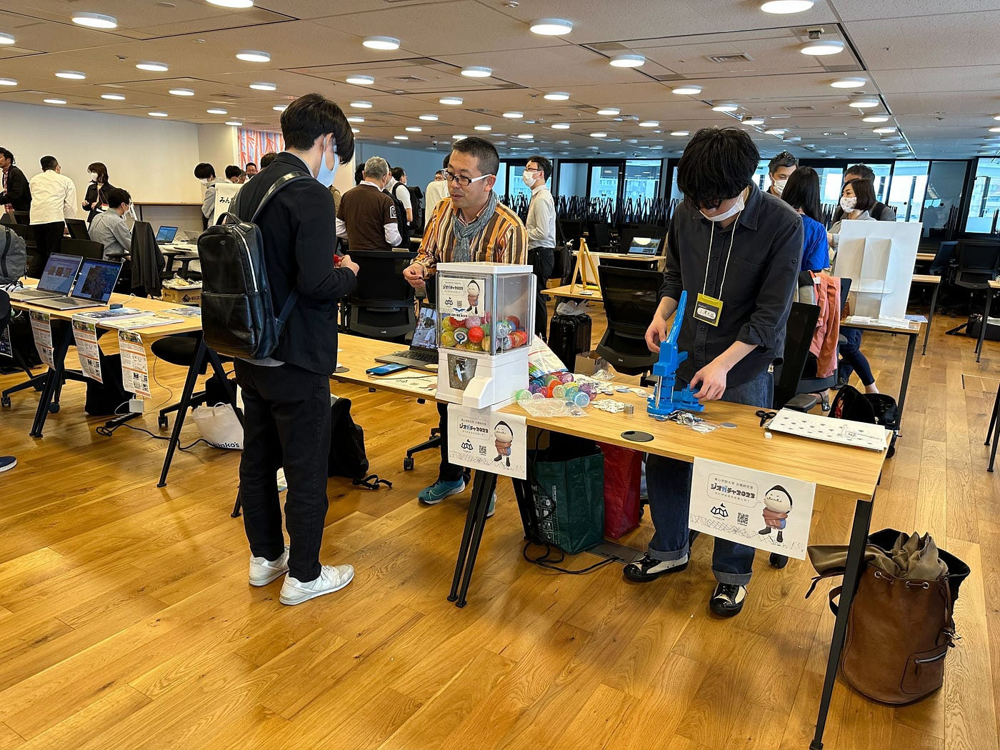
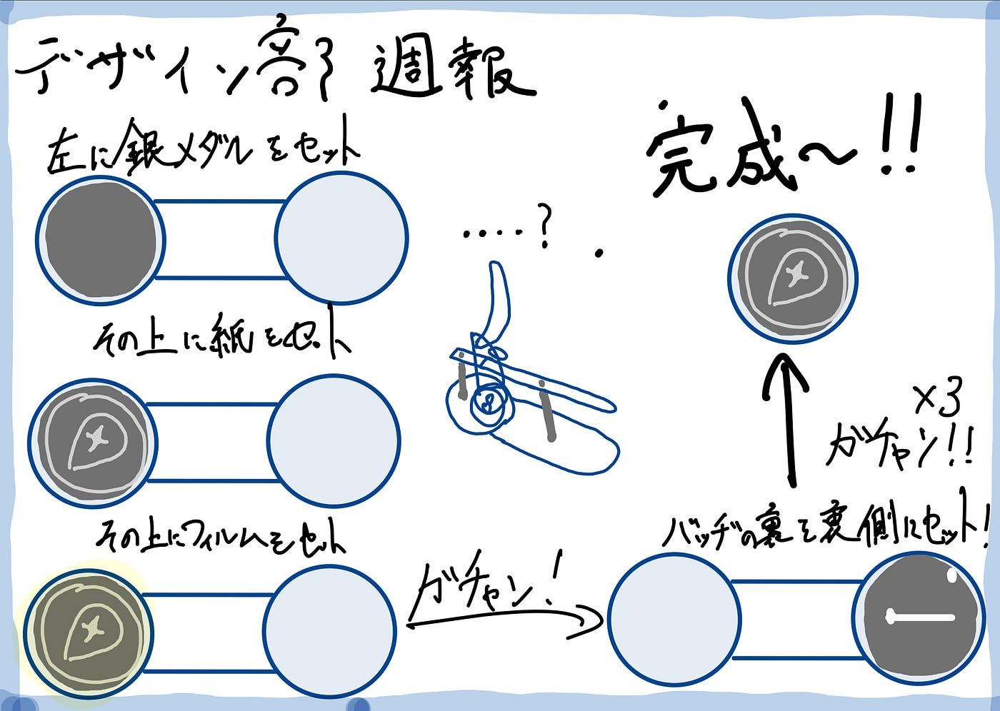

### ハッカソン&ジオ展な1週間

こんにちは！デザイン部の小澤です。

今週は激動の1週間でした。
ジオガチャハッカソン、マッパソン、ジオ展と行事が続き、正直色々中途半端になってしまいました。

まずギニアのマッパソンですが、自分はあんだけ注意されていたハッシュタグを忘れてマッピングしてました😅
途中で気づいて本当に良かったです😅

インターンの関係で全く時間が取れず、結果的には5位と言う情けない順位となってしましました。
次回からはしっかりとゼミ内で協力体制を組み立てていく必要があると感じました。

次はジオ展に関してです。

自分が到着した時には他のゼミ生が誰もいなかったので、一生バッジ作りをしてました。思っていたよりも原始的な作り方で、楽しかったです。休みなく人間に圧力を加えられるという過酷な労働環境により、後半は機会が壊れてしまいました。紙2枚でやっと作れると言う状態でしたが、先生が解決策を編み出してくれたようで安心しました☺️

いくら缶バッヂを作っても、絵は上手くなりません。真ん中の謎の機械の正体は、自分でも分かりません。

