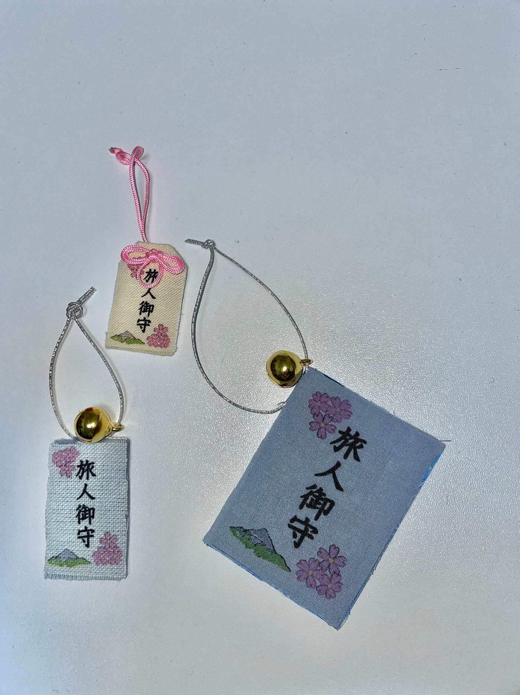
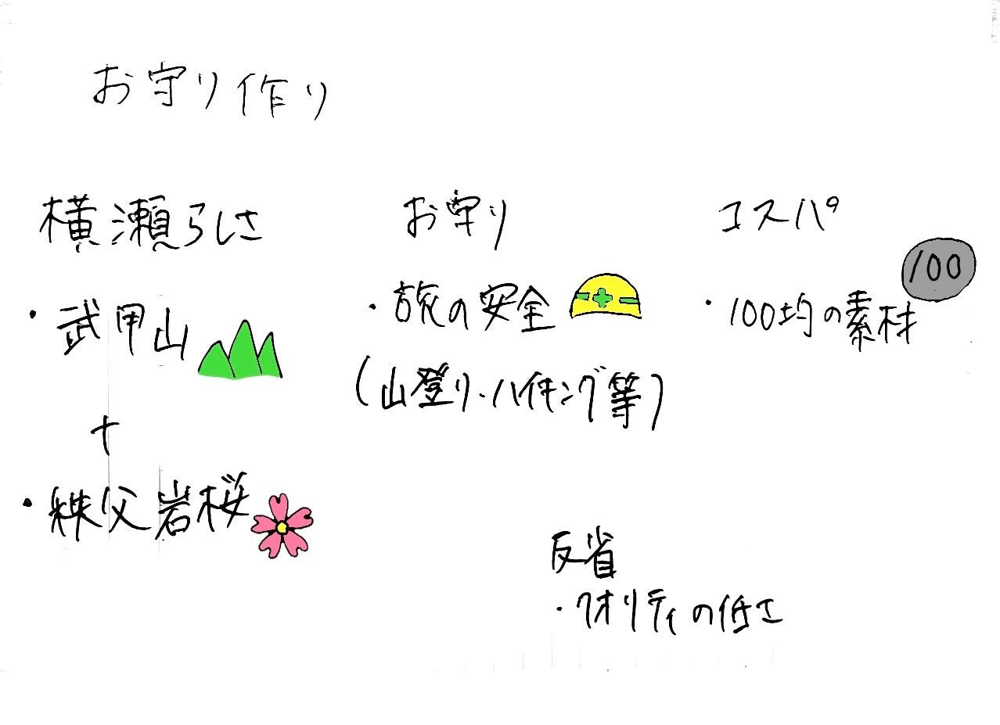

### お守り作り＠横瀬ガチャハッカソン

お疲れさまです、３年の深水です。

横瀬ガチャのハッカソンということで、自分はお守りを作ってみました。

横瀬に観光に来る人の多くが山を登ったりハイキングをしたりすると思うので、その安全を願うようなものにしました。お守りの名前は長沼神社の[旅人守り](https://naganumajinja.or.jp/omamori.html)を参考にしました。

デザインは[アイビスペイント](https://ibispaint.com/)を使って、秩父岩桜と武甲山をモチーフにしたものを作成しました。

お守り本体は百均で購入した布を縫ったり、厚紙に貼ったりして作成しました。印刷には、研究室のガーメントプリンターを使用しました。

反省としては、ただハサミで切って両面テープで貼り付けただけなので切り跡や接着の甘さなど、クオリティの低さが目立つことです。ただ、安価で時間や手間を必要とせずに作成できるので次はもっと丁寧に作ってみたいと思いました。

