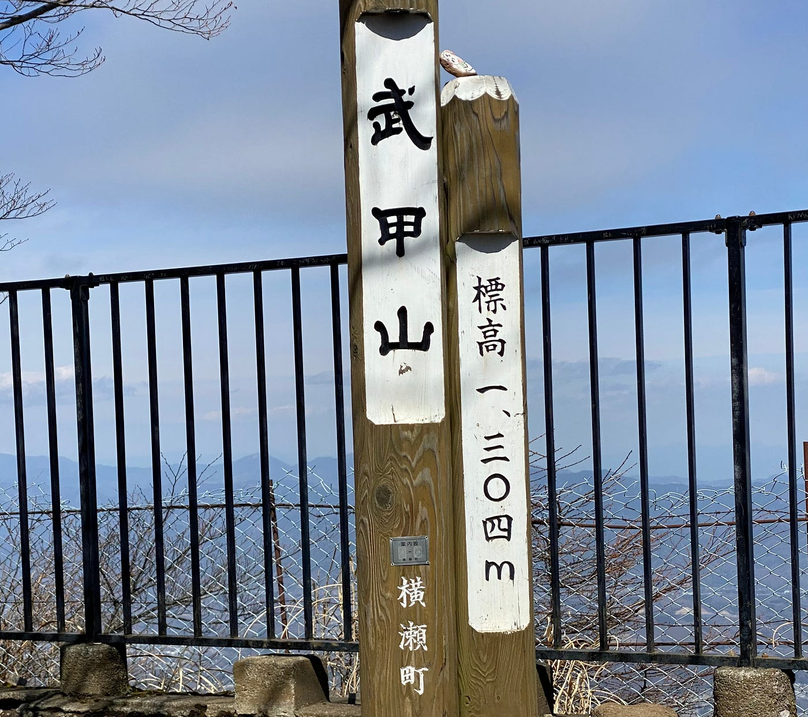
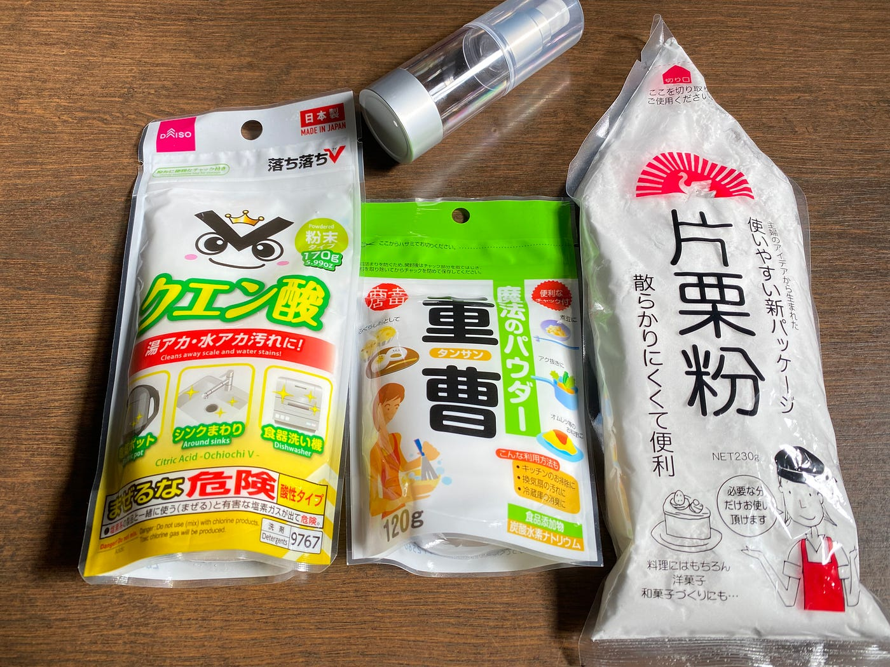
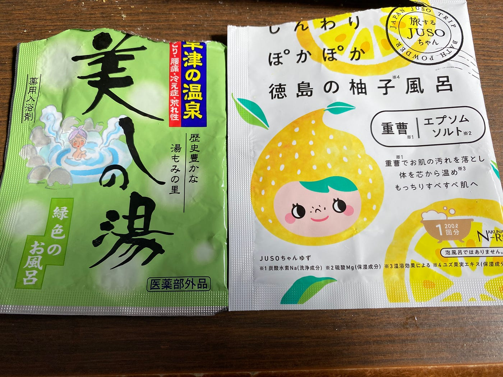
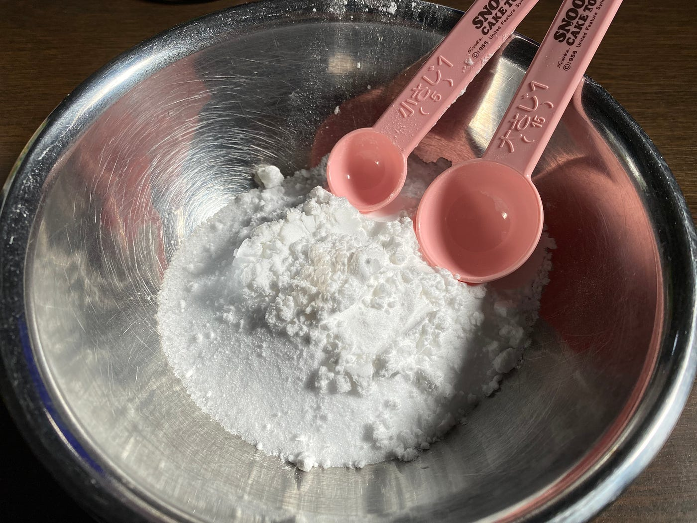
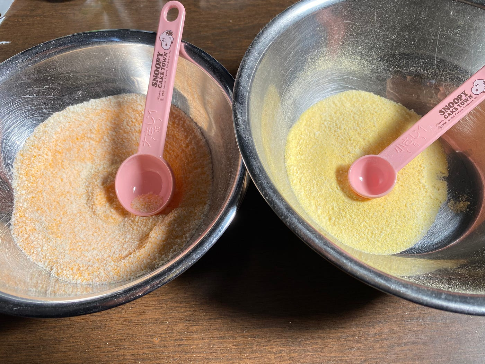
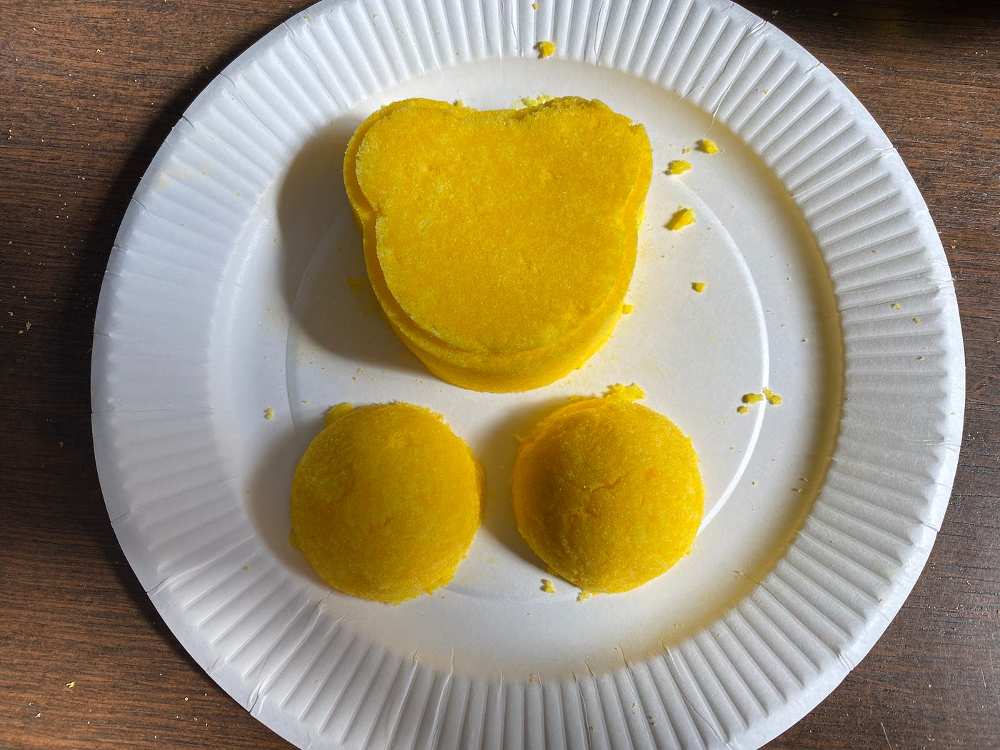
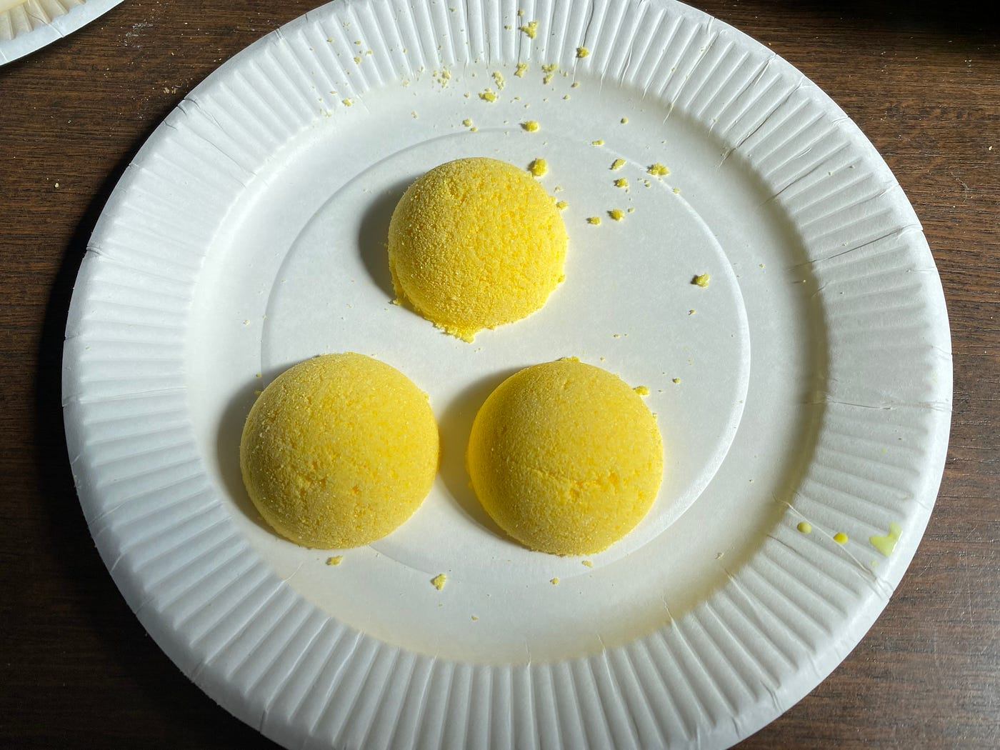
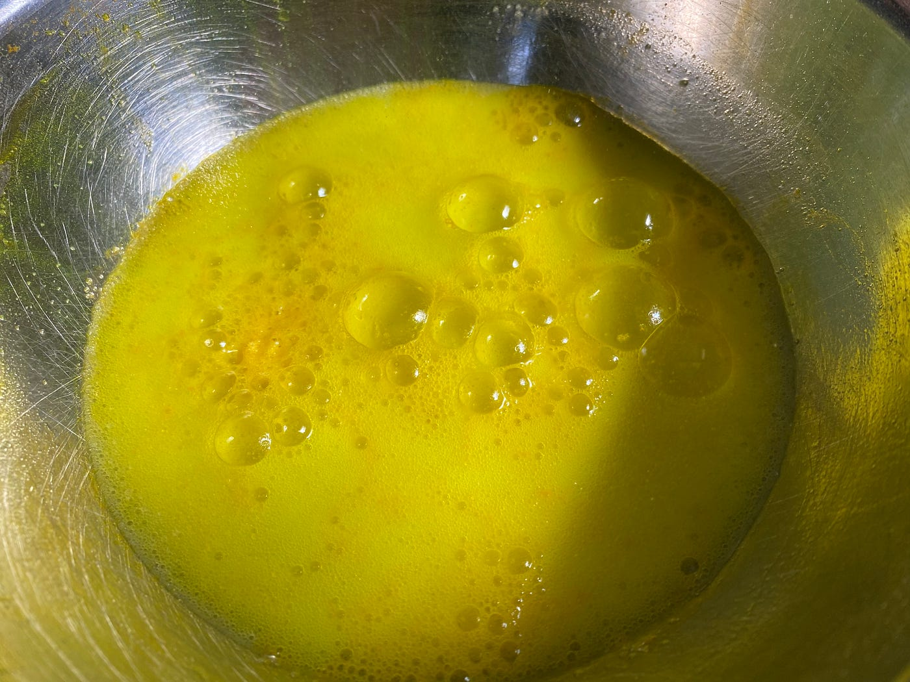
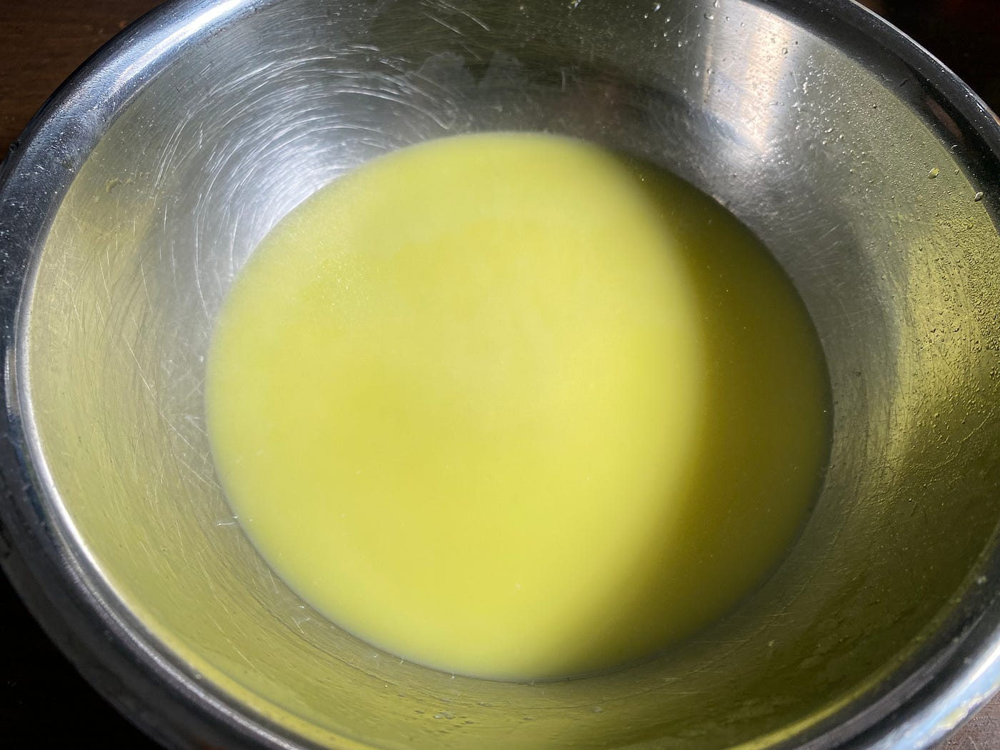

### 疲れを癒すバブ作り！？

こんにちは、4年植松です。ついにゴールデンウィーク！年中休みみたいな私たち4年生にとって連休はあまり特別なことではないですが帰省して社会人の友人に会えるのはやっぱり嬉しいですね。

さて今回は前回に続き、ガチャガチャハッカソンです。テーマは横瀬らしいガチャガチャです。私は入浴剤を作りました。

> 選定理由

私の中で横瀬と言ったら1年前の追いキャンで武甲山に登ったことから山のイメージがあります。山登りをしたら疲れるということで温泉に入る時間のない日帰りのお客様のための入浴剤を中身にすることに決めました。

> 材料

・重曹

・クエン酸

・片栗粉

・水少々

・好みに応じて色付けや香りづけ用に着色料やアロマオイル

・お菓子作りなどに使われるデコレーション用の型

今回は重曹100g、クエン酸50g、片栗粉50gの分量で作りました。また家に着色料がなかかったため代替品として市販の入浴剤を2種類使用して作りました。

> メソット

作り方の手順

1 重曹、クエン酸、片栗粉を分量どうりよく混ぜ合わせる。

2 その他好みで色や香りをつける。

3 霧吹きで水を少しづつかけながらしっとりするまで混ぜる

4 型に押し付けて固まるまで数時間放置

> 成果物

> 感想

材料は全て100円ショップで揃うことに加え、作業も簡単で大量生産できるため、ガチャガチャと相性が良いと感じました。また大きめの入浴剤を作り、その中に何か景品を入れたり、絵を描いたりするなどして工夫するとさらに面白いかもしれません。最大の懸念点としてはガチャガチャの際に落ちてくる衝撃で入浴剤が割れないかどうかです。（お風呂に入れちゃえば変わらないかな、、、）

帰省中だったので母と一緒に作ったのですが小学生の頃の自由研究を思い出しました笑

グラレコ
