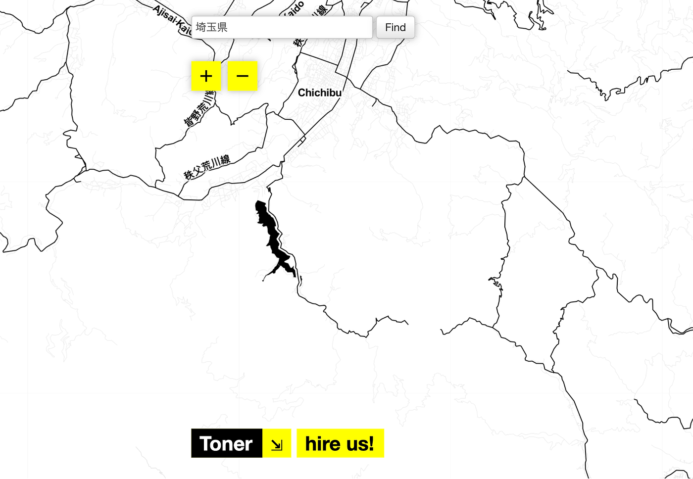
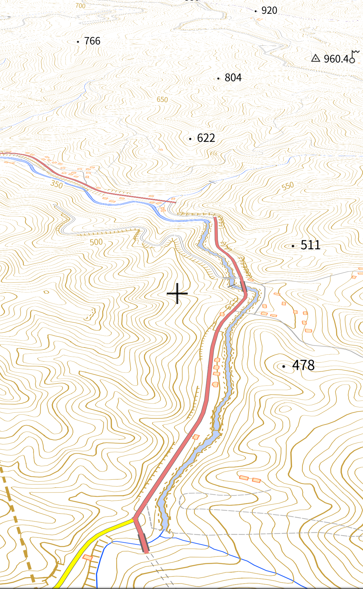
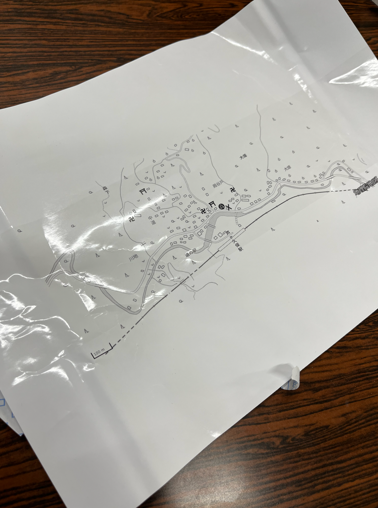
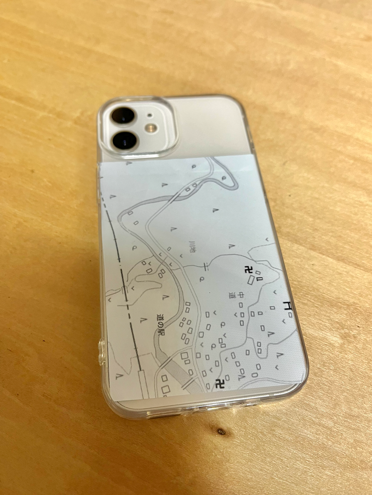
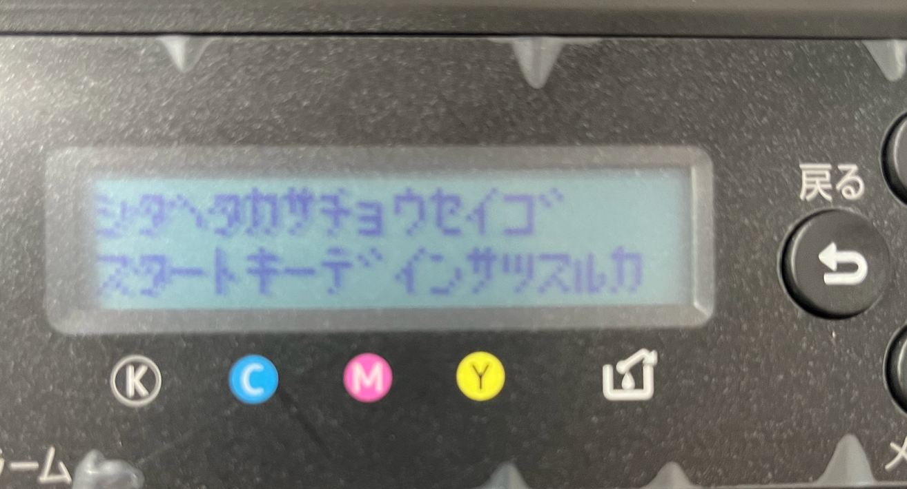
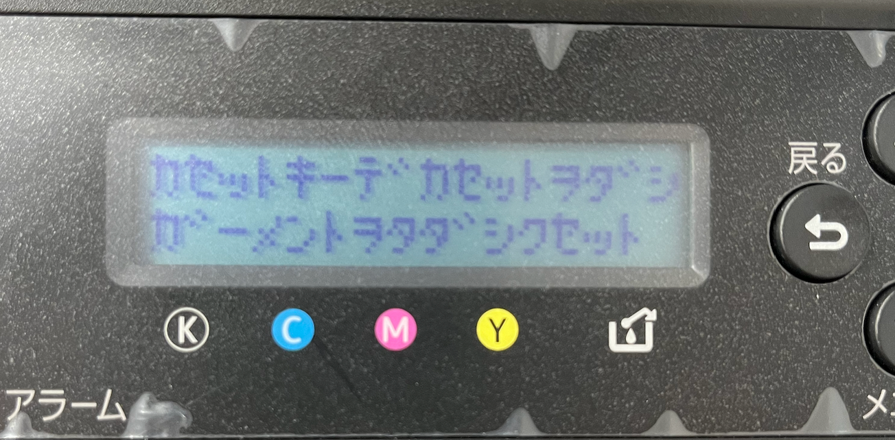

### ジオスマホケース/横瀬ガチャ

4年小澤です！
今回は、横瀬ガチャの試作品作成と言うことで、前回のジオガチャハッカソンで発表した、「ジオスマホケース」の試作を行いました！

デザインについても新しくしたのですが、先生におすすめしてもらった「Stamen Design」 の Tonarでは、横瀬周辺は表示されませんでした、、

芦ヶ久保ではなく、自分の地元の「足久保」も調べてみると同じように表示されなかったので、地図データの足りていない田舎？の方だとまだ表示されないのかと考えました。

そこで、地理院地図ベクターを使用してデザインを作成しました。

結果的には、熱でシール部分がおかしくなり、少しごちゃついてしまいました、、。

ただ、ガーメントプリントで印刷することは可能だと言うことはわかりました！

そして、できた後に致命的なことに気づきました。
それはシールが透明ではなく白地だと言うことです。これじゃスマホケースに貼ることができません、、、汗汗。

別のデザインもやってみよう！と思ったのですが、

こんな表示が出て、何もできませんでした、、。
高さ調節しても不可能でした、、。改善方が分かる方教えて頂きたいです！

デザイン面でも、方法面でも、だいぶ難しいなあと思いました、、、。
