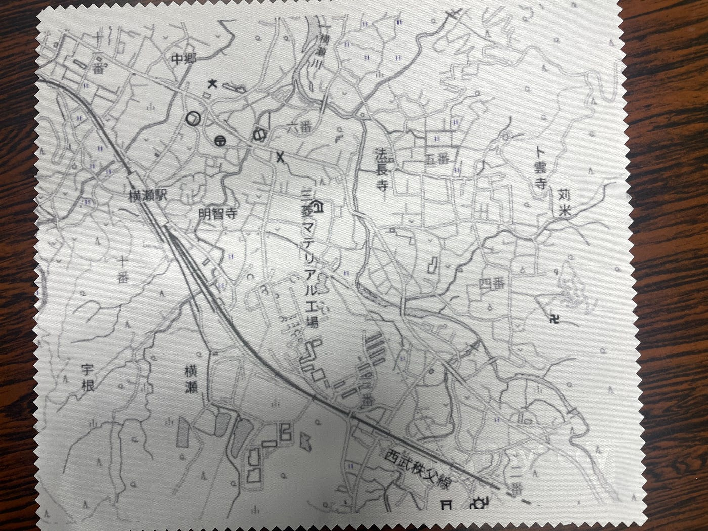
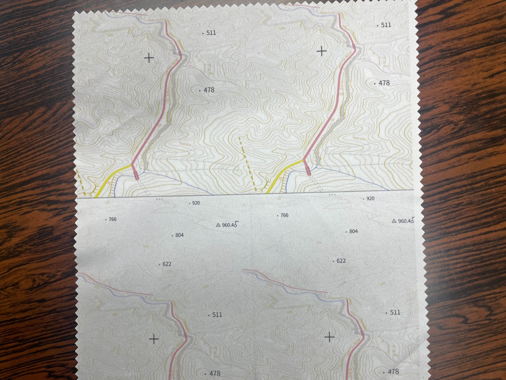
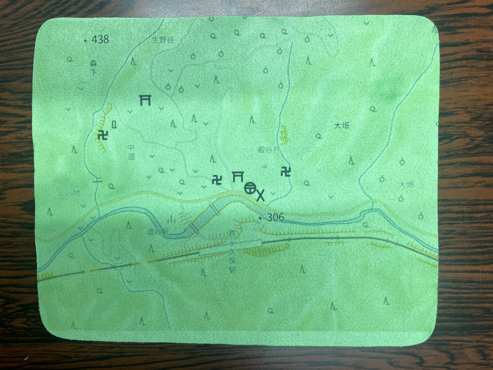
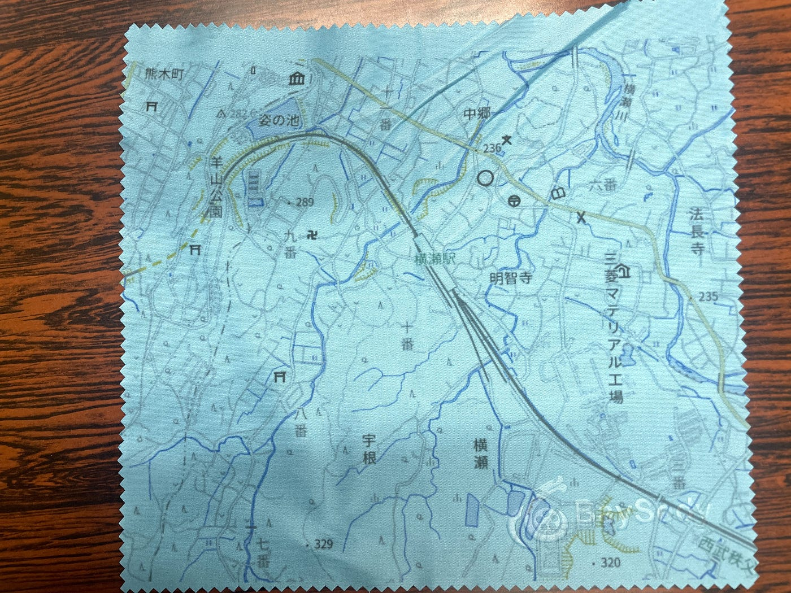
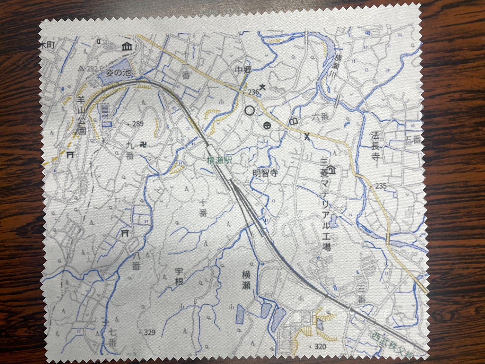
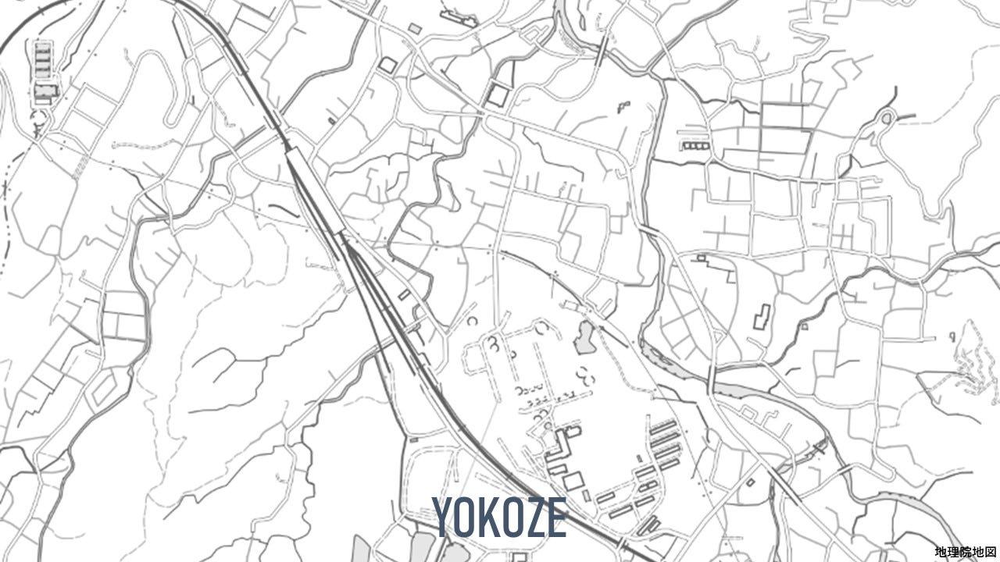

### クリーニングクロス/横瀬・芦ヶ久保ガチャ

こんにちは。

今回は芦ヶ久保駅に設置するガチャガチャのプロトタイプ作成というところで、私は横瀬町の地図を印刷したクリーニングクロスをいくつか作りました！

ツールは[地理院地図Vector](https://maps.gsi.go.jp/vector/#14.404/35.982794/139.105617/&ls=vblank&disp=1)を使用しました。

以下プロトタイプです。

山の色に合わせて緑のクリーニングクロスを使用しました。

こちらは川の色に合わせて水色のクリーニングクロスで印刷。

割と鮮やかでいいなと感じました！

印刷まではいけませんでしたが、こんな感じで文字入りのものも作れたらと思います。

地理院地図Vectorが割と使いやすく、いろんなバージョンを試せたのが印象的でした。

横瀬の地図を印刷したこのクリーニングクロスを使って横瀬の地理の理解と愛を深めてもらえればと思います！
