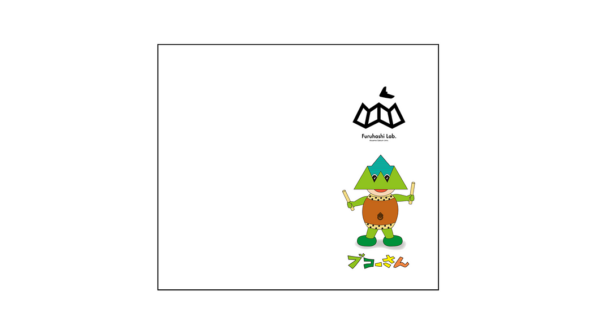
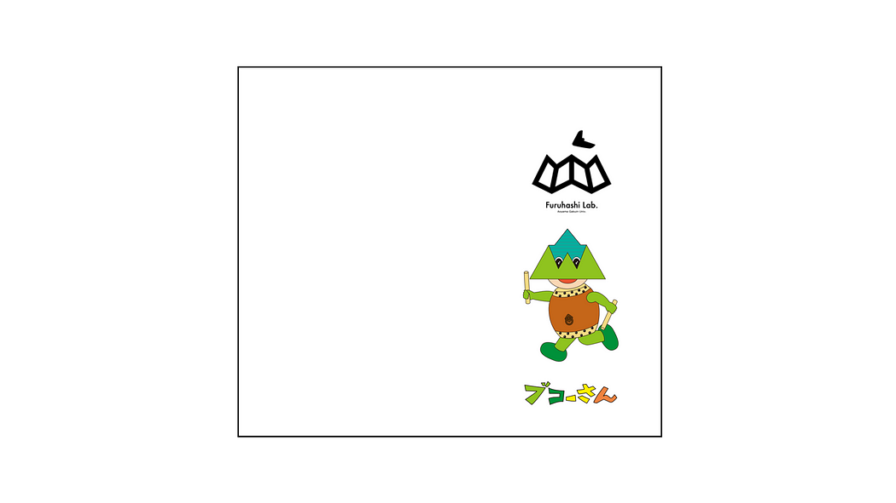
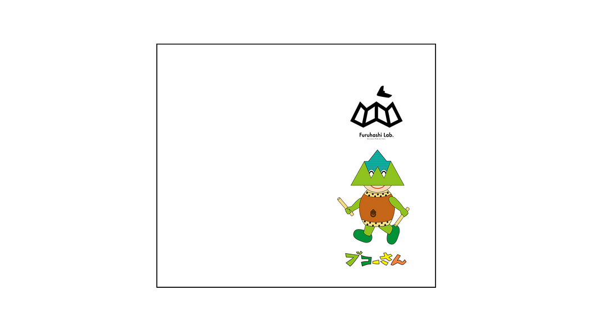
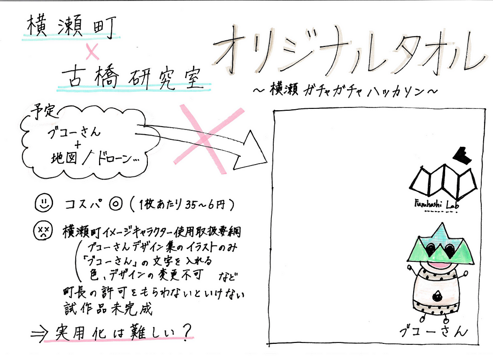

### 横瀬町×古橋研究室オリジナルタオル

3年の上原です。家とバイト先を往復していたらあっという間にGWが終わっていました（泣）

横瀬のガチャガチャハッカソン、私はタオルのデザインを考えました。

横瀬には登山に来る方が多いということで、何かと汎用性のあるタオルなら実用的なのでガチャガチャを回してもらえるのではないかと考えました。

デザインには、横瀬町のゆるキャラである「ブコーさん」を使用しました。もともとは自分でデザインを考えて、もっと自由に（古橋ゼミらしく地図を持たせたり、ドローンを飛ばせたり…）アレンジしたかったのですが、[使用取扱要綱](https://www1.g-reiki.net/yokoze/reiki_honbun/e360RG00000613.html)を守らないと使えないようだったので急遽断念しました。

利点としては、コスパが良いこと。[ダイソーのタオル３枚組（100円＋税）](https://jp.daisonet.com/collections/accessory0201/products/4549131453805)に印刷するなら、1枚あたり約35～6円で生産可能です。

懸念点としては、前述の通り[横瀬町イメージキャラクター使用取扱要綱](https://www1.g-reiki.net/yokoze/reiki_honbun/e360RG00000613.html)に則って様式を提出するという手間がかかること、[ブコーさんデザイン集](https://www.town.yokoze.saitama.jp/wp-content/uploads/2020/01/buko_HP.pdf)内のデザインしか使えないこと、デザインの変更が直前だったために試作が間に合っていないことがあげられます。オリジナリティが出しにくいのが最大の難点です。

コスパは◎ですが、作成にあたって当初想定していたよりも多くの制限がかかってしまうため実用化は少し厳しいのかなと思っています。

