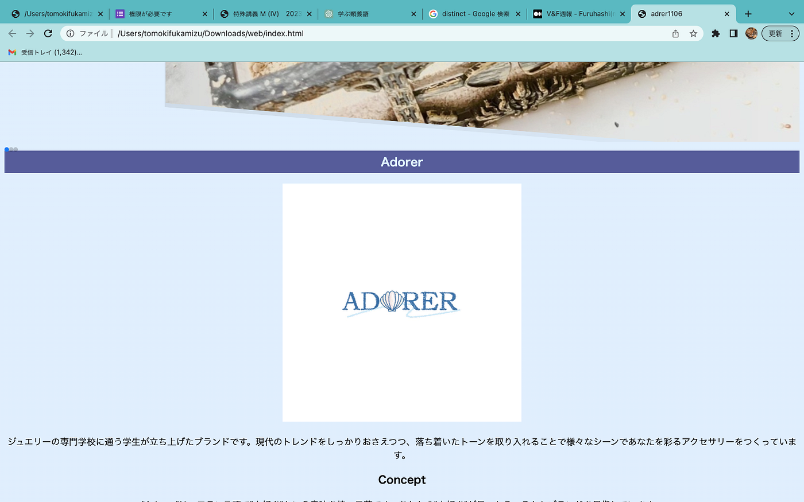
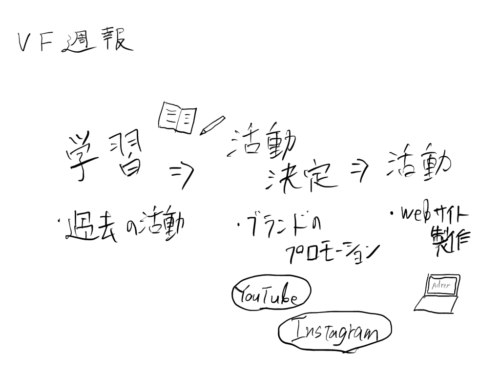

### V&F週報

こんにちは、3年の深水です。今年の動画部は一人で活動することになったので、頑張ろうと思います。

今週は過去の活動内容を確認して、動画部がどのような活動を行うのかを勉強しました。そのうえで、自分の活動の方向性を明確にしました。

そこで、動画部での活動として、プロモーション動画の作製を行うことにしました。具体的には、知人が作成したアクセサリーを宣伝するための動画を制作して、YouTubeやInstagramに載せたいと考えています。

[Adrer1106](https://www.instagram.com/adorer1106/)

手始めとして、ブランドのウェブサイトをHTMLとCSSで制作しています。今週の活動は、これを完成させて公開することを目標にしたいと思います。

グラレコ

