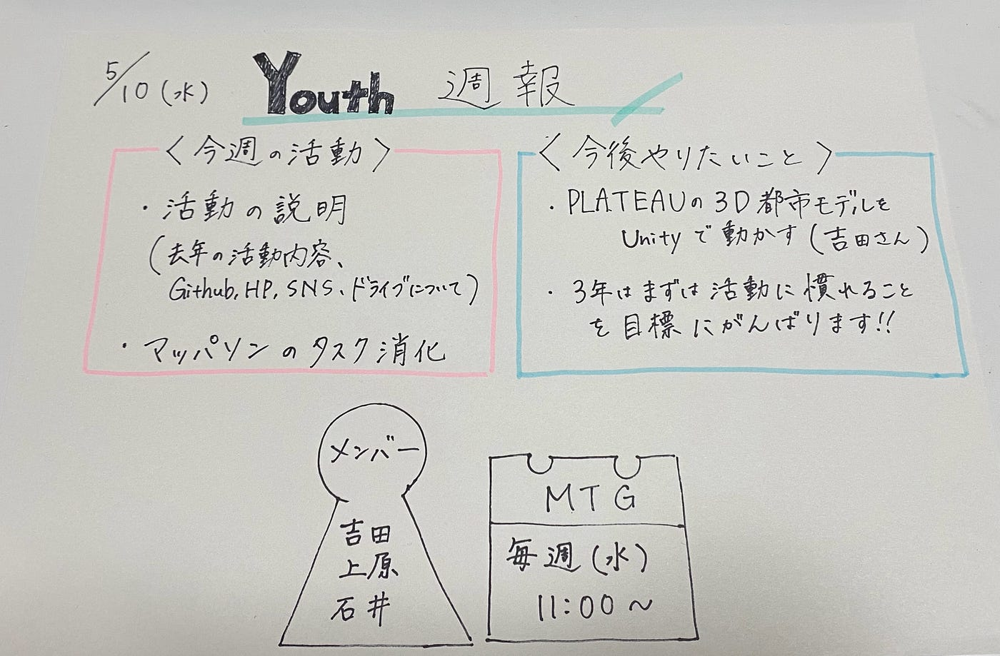

### Youth週報

こんにちは！3年の上原です。初めての週報なので少しドキドキしています。

> 活動について

2023年のYouthは3人で活動していきます。よろしくお願いします。ミーティング（前期）は毎週水曜日11:00～の予定です。

> 今週の活動

今週は、吉田さんがスライド資料を作ってくださり、新メンバーの私と石井さんに説明をしてくれました。[Github](https://github.com/furuhashilab/youthmappers4agu)や各種SNS、[Googleドライブ](https://drive.google.com/drive/u/7/folders/0AHZfntbcQr9GUk9PVA)についても説明を受けました。

その後、[マッパソン](https://tasks.hotosm.org/projects/14606/tasks)の残りタスクを消化しました。ノルマは白1つ、黄1つ以上です。

> 今後、YouthMappersAGUで行っていきたいこと

・PLATEAUの3D都市モデルをUnityにインポートし動かす（吉田さん）

私を含めた3年2人の新メンバーは、Youthの活動に慣れることを目標にまずは1ヵ月頑張りたいと思います。

> グラレコ

