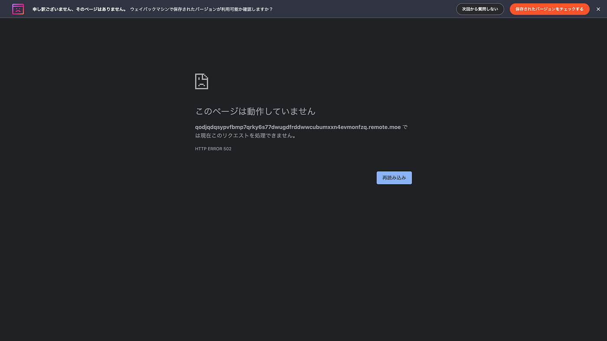
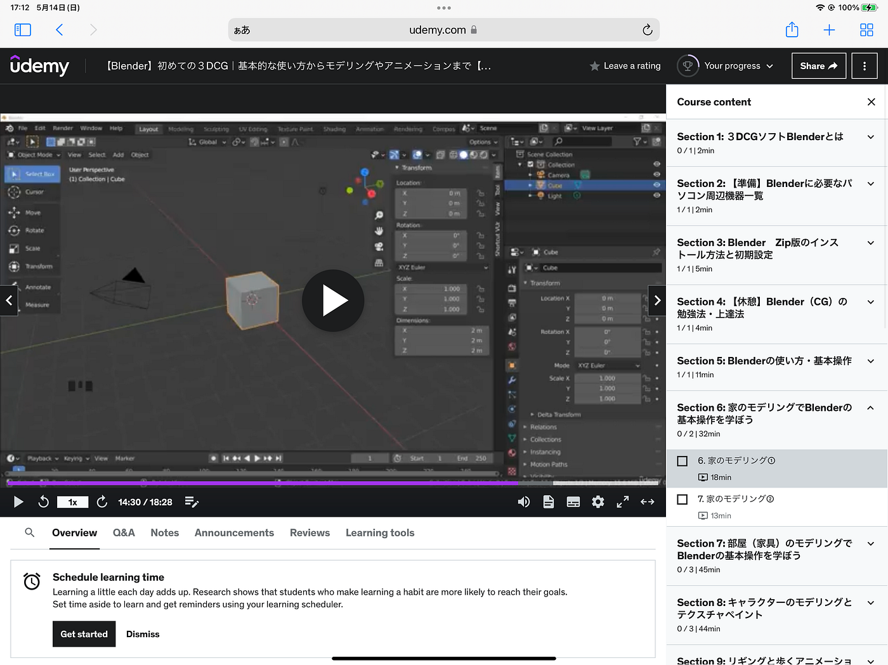
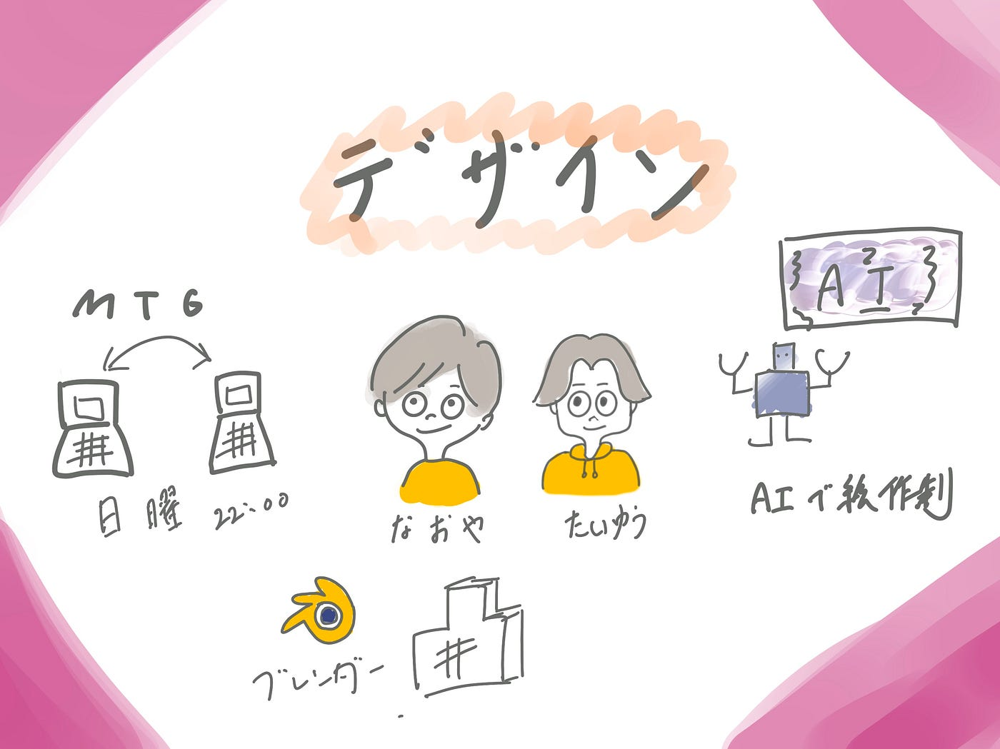

### デザイン部週報

こんにちは 4年植松です。

新学期始まってバタバタしていたせいか久しぶりの週報に感じます。以前から話していましたが私、植松は就職先の関係で今年はデザイン部で活動することになりました。今のところ四年の小澤と2人ですが二人三脚で頑張っていきます。

> MTG

初回ミーティングをふたりで行った結果お互いやりたいことが明確であったことに加え、やりたい内容が大きく異なっていたため、情報交換できるところは積極的に行いつつも、個人で作業を進めるという方針に決定しました。

・ミーティング 日曜２２時

> 小澤 やること

小澤は絵を描くAI使って、ゼミのクリエイティブにどう生かせるかを考えて作品を作っていくそうです。

ただ、Stable Diffusion web UI使えなくなったそうです。

> 植松 やること

・販促のためのクリエイティブ広告作成

・ブレンダーの技術向上

今週はUdemyでブレンダーの基本的な使用方法が学べる動画を見つけたので購入してみました。3000円くらいでした。

Udemyには初心者向けのブレンダー講座がたくさんあることに驚きました。またこの先の発展の動画もありましたがお値段8000円と安くはない金額でした、、、

今回はスケジュールの関係で成果物は作れませんでしたがこれからUdemyを上手く活用しつつブレンダーをマスターしていこうと思います！

グラレコ

