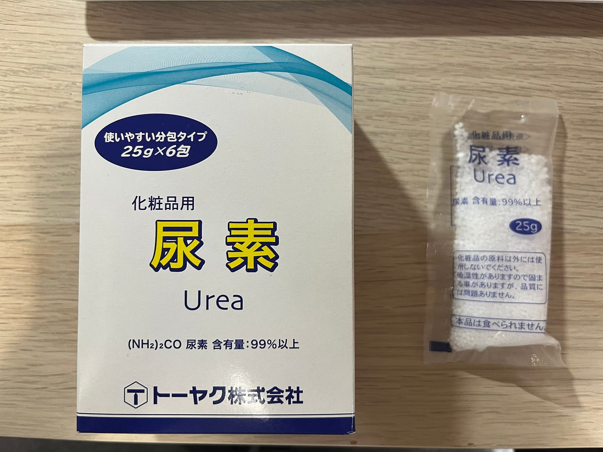
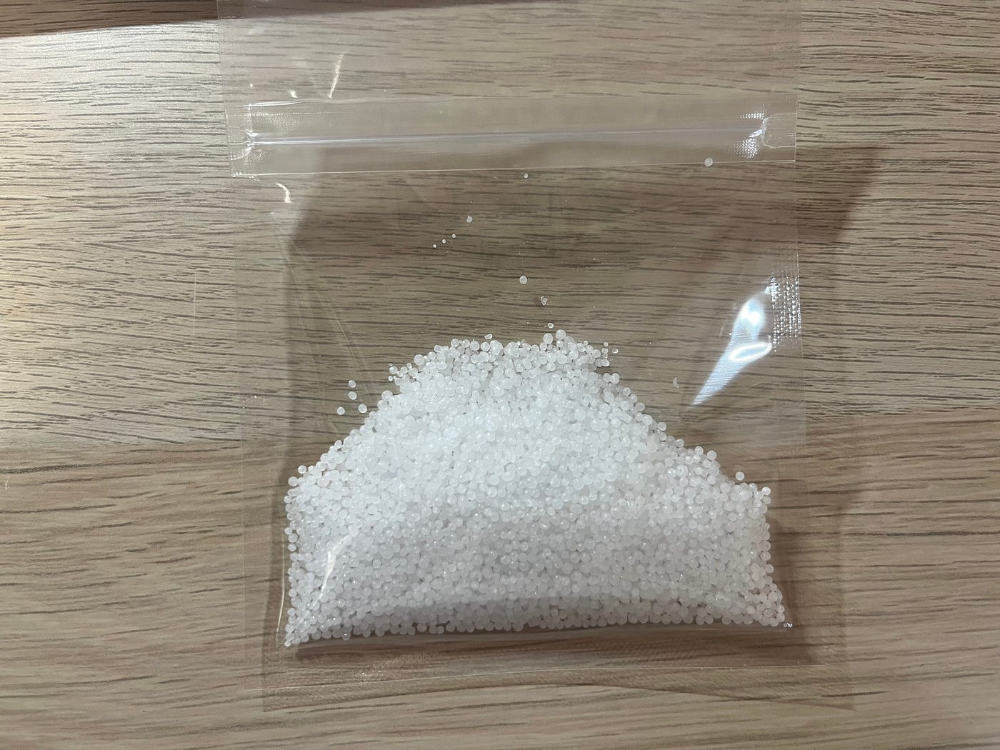
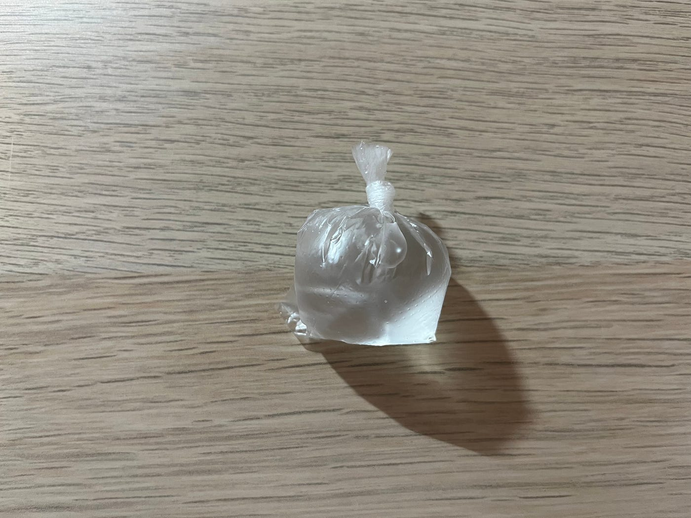
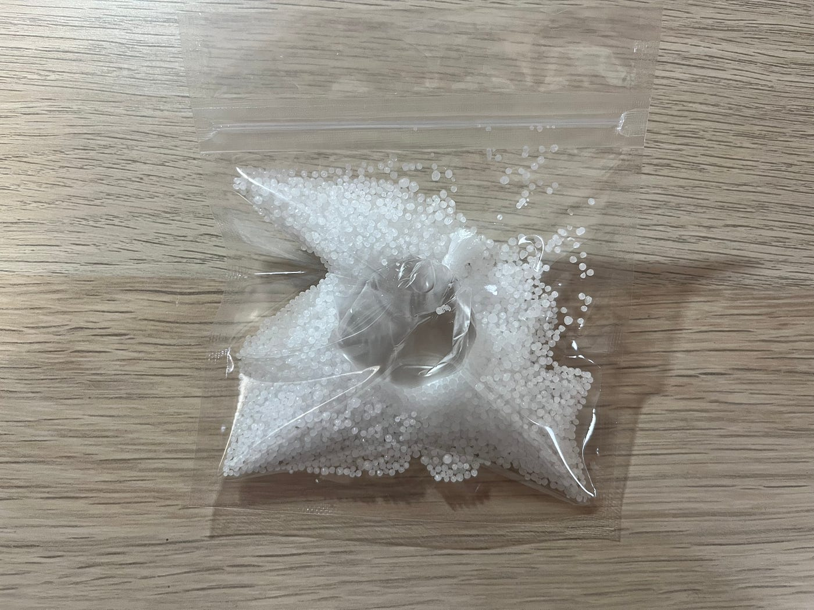
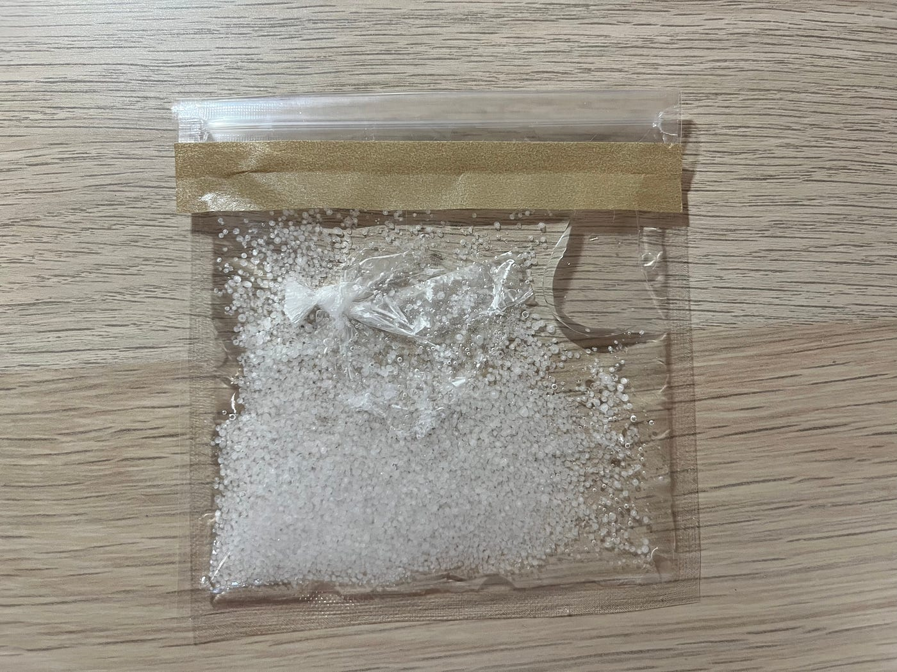
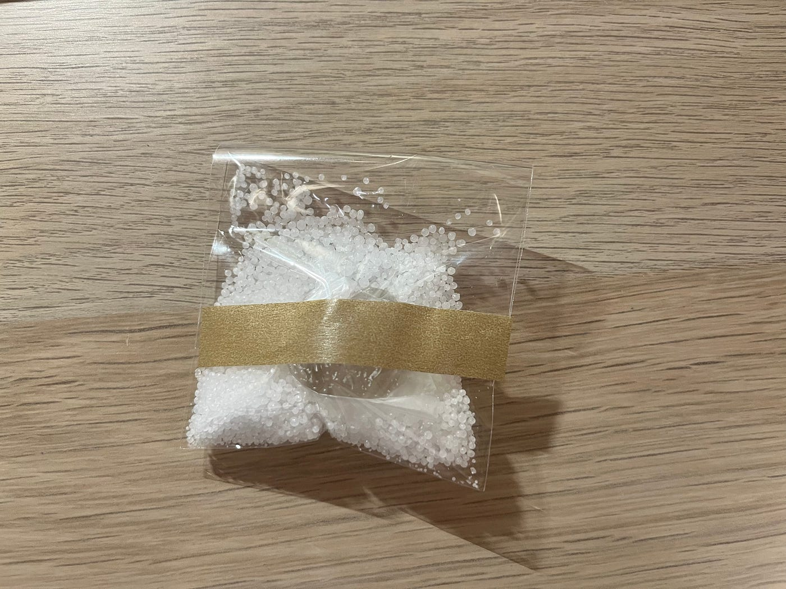
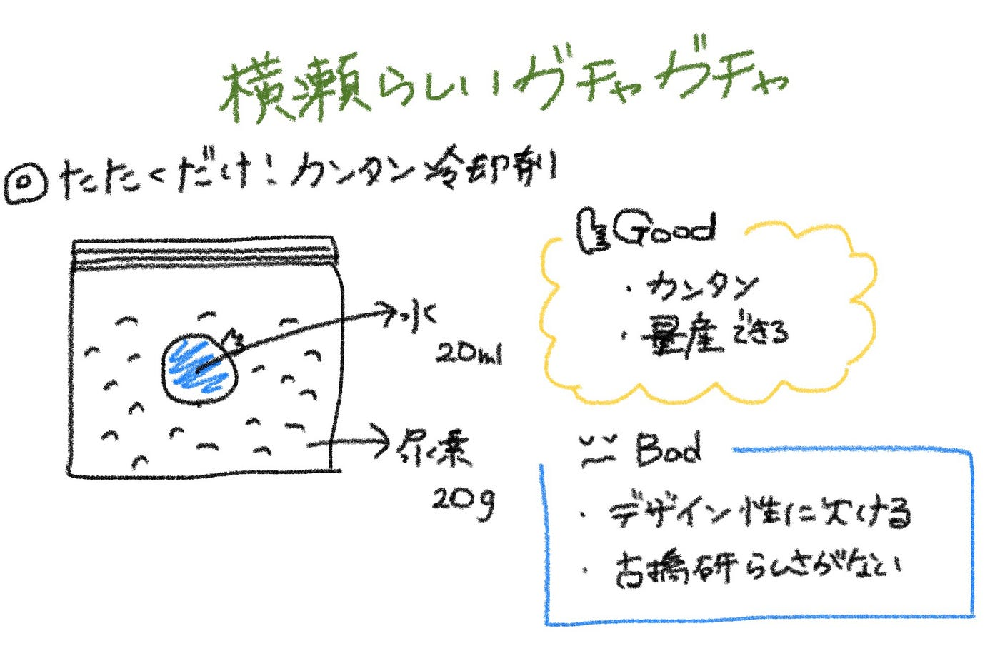

### 瞬間冷却材/横瀬ガチャ

こんにちは！３年の石井です。

今回は「横瀬らしいガチャガチャ」をテーマにガチャガチャハッカソンを行いました。そこで私は瞬間冷却材を作りました。

【理由】

横瀬には武甲山という山があり、登山客の疲れを入浴剤を利用して癒してもらうという[４年植松さんのアイデア](https://medium.com/furuhashilab/%E7%96%B2%E3%82%8C%E3%82%92%E7%99%92%E3%81%99%E3%83%90%E3%83%96%E4%BD%9C%E3%82%8A-c936784f75aa)からインスピレーションを受け、疲れ切った筋肉をアイシングして疲労回復につなげてもらおうと思い、製作を決めました。

【材料】

・尿素 ２０ｇ

・水 ２０ｍｌ

・チャック付き袋

・ポリ袋

【作り方】

１. 尿素を２０ｇはかり、チャック付き袋に入れます

２. 水を２０ｍｌはかり、ポリ袋に入れ、できるだけ空気を抜いて結びます。

３．水が漏れていないことを確認したら、１のチャック付き袋に入れます。

４. チャック付き袋もできるだけ空気を抜いてチャックを閉め、さらにチャックの口を折り返してテープで止めます。

５. 完成！

６. 使いたいときに手でたたき、中の袋を破裂させると冷たくなります！

尿素２０ｇ、水２０ｍｌで作ってみたところ、サイズがちょっと大きいかなと思ったので、尿素１０ｇ、水１０ｍｌでも作ってみました！

小さく収まりましたが、冷たさは変わりませんでした。

【感想】

とても簡単にできたし、実際に使用してみて、めちゃめちゃ冷たくて気持ちよかったです！デザインがシンプルすぎて古橋研らしさがないので、水をピカチュウカラーの黄色にするとか、チャック付き袋に何かしらのデザインのシールを貼るとかするといいのかなと思いました。

グラレコ

