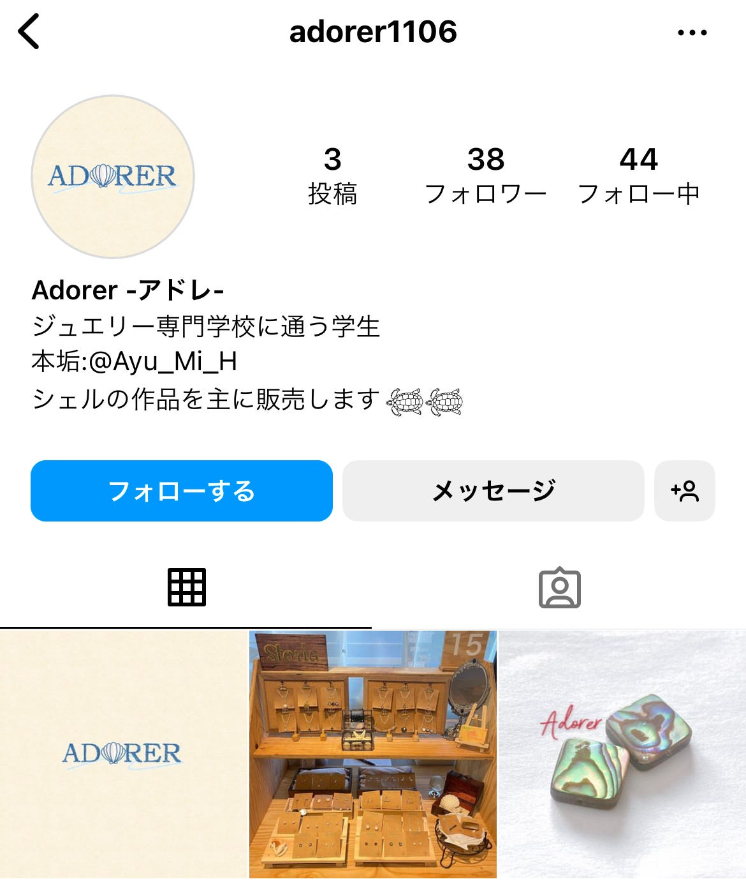
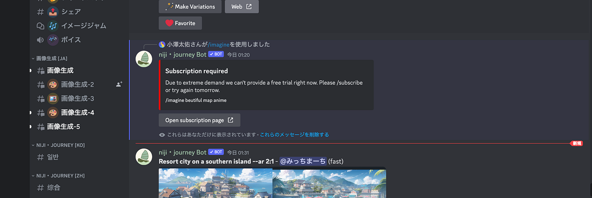
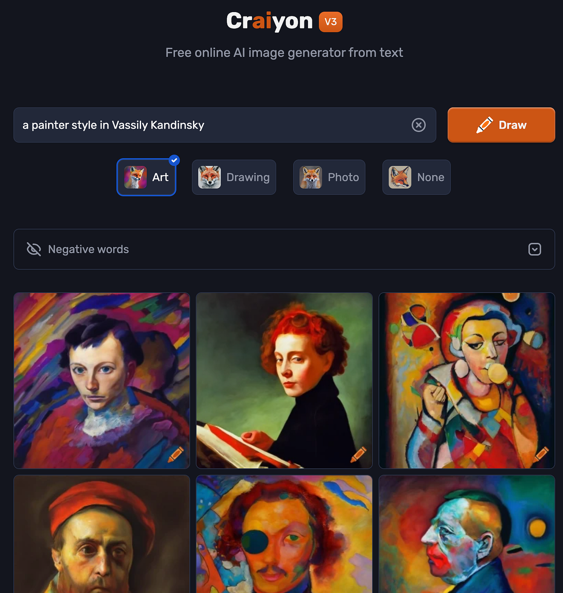
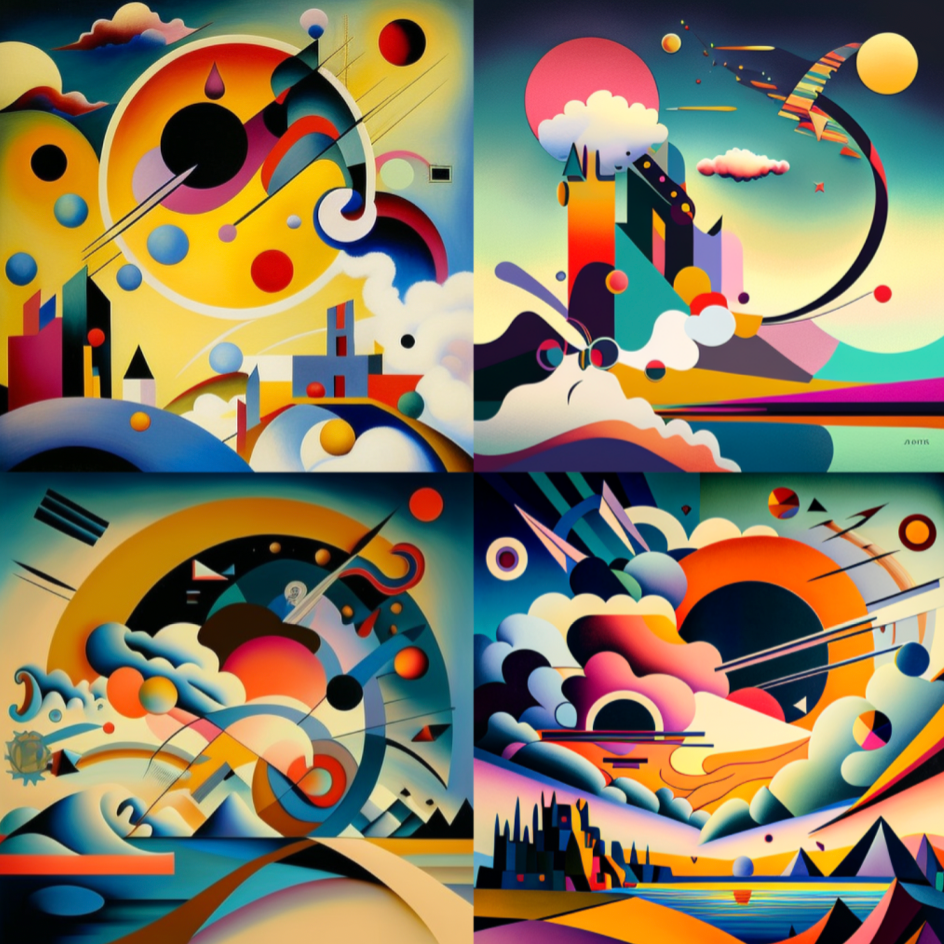

### デザイン部週報

こんにちは！デザイン部の4年小澤です。

今回はなんと、新たにメンバーが増えるとのことで、再度ミーティングを行いました！

新メンバーはともきで、webサイトデザインの活動を行いたいそうです！

目的として、
[https://www.instagram.com/adorer1106/?igshid=NTc4MTIwNjQ2YQ%3D%3D](https://www.instagram.com/adorer1106/?igshid=NTc4MTIwNjQ2YQ%3D%3D)

こちらのwebサイトのデザインを行う予定だそうです。

そのために、まずはこのサイトに使用する画像を作るべく、「[Ibis paint](https://ibispaint.com/)」を使うとのことでした！

またもやデザイン部領域が広がり、期待大です！！

次は、自分個人に関して！

前回紹介してもらった「にじジャーニー」を使用してみたところ、

無料で使えるけど、利用している人が多すぎて、有料版の人が優遇されるらしいです。そのため、事実上無料版の人は使う時間がかなり限られそうです、、。

そこで、別のサービスも試してみました。

使ってみたのは「Craiyon」というソフトです。

[Midjourney](https://www.midjourney.com/)と同じプロンプトで出力したのですが、やはりクオリティにかなりの差がありました、、。

色んなプロンプト試してみたんですけど、Craiyonはかなり絵の具っぽさの強い作品ばかりでした。

こちらが同じプロンプトのMidjourneyバージョンです。

先生、やっぱりMidjourney使いたいかもです、、、🥺

他のソフトも使ってみます！

グラレコ

すみません時間がなさすぎたので、後日添付します🙇
