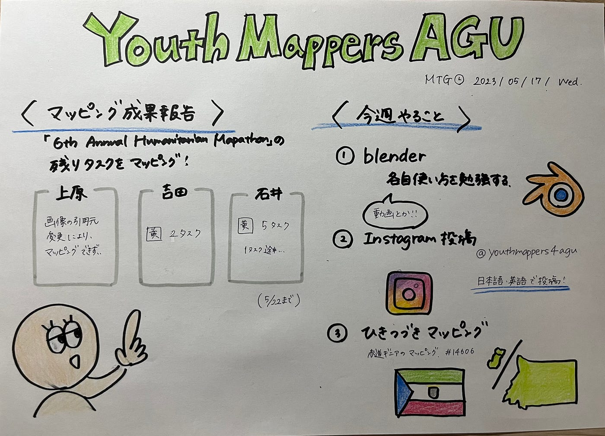

### Youth週報

こんにちは！３年の石井です！毎日バイトと課題に追われながら頑張って生きてます笑

【マッピング成果報告】

各自[マッパソンの残りタスク](https://tasks.hotosm.org/projects/14606/tasks)をマッピングしたので報告します！

吉田さん：黄２タスク

上原さん：画像の引用者変更により画面が一面緑になってしまいマッピングできず…

石井：黄５タスク

【今週やること】

１．[blender](https://www.blender.org/)の使い方を勉強する

２．[Instagram](https://www.instagram.com/p/CsclImqysrO/?igshid=MzRlODBiNWFlZA==)投稿

３．引き続きマッピング

【グラレコ】

