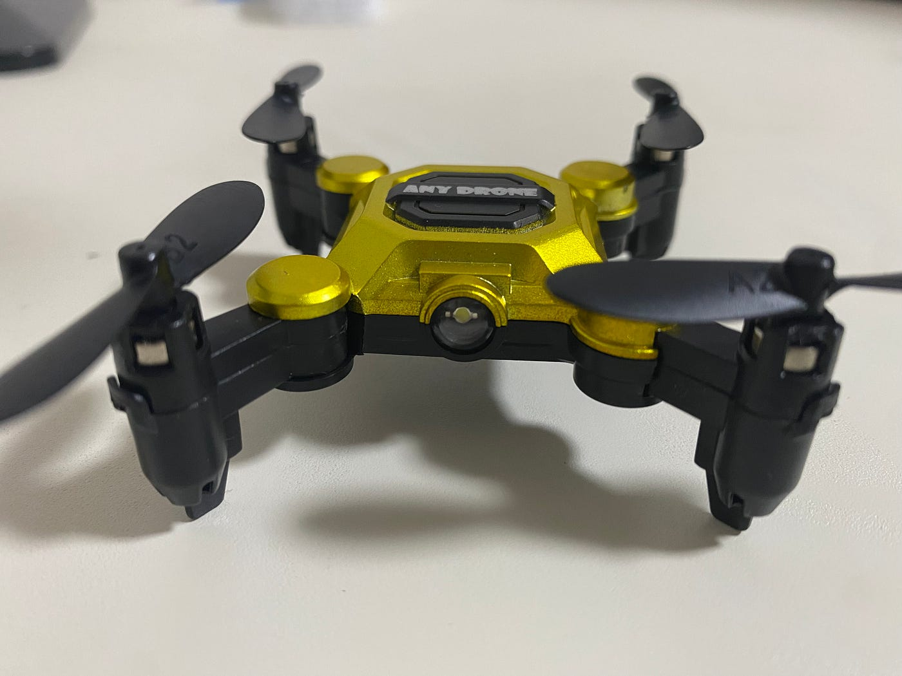
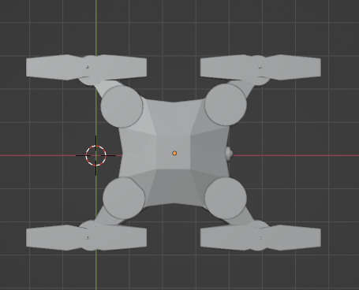
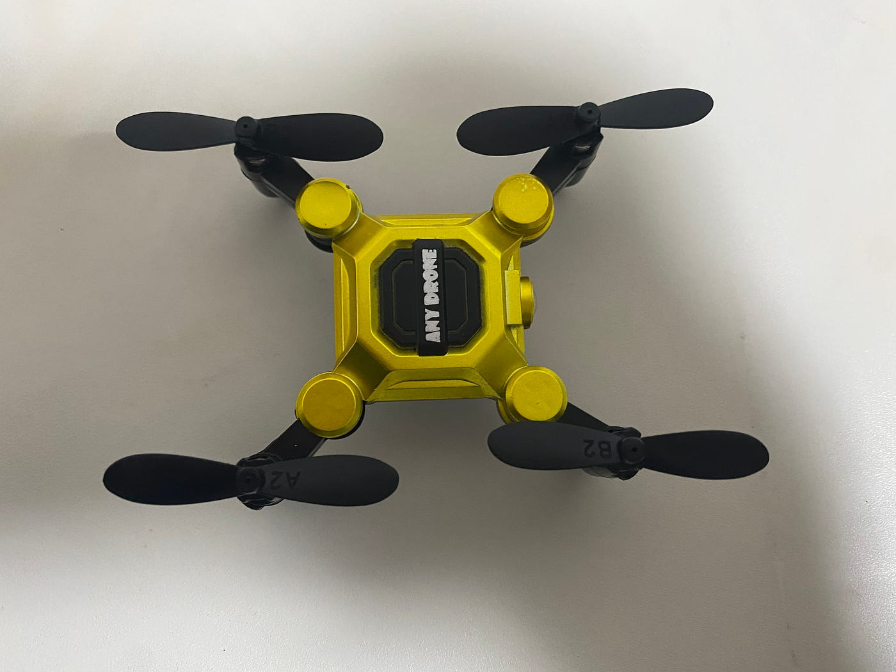
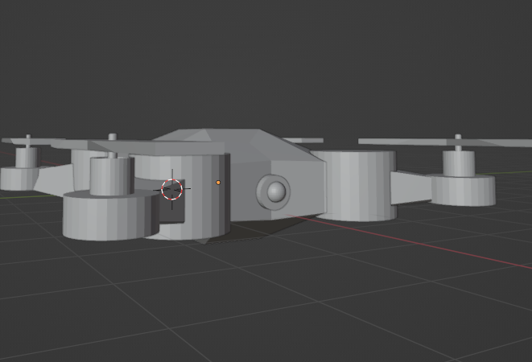
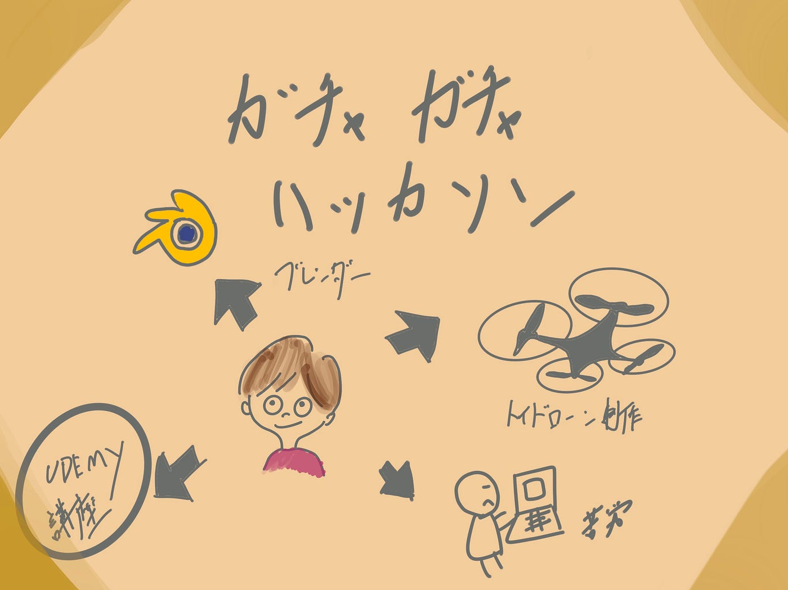

### ガチャガチャハッカソン

こんにちは。4年植松です。

古橋ゼミ5月の[ハッカソン](https://github.com/furuhashilab/README/issues/35)は「[ドローンモデリングハッカソン](https://github.com/furuhashilab/dronegacha)」でした。

> _**概要_**

- 一人１作品、既存のドローンを3Dプリンタ出力前提に多少デフォルメをして、3Dモデルを作成する

- モデリングツールは**Blender**を使うこと

- 作成した3Dモデルは .blender ファイル .stl ファイルの２種類を [GitHub レポジトリ](https://github.com/furuhashilab/dronegacha)にアーカイブ・公開する。

> **制作物選定**

今回私は昨年ドローン部として活動していた際に使用していたトイドローンをブレンダーで作成しました。

> **制作過程**

去年、ブレンダーを使ってドローンを作った経験からミラーの機能の存在を知っていたので今回もミラー機能を使いながら作成しました。

> **成果物**

> **よかった点**

大枠の形は合っているので見比べればなんとかこのドローンであることがわかる点です。

> **反省**

ミラー機能を使って作成してしまったため、ドローンのボディの凹みや模様を作ることができませんでした。

今後ブレンダーを使う機会は増えていく可能性がありますので食らいついていこうと思います。

> **グラレコ**

