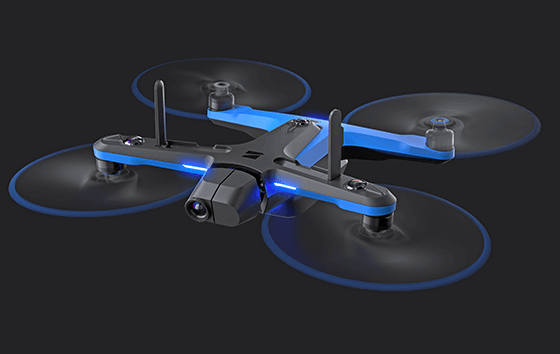
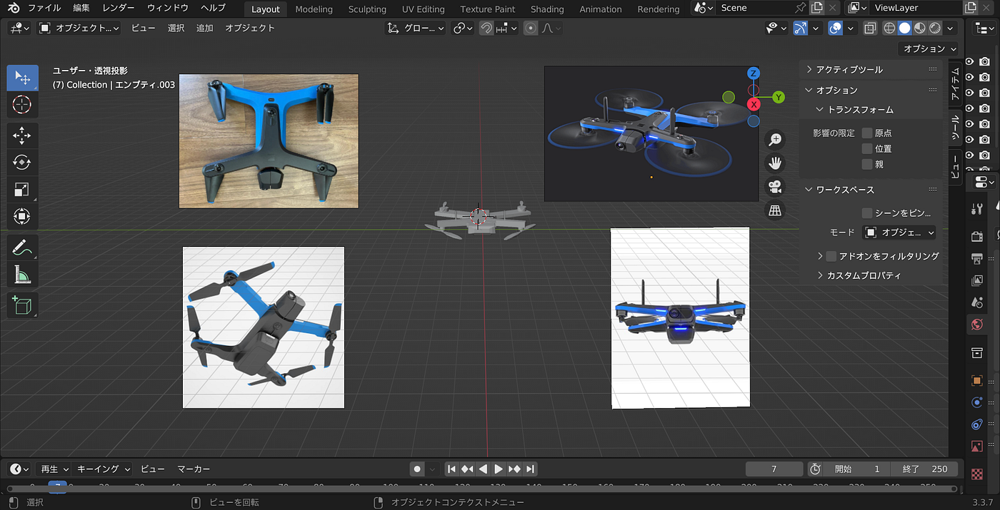
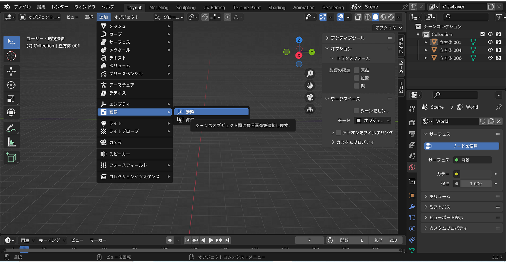
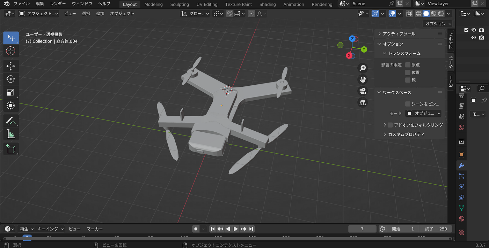
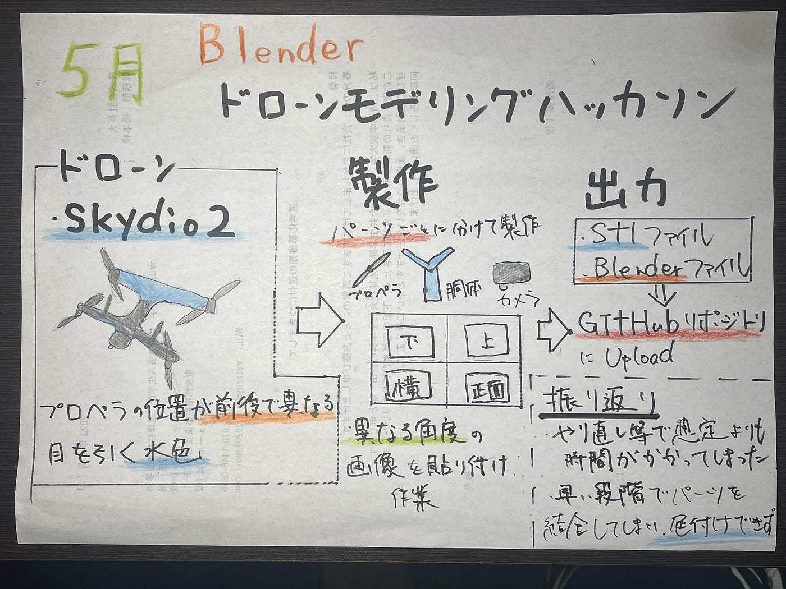

### 吉田 ドローンモデリングハッカソン

こんにちは！4年の吉田です。

古橋ゼミ5月の[ハッカソン](https://github.com/furuhashilab/README/issues/35)は「[ドローンモデリングハッカソン](https://github.com/furuhashilab/dronegacha)」でした。

> _**概要_**

- 一人１作品、既存のドローンを3Dプリンタ出力前提に多少デフォルメをして、3Dモデルを作成する

- モデリングツールは**Blender**を使うこと

- 作成した3Dモデルは .blender ファイル .stl ファイルの２種類を [GitHub レポジトリ](https://github.com/furuhashilab/dronegacha)にアーカイブ・公開する。

ということで今回僕は、モデルとして[Skydio2](https://www.jiw.co.jp/store/)というドローンを選びました！

・プロペラの位置が前は下側についており、後ろは上側についていて珍しかった点

・目を引く水色

が選定理由でした。

> _**製作_**

Blenderで製作する際はこのようにあらゆる角度の画像を複数枚表示させてパーツの形や位置に注意しながら取り組みました。

**複製**や**ミラー機能**等を使い、最終的に全パーツをくっつける方法で完成させました。

> _**完成品_**

**・[Stlファイル**](https://github.com/furuhashilab/dronegacha/blob/main/%E5%90%89%E7%94%B0_Skydio2.stl)

・**[Blender**](https://github.com/furuhashilab/dronegacha/blob/main/%E5%90%89%E7%94%B0%E8%88%AA_Skydio2.blend)

> _**振り返り_**

やり直しを何度か行ったりと、想定よりもかなり時間がかかってしまったが、なおやが送ってくれた動画やYouTube等で学習しながら進めることができました。

> _**反省点_**

・早い段階でパーツの結合を行ってしまい、色を付ける際にパーツごとに色分けができなくなってしまっていた。

> _**グラレコ_**

