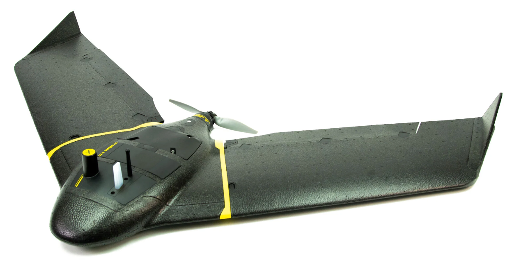
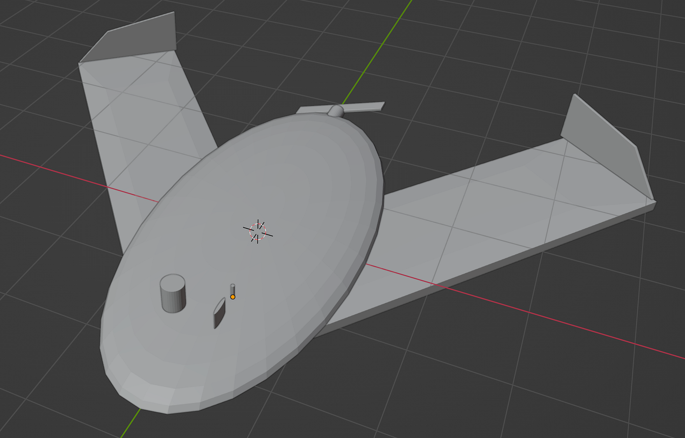

### 小澤 ドローンモデリングハッカソン

約1年前に出会い、一生触りたくないと思っていたブレンダーを使用し、ドローンのモデリングを行いました。

結果から言うと、モデルになったドローンに申し訳がないです。

今回、犠牲になったドローンは「Sensefly ebee x」です。

元々は、ファントムを作ろうと頑張っていたのですが、あまりに見通しが見えず、機体を変えることにしました。

そこで、横瀬の防災訓練で物凄く印象的だった「Sensefly ebee x」をモデリングすることにしました。

羽の先を三角にするべく、2時間格闘した結果できず、ただ風の抵抗を生み出すためだけの羽になりました。

情けない限りです。

> 振り返り

自分の機械音痴さに、ここ最近で1番イライラしました、、😅
何より、最初にナオヤが送ってくれた資料動画に気づかず、独自でやろうとしたのがバカでした。精進します。

[https://github.com/furuhashilab/dronegacha/issues/5](https://github.com/furuhashilab/dronegacha/issues/5)
