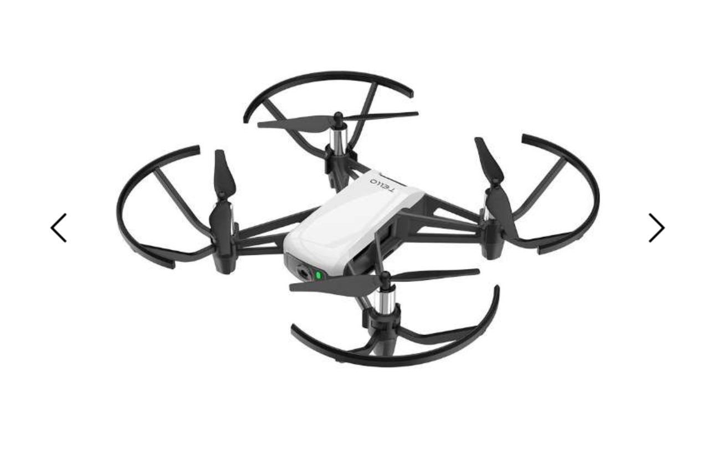
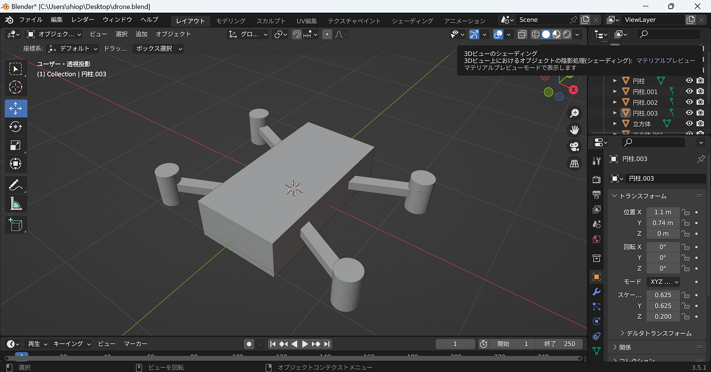
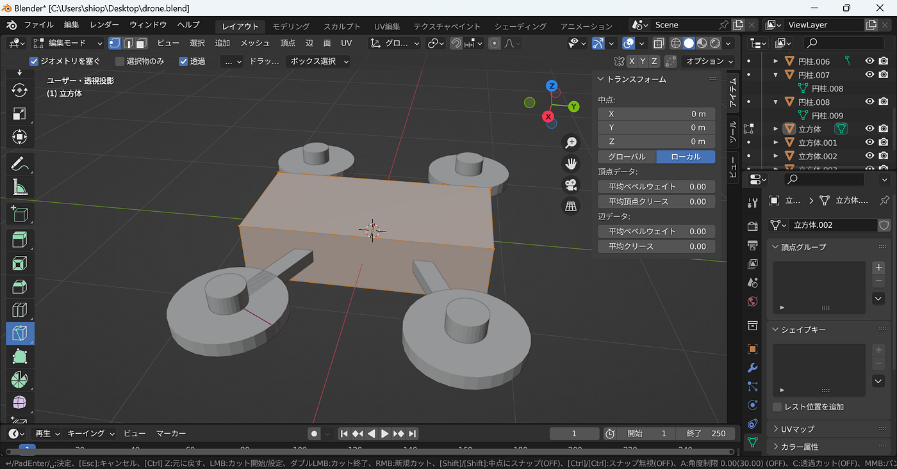
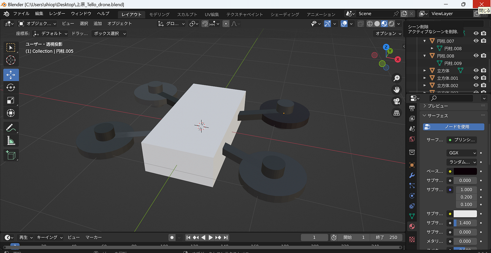

### 上原ドローンモデリングハッカソン

3年の上原です。5月のハッカソンはドローンのモデリングでした。

> モデル

検索して引っかかった画像の中から気に入ったデザインのものを選びました。選ばれたのは、[Ryze Tech Tello (JP) カメラ付ドローン 子供用 小型 空撮用 TELLO](https://www.biccamera.com/bc/item/6621239/?source=googleps&utm_content=001120048&utm_source=ssc&utm_medium=cpc&utm_campaign=UC_SK_5_camera&gclid=CjwKCAjw67ajBhAVEiwA2g_jEFgwOM5cWQU-qcjbkKISbmBuiNNHhhyTbvHkhAi1CgsHH79xee62vBoClH4QAvD_BwE)です。

> 製作

blenderを使うのは初めてだったので、なおやさんに共有していただいた動画を見ながら作っていきました。

しかし、図形の分割が上手くいきませんでした。円柱を分割して、プロペラを作っていくつもりだったのですが、切り離すことができませんでした。また、本体の角も削りたかったのですが、こちらも上手くいきません。

その結果、かなり雑なデザインになってしまいました。

> 反省

知識・技能不足により、納得のいく完成系までもっていくことができませんでした。もっと勉強します。

> 成果物

・[GitHub](https://github.com/furuhashilab/dronegacha)
