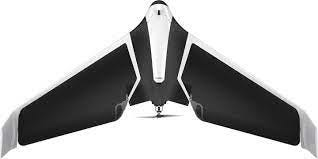
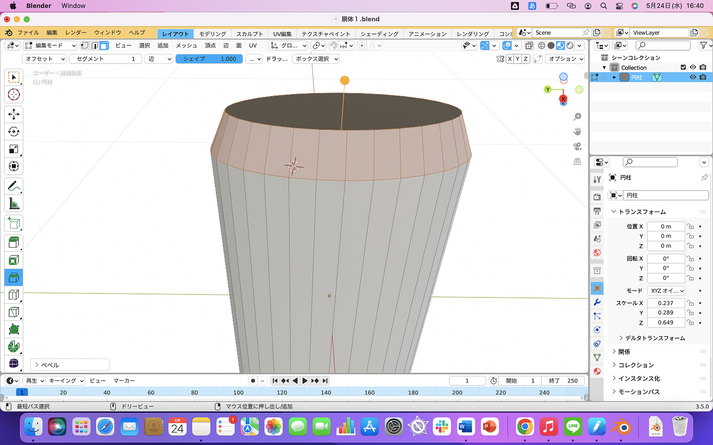
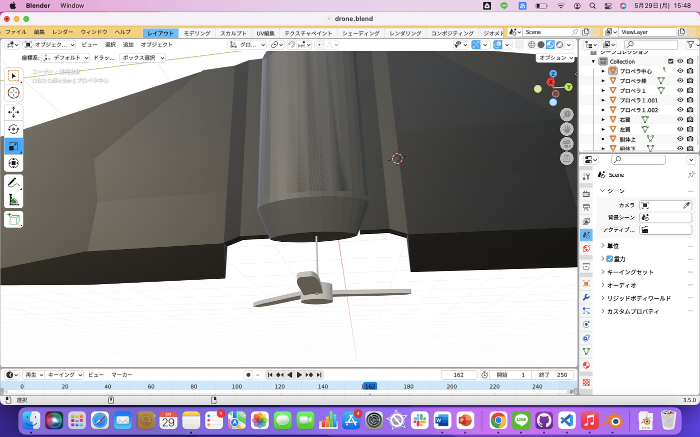
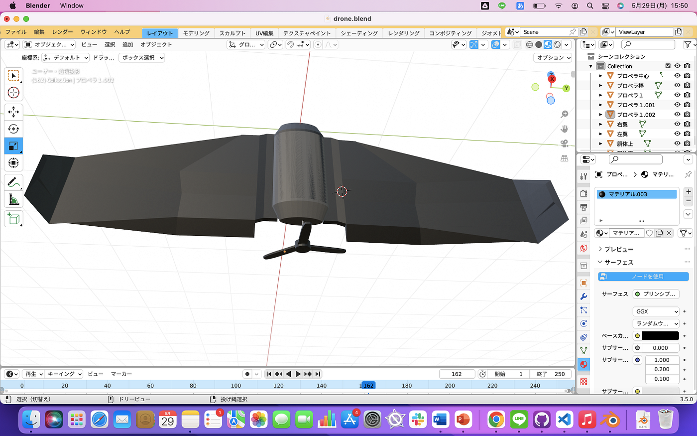
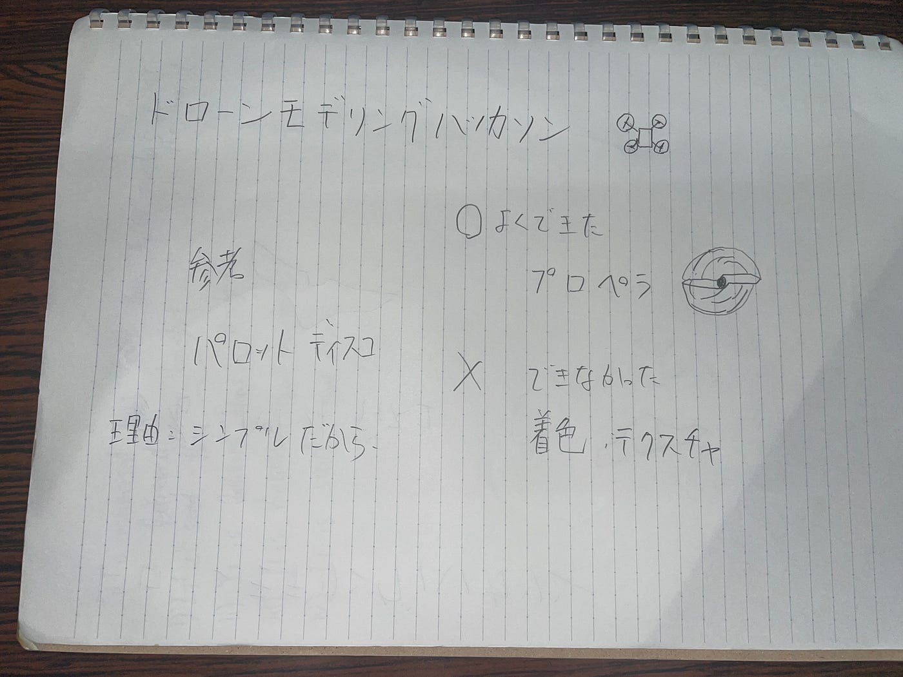

### 深水 ドローンハッカソン

３年の深水です。５月のハッカソンではドローンの３Dモデリングを行いました。

ドローンの形状は、形が気に入った [パロット ディスコ FPV](https://hitecrcd.co.jp/products/discofpv/) を参考にしました。

blenderの扱いがなかなか難しくて苦戦しました。

胴体は円柱を潰して、翼は立方体を変形して作りました。全体的に不格好になってしまいましたが、プロペラの部分だけは上手くできたと思います。

テクスチャを上手く描く事ができず、不本意ながら全部黒色で塗りました。

完成形

次の機会があったら、今度はテクスチャを上手く表現したいです。

グラレコ

