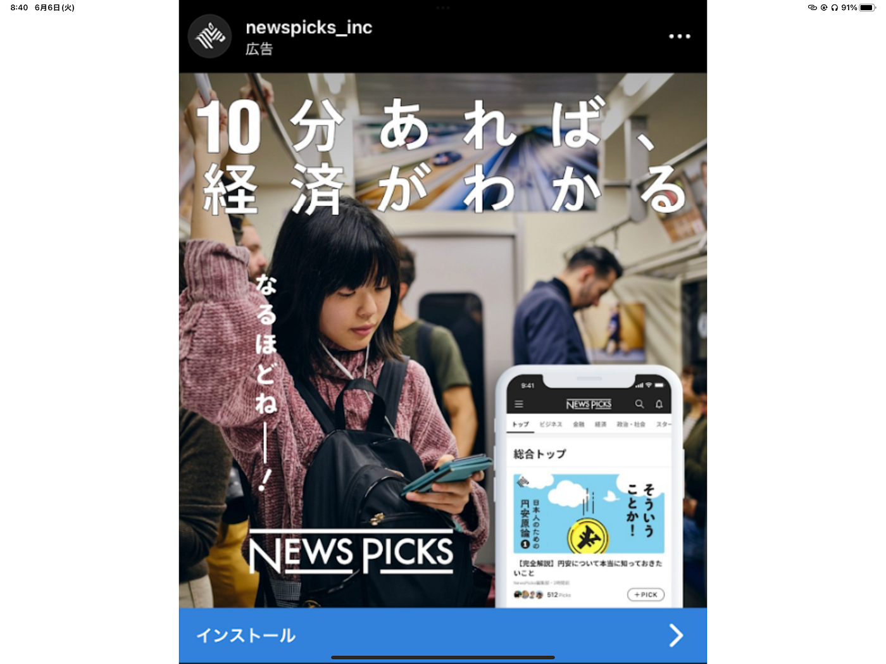
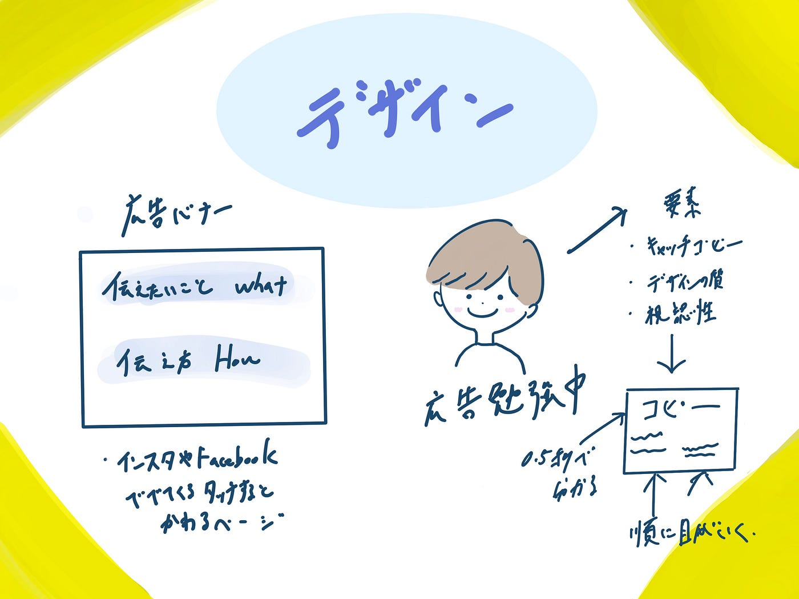

### 勉強始めました

こんにちは 4年植松です。

デザイン部として私はしばらくは広告のバナーデザインをしていこうと考えています。

良いインプットがないと良いアウトプットはできないということで今回は絶賛勉強中の私がいくつかよい広告バナーを作るためのTipsを共有したいと想います！直接バナーに関わることは少ないかもしれませんが知っておくだけで今後様々な場面で生きると思います！特に3年生は古橋ゼミやyouthmappersの紹介などで！！

> 広告バナーとは

Webメディア上で商品やサービスを宣伝するために、画像や動画、アニメーション等を用いた広告のことです。つまりよくインスタやFace bookを見ていると出てくるタッチすると別ページに遷移するもののことです。

ここで本やマーケターの方との壁打ちを通して勉強する中で結論づいた良いバナーの共通点をいくつか紹介します。

大きくわけて「良い」バナーと判断するには2つの軸があります。

**「伝えたいこと = WHAT」が良い**

**「伝え方 = HOW」が良い**

Newspicksのバナーを例にあげて説明します！

伝えたいこと

newspicksなら、カンタンに経済がわかる！

- newspicksは、「簡単さ」を推しています。日経などと比較しても簡単に経済が分かる、というのが推しポイントです。たしかに経済を学ぶべきだと思っているけどめんどくさいと思っている人は多いと思うので刺さる人は多そうですよね。

- 伝え方：バナーデザイン、コピーともに良い

- キャッチコピー：「10分あれば」がちょうど良いですよね。20分だと長いし、3分だと断片的な情報すぎます。また、「経済情報が理解できる」や「ニュースが理解できる」よりも「経済がわかる」のほうが情報がすぐに入ってくるし、「経済メディア」であるということも伝わります。つまり短いテキストでより必要な情報が詰め込めているということです。

- デザインも電車の中のシーンを見せることによって、「スキマ時間に学んでいる感」が直感的に理解できますね。このように何気なく目にする広告にはマーケターの様々な工夫があります！みなさんもこれから少し広告に注目して生活してみると新たな発見があるかもしれません。

