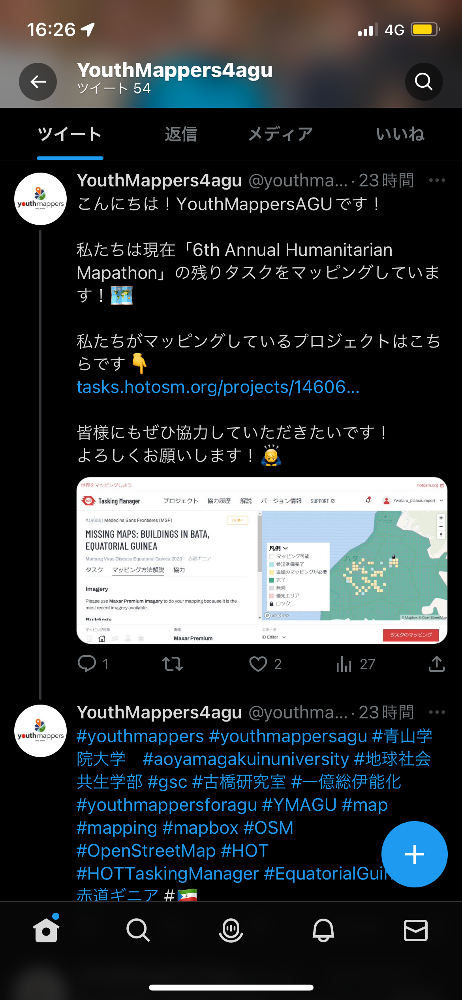
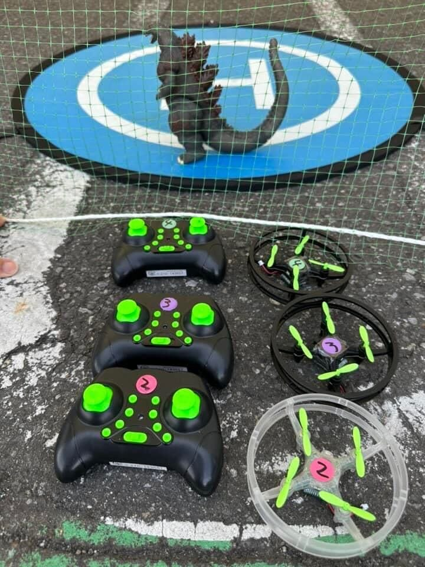
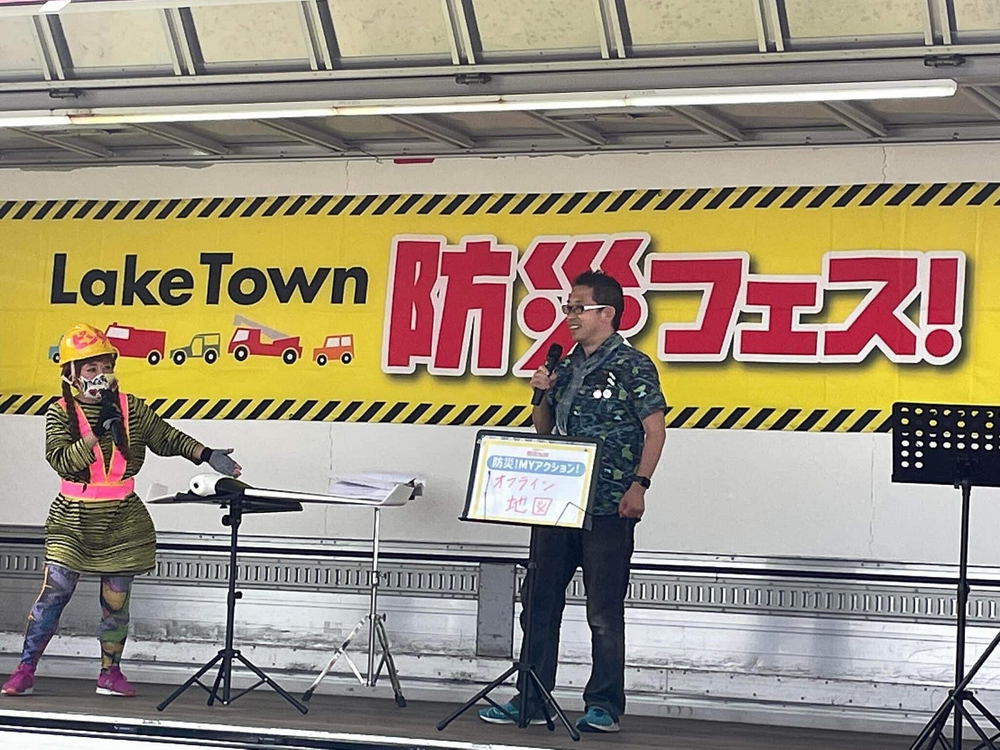
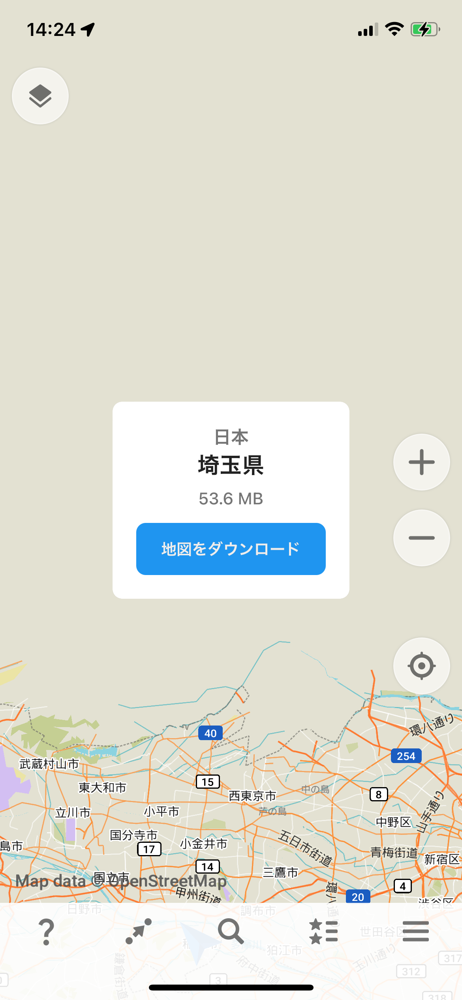
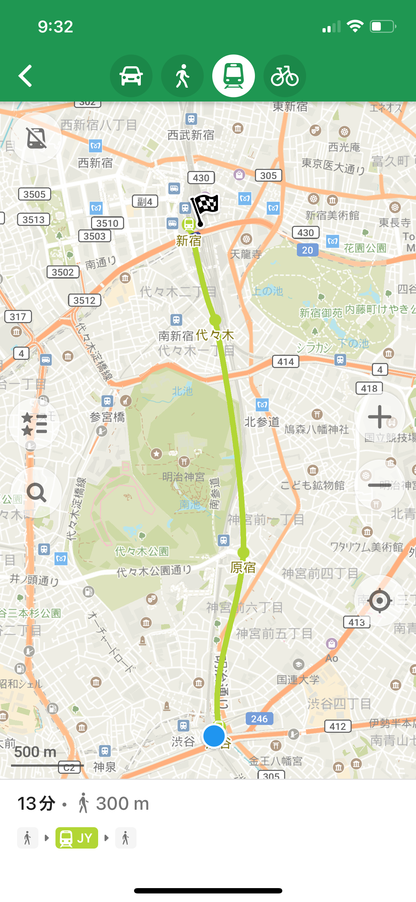
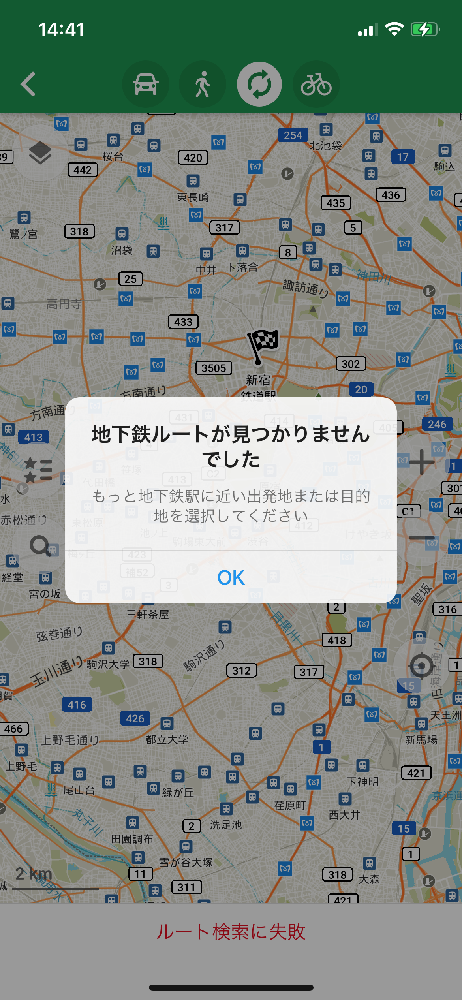
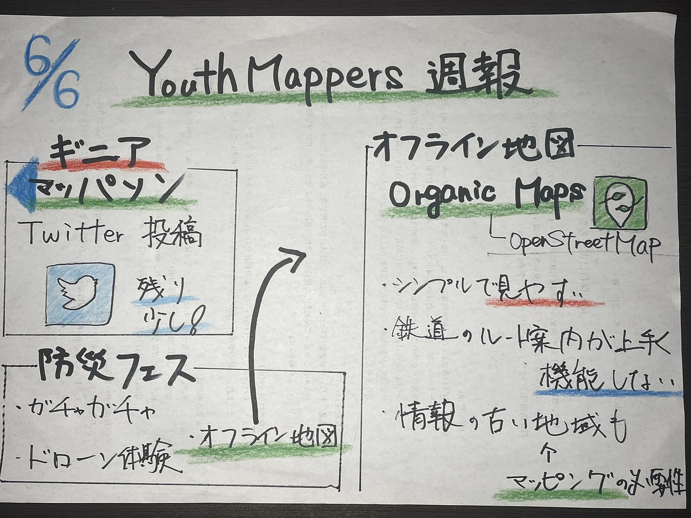

### 6/6 YouthMappers週報

こんにちは！4年の吉田です。先週の[ハッカソン](https://github.com/furuhashilab/dronegacha)を終えBlenderから解放され、再びいつもの活動に戻ってきました。

今週も引き続き4月のギニアの[マッパソン](https://tasks.hotosm.org/projects/14606/tasks/)の残りタスクを行いつつ、YouthMappersAGUの[Twitter](https://twitter.com/youthmappers4a1)でも[Instagram](https://instagram.com/youthmappers4agu?igshid=OGQ5ZDc2ODk2ZA==), [Facebook](https://www.facebook.com/youthmappers4agu/)と同様に情報の拡散、協力を募りました。(フォローまだの人はフォローといいねお願いします！)

また、個人の活動として、5月28日に越谷レイクタウンで行われた「[防災フェス](https://iko-yo.net/events/363698)」に行ってきました！初めて車で行ったのですが、日曜日で人も多く、また駐車場行き方もよく分からずレイクタウン周りを15分くらい彷徨ってました🤦‍♂️

ドローンバードのブースでは、ガチャガチャとドローン体験ブースが設けられてました。

ガチャガチャは「[ジオ展](https://www.geoten.org/)」と同じように缶バッチが主に入ってました！

一方ドローン体験は、子どもがメインでしたが、大人の方も楽しんで操縦していたのが印象的でした。

また、防災フェスのステージで古橋先生が登壇した際、有事の際に**オフライン地図を活用することの重要性**をお話ししていたので早速オフライン地図である[ Organic Maps](https://apps.apple.com/jp/app/organic-maps-offline-hike-bike/id1567437057)をダウンロードして、使ってみました。

Organic Mapsは[OpenStreetMap](https://www.openstreetmap.org/#map=5/39.634/143.481)を採用しており、見たい地域(都道府県)をあらかじめダウンロードしておくことで、オフライン環境下でも見ることが可能となっています。お店や公園、駅などの名前は詳細に表示されており、非常にシンプルで見やすかったです。
(自宅周辺があまりマッピングされていないことに気がついたので、ついでにマッピングもしました)

**ルート案内機能**もあり、車や徒歩でのルート案内は問題ありませんでしたが、**鉄道**の機能を使うと、「地下鉄ルートが見つかりません」と出たり、徒歩のルートが出たりなどしました。
(自分の最寄り駅から新宿駅ではルートが出なかったですが、渋谷から新宿はルートが出ました。

また、車の渋滞情報やハザードマップ等のマップレイヤーがなかったため、レイヤーが拡充されればもっと良いものになるのではないかなと感じました。

しかし、現在地も表示され、オフライン環境下でこれだけ見やすい地図があるのは(通信制限時でも)非常に便利だなと感じました。ただ、地域によっては飲食店の情報が古く、Google Mapに劣る部分があったので、OpenStreetMapで随時情報を更新していかなければなと改めて感じました。

同じオフライン地図である[MAPS.ME](https://apps.apple.com/jp/app/%E3%82%AA%E3%83%95%E3%83%A9%E3%82%A4%E3%83%B3%E5%9C%B0%E5%9B%B3-gps%E3%83%8A%E3%83%93-maps-me/id510623322)も使ってみました。

こちらの方が機能数が少し多かったですが、大きく異なった部分はありませんでした。

どちらが使いやすいかは個人によるのかなと。

[Organic Maps](https://apps.apple.com/jp/app/organic-maps-offline-hike-bike/id1567437057)、[MAPS.ME](https://apps.apple.com/jp/app/%E3%82%AA%E3%83%95%E3%83%A9%E3%82%A4%E3%83%B3%E5%9C%B0%E5%9B%B3-gps%E3%83%8A%E3%83%93-maps-me/id510623322)をまだダウンロードしていない方は是非ダウンロードして使ってみてください！

> _**グラレコ_**

