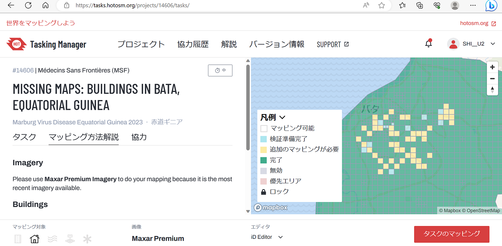
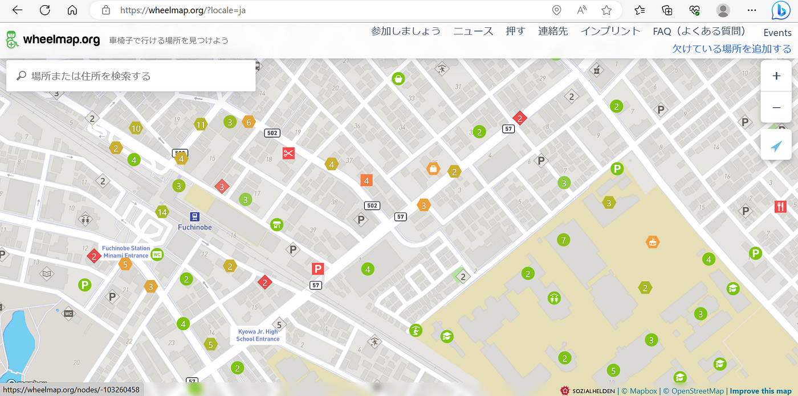
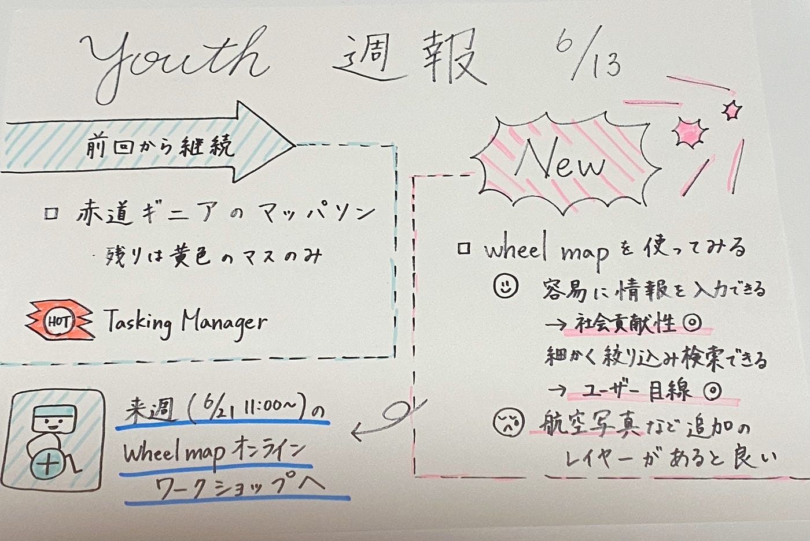

### 6/13 Youth週報

こんにちは。3年の上原です。梅雨入りしてじめじめとした日が続いていますが、皆さんいかがお過ごしですか？私は洗濯した服を外に干せなくて困っています。

さて、YouthmapparesAGUの今週の活動は主に２つでした。
①マッパソンに引き続き取り組む
②来週のイベントに向けてWheelmapを使ってみる

> マッパソン

4月から継続して行っている[赤道ギニアのマッパソン](https://tasks.hotosm.org/projects/14606/tasks/)ですが、ついに白タスクがなくなり、黄色タスクのみとなりました！タスク完了の日も近そうです。

> Wheelmap

[Wheelmap](https://wheelmap.org/?locale=ja)とは車椅子ユーザー向けの地図です。Youthのメンバーが試しに使ってみました。良い点として、オープンな地図であるため情報を入力するだけで誰でも簡単に社会貢献ができるという点、条件を細かく絞り込んで検索できるというようにユーザー目線で作られているという点が挙がりました。一方で、航空写真などの追加のレイヤーがあればもっと良くなるという意見もありました。

来週（6/21）には、Wheelmapオンラインワークショップが開かれます。プレゼンに向けて準備を進めていきたいと思います。

> グラレコ

