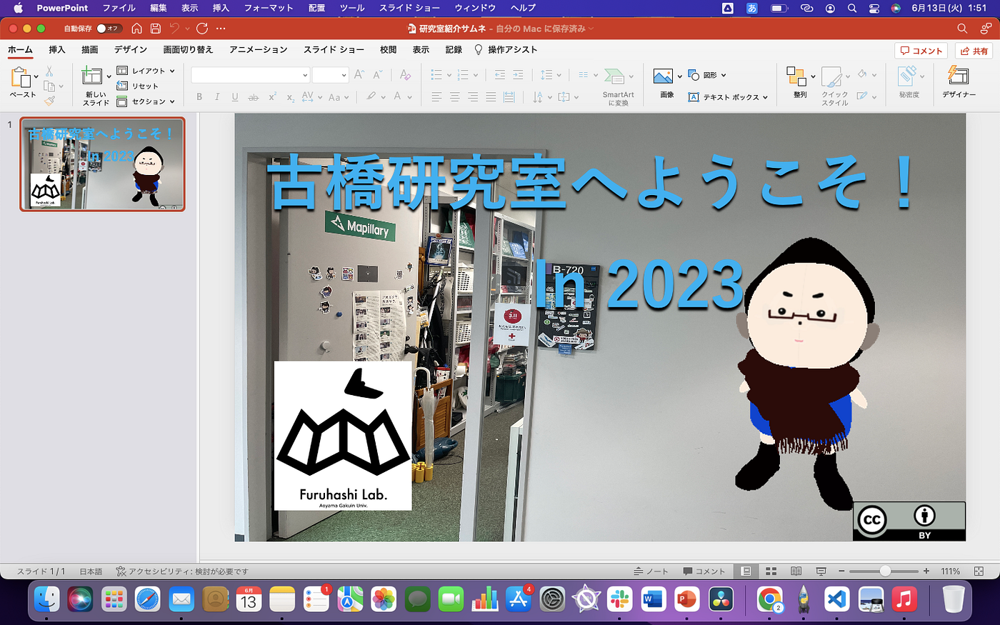
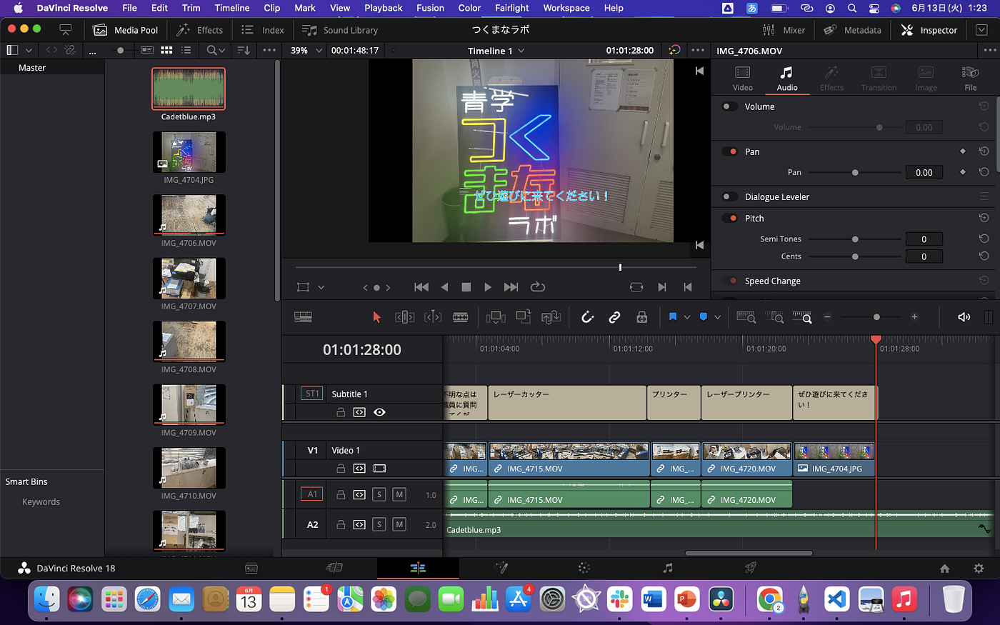
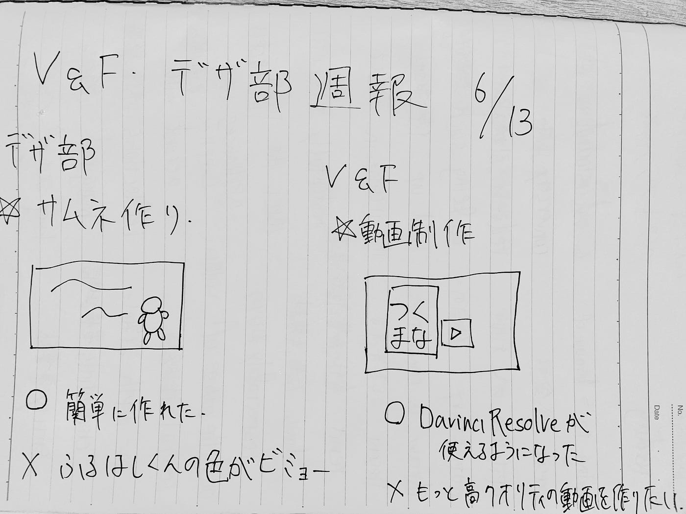

### デザ部 V＆F 週報

こんにちは、3年の深水です。今週はデザイン部と動画部の両方で活動したのでまとめて週報にしました。

> _**目次_**

①デザイン部 →紹介動画のサムネ作り

②動画部→動画の制作練習

> _**研究室紹介動画のサムネイル制作_**

去年と一昨年とは少し違うものにしたいと思い、[ふるはしくん](https://github.com/furuhashilab/Gachagacha_Hackathon_2023_-teamA)を載せたものを[powerpoint](https://www.microsoft.com/ja-jp/microsoft-365/powerpoint)を用いて作ってみました。ふるはしくんのデータは、先生が[Sketchfab](https://sketchfab.com/feed)にあげていたものをダウンロードして使用しました。

実際に使用するかどうかは他の三年生と相談したいと思います。

> _**動画制作の練習_**

今まで動画を制作したことがなく、[Davinci Resolve](https://www.blackmagicdesign.com/jp/products/davinciresolve)を使ったことがなかったので、練習を兼ねて[つくまなラボ](https://www.aoyama.ac.jp/post05/2023/news_20230519_01)の簡単な紹介動画を作ってみました。

撮影は[iPhone12](https://www.apple.com/jp/iphone-12/specs/)を使用し、BGMは[DOVA-SYNDROME](https://dova-s.jp/)というサイトからダウンロードして使用しました。

大まかな機能の使い方が身についたので良かったです。

まだゼミ内公開の許可しか頂いていないので、制作した動画はYoutubeの限定公開にしています。

> _**グラレコ_**

