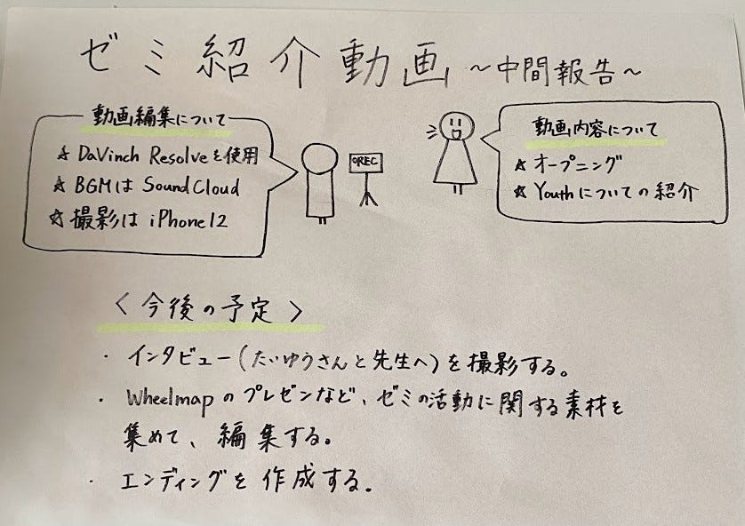

### 古橋ゼミ紹介動画～中間報告～

こんにちは、3年の上原です。

今月のハッカソンは、古橋ゼミの紹介動画づくりです。3年生メンバーが中心となって作成していきます。

> ルール

・映像作成は3年生のみ
・30秒～2分程度に収める
・[DaVinch Resolve](https://www.blackmagicdesign.com/jp/products/davinciresolve/)を用いて編集する
・資料を[GitHub](https://github.com/furuhashilab/welcome2furuhashilab2023)に残す

> 進捗報告

サムネとオープニングの撮影、YouthMappersAGUの紹介の撮影を行いました。撮影はスマホ（iPhone12）を用いました。全体が2分程度の尺しかないのでどれくらいの量を話すべきか、構成を逆算しながら考えるところが難しかったです。また、研究室の中だとスペース的に撮影が難しかったので撮影場所は研究室の扉の前となっています。

また、動画編集は深水くんが担当しています。編集ソフトはDaVinch Resolveを、BGMは[SoundCloud](https://www.bing.com/ck/a?!&&p=7de3e7e78a8b181dJmltdHM9MTY4NzEzMjgwMCZpZ3VpZD0xZDA5YWViZi02ODMwLTY1MTktM2FiYy1iZWI4NjllMjY0NjkmaW5zaWQ9NTIyOQ&ptn=3&hsh=3&fclid=1d09aebf-6830-6519-3abc-beb869e26469&psq=soundcloud&u=a1aHR0cHM6Ly9zb3VuZGNvdWNoLnNvdW5kY2xvdWQuY29tLw&ntb=1)から[Happy](https://on.soundcloud.com/1bchssHA2kcigfyN9)を使ったそうです。音楽のライセンスは、free to useとNo copyrightsのタグが付いていました。

中間報告用の動画はこちらです。[https://youtu.be/IAh3n1S-bhA](https://youtu.be/IAh3n1S-bhA)

> 今後の予定

古橋先生とたいゆうさんに、それぞれインタビューをしている様子を撮影する予定です。また、ゼミの活動が分かるような写真や動画（例：21日のWheelmapのプレゼンなど）を集めて編集してきます。エンディングも制作するつもりです。

> グラレコ

