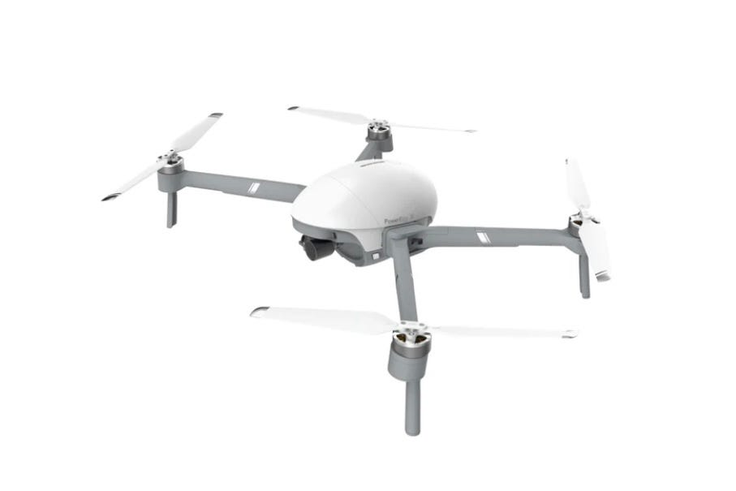
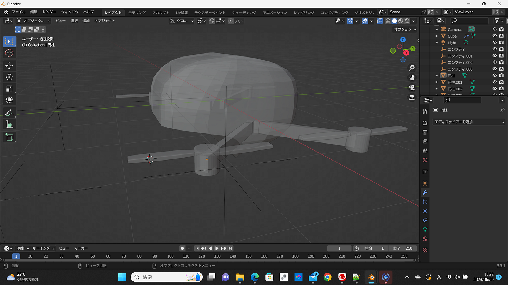

### 石井 ドローン成果発表パート２

こんにちは！3年の石井です。

前回の授業に参加できず、今回も遅れての発表となってしまいました。

製作したものが消えてしまう事件が発生してから１週間、あれこれ試してみましたが、どうにもならなかったので、１から製作しました。

【モデル】

モデルは前回と同じです。

[PowerEgg X](https://store.jp.powervision.me/products/powereggx) ([PowerVision](https://store.jp.powervision.me/))

【成果】

あまり納得いくものができず、まだまだ勉強不足だと感じました。もっといろいろ触ってみて、技術向上を目指していきたいと思います。

【グラレコ】
