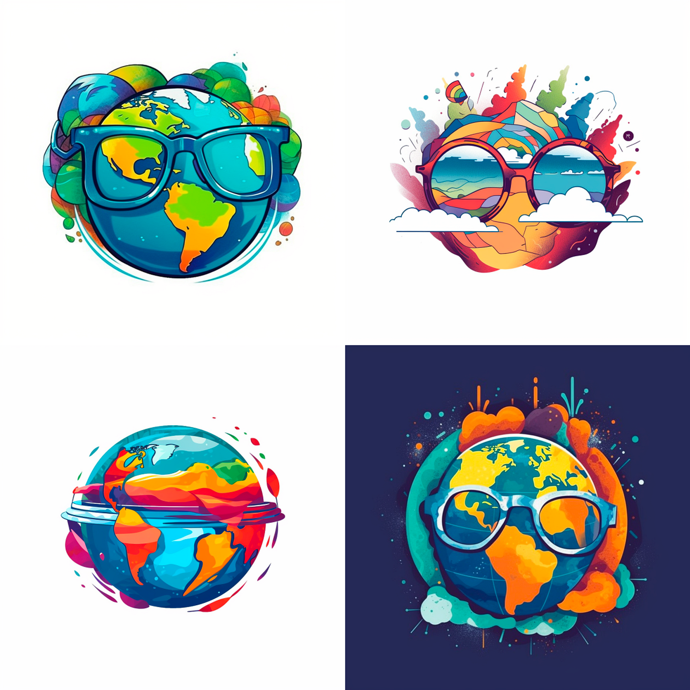
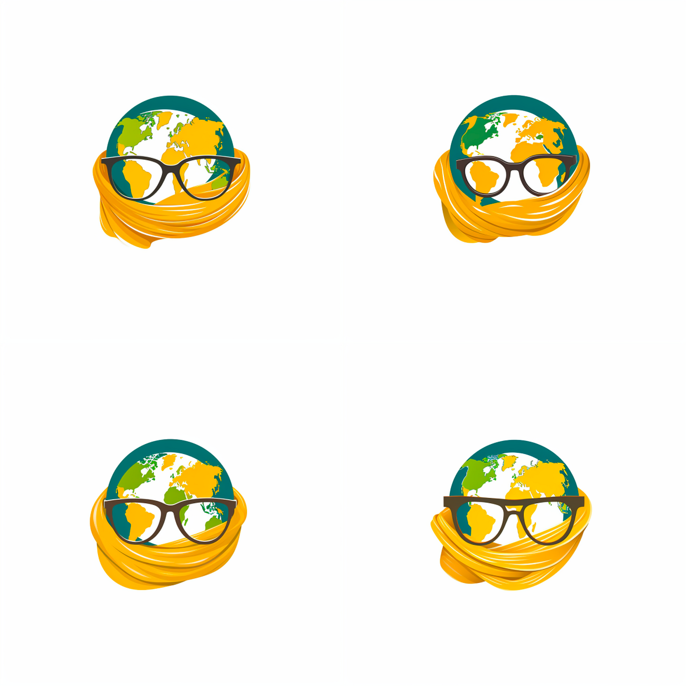
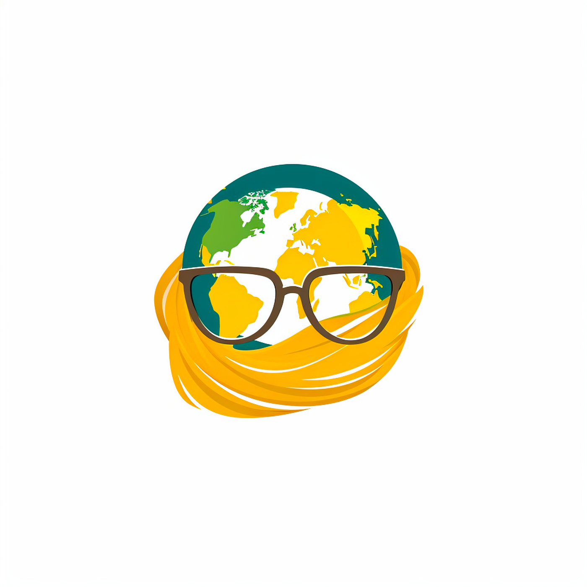
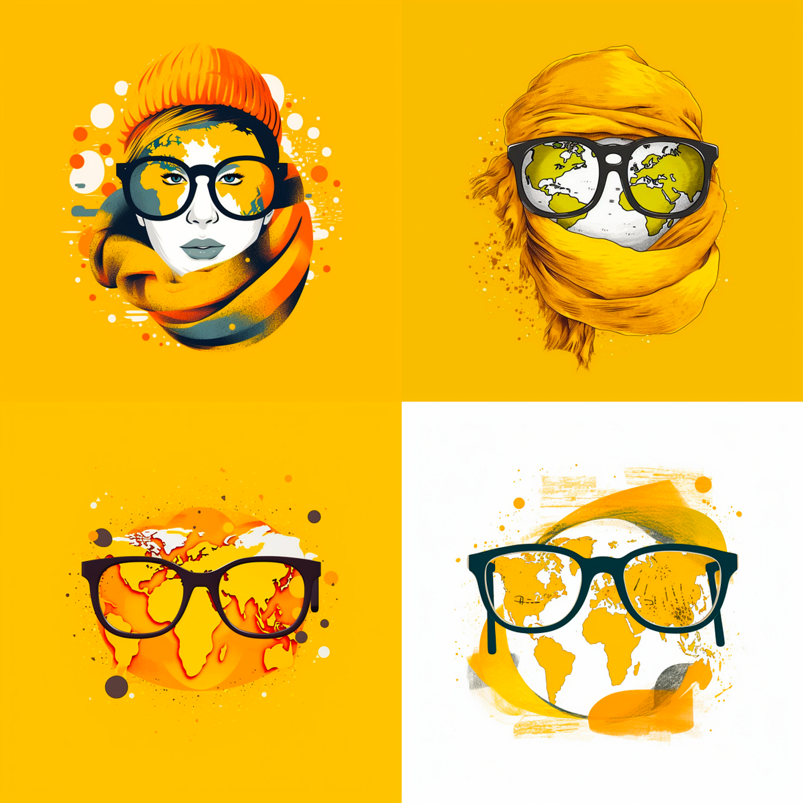
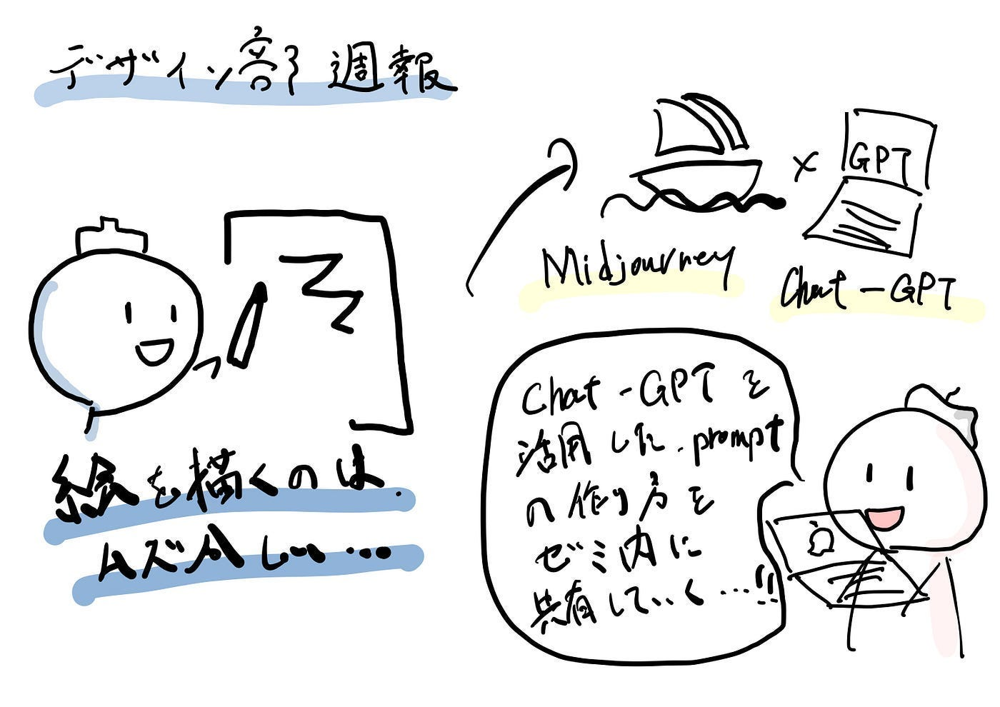

### デザイン部 週報

今回は、画像生成AIの活用をメインに考えている自分が、今後何を目的にするかについても含めて、記載していきたいと考えています。

今自分の中で考えている、最も純粋な想いは、「自己表現として、なんか自分が思い描いている景色とか、配置とかをAIを活用して描けるようになりたい」です。アホっぽい内容ですが、画力が壊滅的な自分にとっては、結構大事なことです。

その活動を、「ゼミでどう活かしていくのか」は、現在まだ考え中です。しかし、その時欲しい素材を、著作権フリーで生成できる技術がゼミ内で共有できれば、ゼミとして大きな成長になるのではないかと考えています。

> _使用するソフトについて_

使用するソフトは、現状使ってみて1番使いやすく、クオリティも高かった「Midjourney」を使用しよと考えています。また、いろいろ触ってみて自分でpromptを作るより、Chat-GPTを使った方がクオリティが高く、何より自分の想像の範囲外の絵の構成を考えるため、課金してGPT4を使っていきたいと考えています。

取り敢えずは、どんな感じの絵が描けるのか知るためにも、思いついた絵の構成をGPTに打ち込んでpromptを生成し、絵を作りまくったり、他のユーザーの良い作品・promptを見て回っていました。

その後、「ゼミ」を表す絵だったり、ロゴだったりを生成しようと考えたのですが、主体が抽象的すぎて、まだ自分には上手くできず、断念しました。

そこで、まずは主体が はっきりしている「古橋先生」に関する絵・ロゴを試しに生成してみました。

Design a captivating logo that artistically combines the elements of geography with the signature glasses and scarf of Taichi Furuhashi, reflecting his contributions to geographic information science (GIS) and mapping. Start with an illustration of the Earth, depicted as a globe with vibrant colors and geographic contours. Make sure the globe is semi-transparent, symbolizing the openness and accessibility of geographic data. Within this globe, create an abstract portrayal of Taichi Furuhashi’s glasses. The frames should resemble latitude and longitude lines, while the lenses are made up of intricate networks of lines and nodes, representing GIS data layers. Around the globe, design a scarf that looks like it’s embracing or flowing around the Earth. The scarf should be depicted with patterns similar to topographic maps and should be in rich, earthy colors. Incorporate wind lines to give the scarf a sense of motion, symbolizing the dynamic nature of the open mapping community. Place the name ‘Taichi Furuhashi’ below the globe in a modern font, with a tagline such as ‘Mapping the World with Openness and Innovation

こちらがGPTが打ち出したpromptで、生成されたのが以下の画像です。
（すみません、Midjourney内にめっちゃ名前出しちゃいました）

もっと先生感を出すには、なんとなくイメージカラーである黄色と、スカーフ要素足りないなあと思い改良したプロンプトが以下です。
Design an inspiring logo that combines geography, Taichi Furuhashi’s signature glasses and scarf, with a strong emphasis on yellow, symbolizing optimism, enlightenment, and creativity in his contributions to geographic information science (GIS) and mapping. Begin with an illustration of the Earth depicted as a radiant globe with gradients of yellow and golden hues, adorned with subtle geographic contours. Inside this globe, artistically incorporate Taichi Furuhashi’s glasses with frames resembling latitude and longitude lines. The lenses should be composed of interwoven networks of lines and nodes in golden colors, representing the rich tapestry of GIS data layers. Surround the globe with a flowing scarf that embraces the Earth. The scarf should have topographic map patterns but rendered in various shades of yellow and gold, symbolizing the precious value of geographic knowledge. Add gentle wind lines around the scarf to depict motion and dynamics. Place the name ‘Taichi Furuhashi’ below the globe in an elegant font, with a tagline such as ‘Illuminating the World through Open Mapping’. Use a rich golden color for the text to match the overall theme.

できたのがこんな感じです

見る人が見れば分かるという感じになりました。

他のやつはこんな感じで、右下のとかオシャンティーです。

とにかく、やっぱりテーマの具体性があれば、それなりのpromptは作れるなと思いました。
今後は、抽象度の高いテーマをどう上手く表現するか、研究していきたいと思います！

グラレコ

