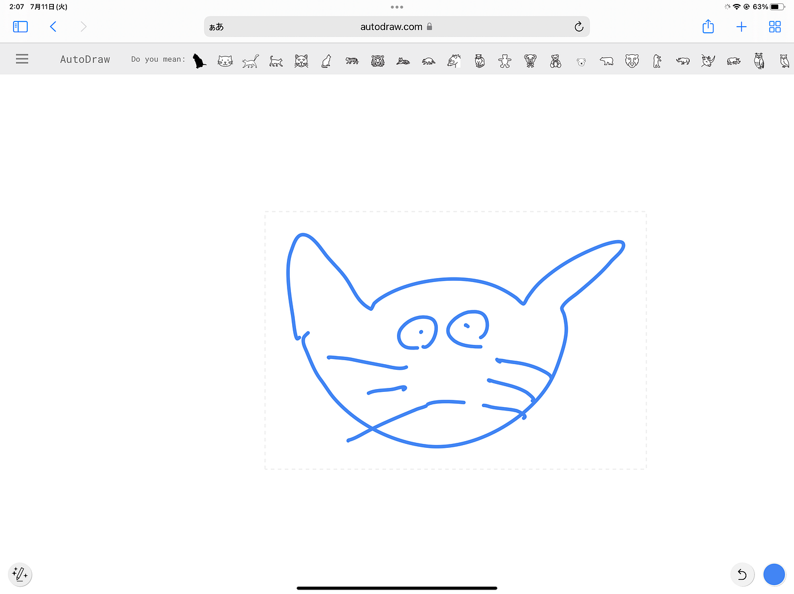
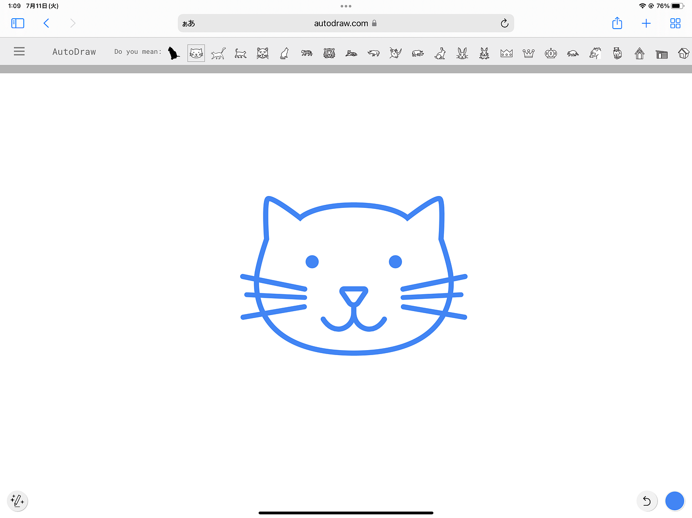
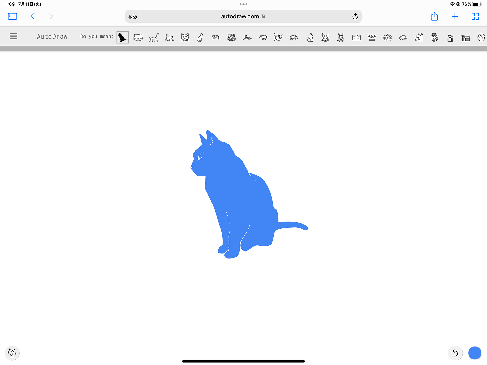
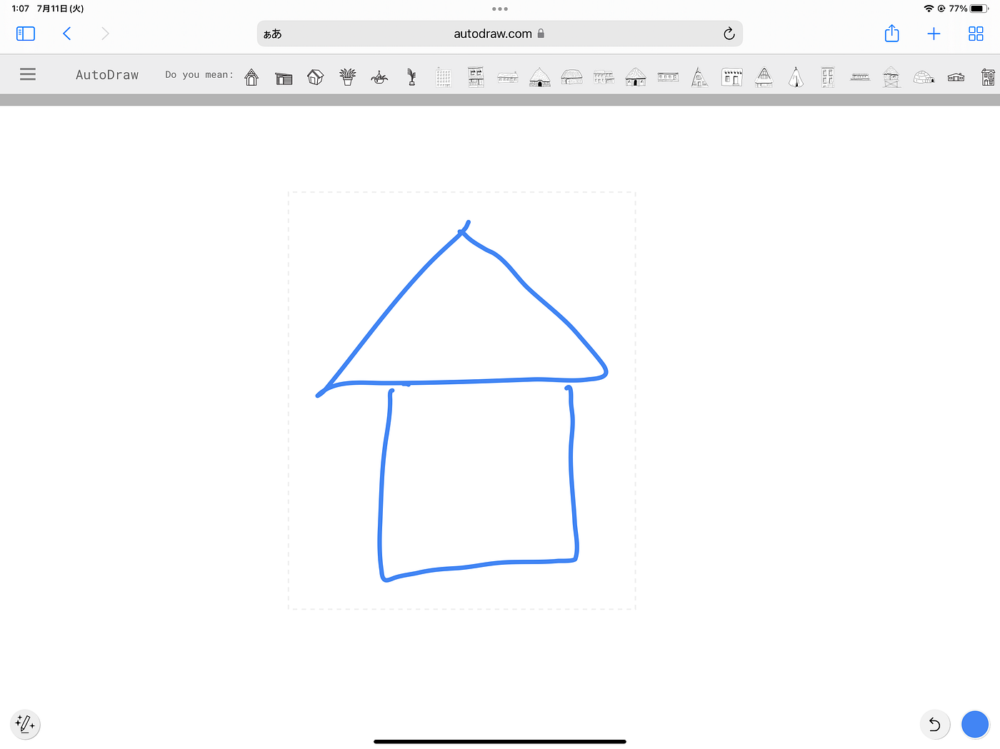
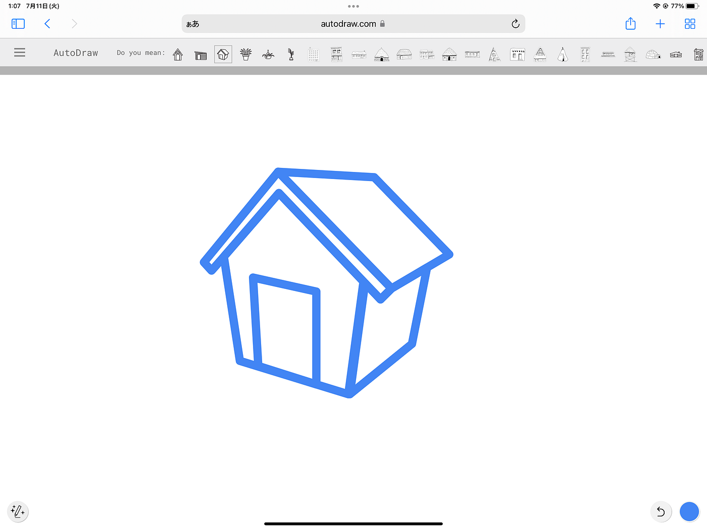
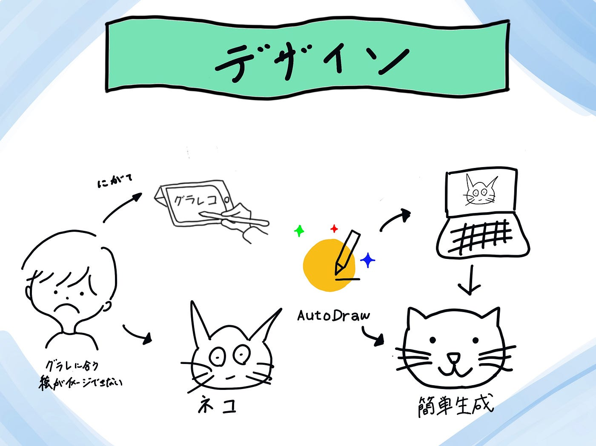

### デザイン部週報

こんにちは ４年植松です。最近PCモニターを導入し、作業効率が爆あがりしました！パソコンカタカタが楽しい楽しい。

さて今日は先週担当した４年小澤に引き続きデザイン部、古橋ゼミで使えそうなAIツールの紹介をします。

**古橋ゼミと言ったらグラレコ！**

> グラレコは

ミーティングでの議論内容や提案を、絵や図形などのグラフィックを用いてまとめる手法です。ミーティングの中から重要となる要素をビジュアル化することで、参加者によりわかりやすく共有できるのが特徴です。

私たち古橋ゼミ生は毎週週報の中でグラレコを書いているのですが絵が特段得意ではない学生にとっては複雑なものを簡単でわかりやすい絵におとしこむことが非常に難しいです。そんな悩みを解決する神ツールを発見したので共有します！

> Auto Draw

[Auto Drow](https://www.autodraw.com/)とはGoogleが提供している無料の自動描画ツールです。 通常のイラストツールとは異なり、AI（人工知能）を利用してユーザーが引いた線に対応したイラストを表示するのが特徴です。

使い方は簡単自分が書きたい絵を大雑把にかくだけでAIが自動で認識し、イラストの候補をあげてくれます。

実践

このようにテキトーに猫の絵を書き込むと

これらの画像が候補としてあがります！すごい！

もう１枚！

家の絵

このように簡単なラフを描くだけでかなりわかりやすい絵のデザイン候補を提供してくれます！私は今までは『〜の絵 イラスト』などと検索して候補を探していましたがその手間が省けるようになりました。

今後もAIツールを使って作業の効率化を行い、何かいいものを発見したら共有します！

【グラレコ】

