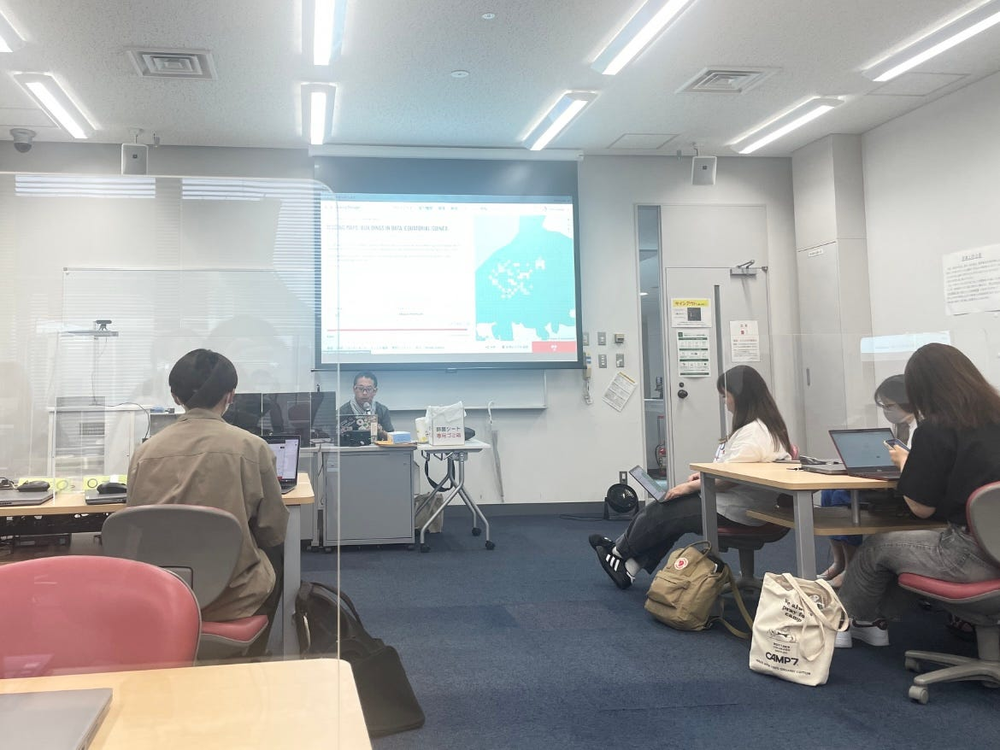
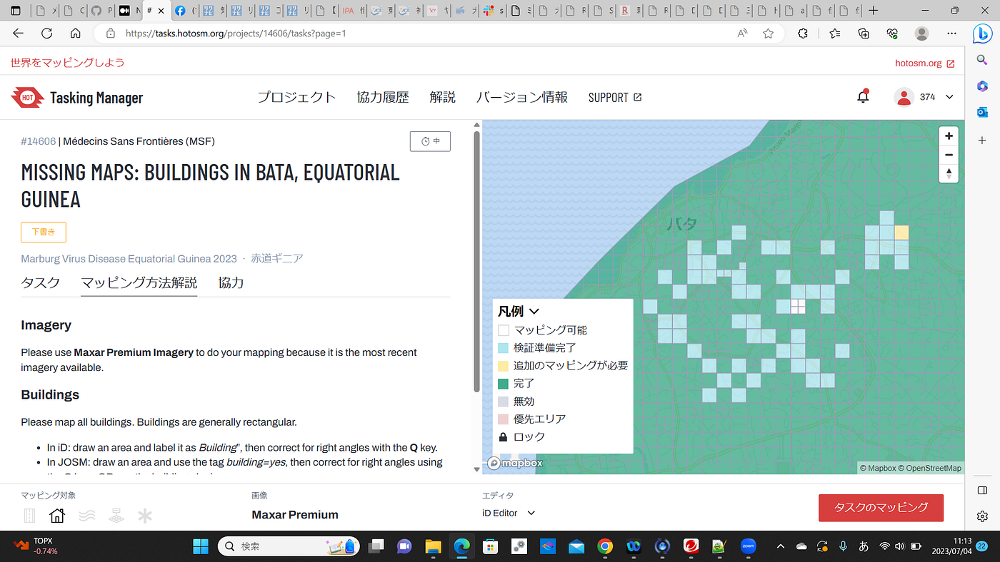

### Youth週報

こんにちは、3年石井です。

今週は、マッピングの残りタスクを進めました。

ギニアのマッピングは「空間情報システムⅠ」でだいぶ進んだそうです。ありがとうございます！

また、６月21日にはWheelmapのイベントがありました。

私たち3年生が主体となった初めてのオンラインハッカソンで、ドキドキしていましたが、無事終了いたしました。

イベントを通して、改めてマッピングの重要さを知ることができました！

【グラレコ】
