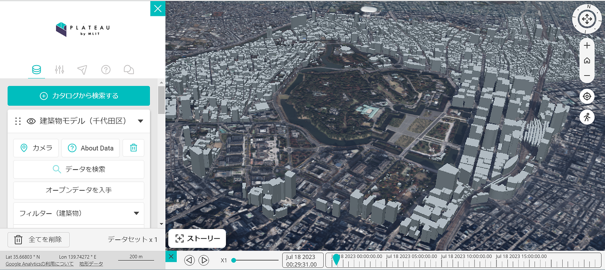
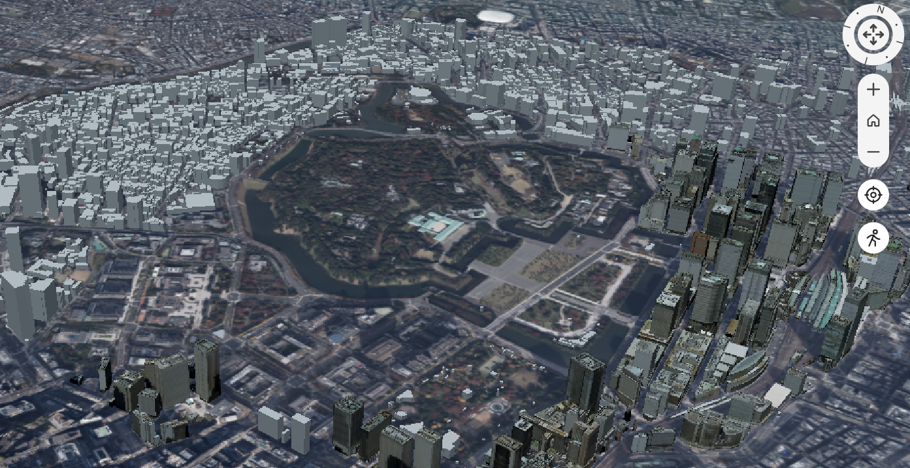
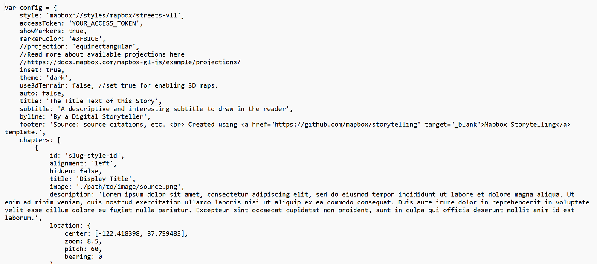

### Youth週報 7/19

こんにちは！4年の吉田です。

夏の暑さに例にもれずやられています…

さて、7月のゼミハッカソンでは[Re:Earth](https://reearth.io/ja/)を用いたストーリーテリングに取り組んでいるチームのメンターとしていろいろアドバイスするという変則的なものとなっています。

各々Re:Earthという慣れないツールの中、頑張っています！

> _**ストーリーテリング_**

今やストーリーテリングは様々なサイト・アプリで作ることができます。

せっかくなので今回は、そんなストーリーテリングができるサイト(Re:Eath以外)を紹介していきます！

1. **[Google Earth**](https://www.google.co.jp/intl/ja/earth/)

個人的に一番初心者に向いているのがこのGoogle Erathのストーリーテリング機能だと感じています。

「目印を追加」で説明したい場所に目印を置くと、タイトルや説明文、写真を貼る箇所が自動的に出てきます。

細かなオプション等の機能は少ないですが、非常に初心者に優しくなっています。

ストーリーテリングやってみたいという人はGoogle Earthから始めてみるのもいいかもしれません。

[過去の吉田の作品](https://earth.google.com/web/@44.80725973,-23.32984292,71.90051504a,4145278.58356511d,30y,0h,0t,0r/data=MikKJwolCiExTFRwWWtrLVZtRlpiOW91WEEwVk5XR21uMFJHbUFRV18gAQ)

**2. [PLATEAU View**](https://plateauview.mlit.go.jp/)

国土交通省が主導する日本全国の3D都市モデルの整備・活用・オープンデータ化プロジェクトである「[PLATEAU](https://www.mlit.go.jp/plateau/)」のWebサイト内の[PLATEAU view](https://plateauview.mlit.go.jp/)にもストーリーテリングの機能が搭載されています。

PLATEAU Viewの魅力は何といっても3D建物モデルが表示できる点です。

LOD1という箱状の3Dモデルから、一段階上がったLOD2という屋根の形状が表現された3Dモデル(一部テクスチャあり)が表示できるため、他のサイトのストーリーテリングよりも視覚に訴えかけられるような作品ができるでしょう。

**3. Mapbox Storytelling**

僕が現在インターンシップに行っている[Mapbox](https://www.mapbox.jp/)にもストーリーテリングの機能があるんです！

ストーリーテリング機能を使うには、まずMapbox Storytellingの[GitHub](https://github.com/mapbox/storytelling)にいき、「Code」→「Download Zip」でZipファイルをダウンロードし、解凍します。

詳しい方法は[GitHub](https://github.com/mapbox/storytelling)の方に書かれているのでそちらを参考にしてみてください！

ただ、こちらのGitHubの説明は英語なので、日本人向けのHow to Mapbox StorytellingをMapbox Japanの[Blog](https://www.mapbox.jp/blog)の方にあげたいと考えています。

ぜひチェックしてみてください！！

Mapbox Storytellingの良いところは[Mapbox Studio](https://www.mapbox.jp/mapbox-studio)で自分でカスタムした地図スタイルを落とし込めるところです。(もちろん3D建物表示もできます。)

自分好みの色・スタイルでストーリーテリングすることで、新しい伝え方もできそうですね！

今回は、Re:Earth以外で、ストーリーテリングできるサイトを紹介しました。みなさんも色々なサイトでストーリーテリングしてみてください！

> _**グラレコ_**

誠意作成中…
