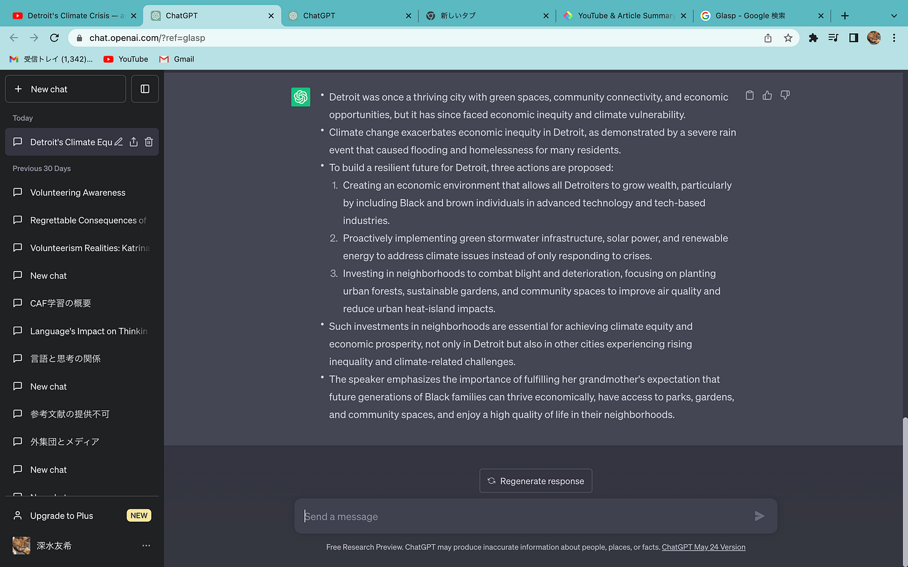
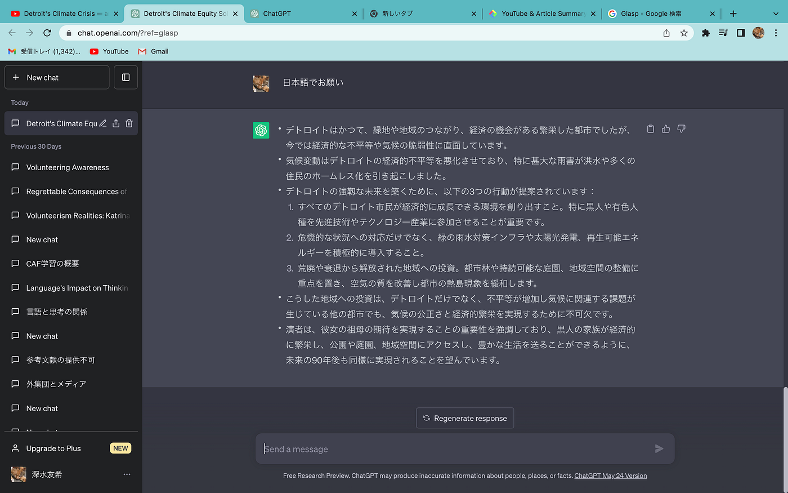
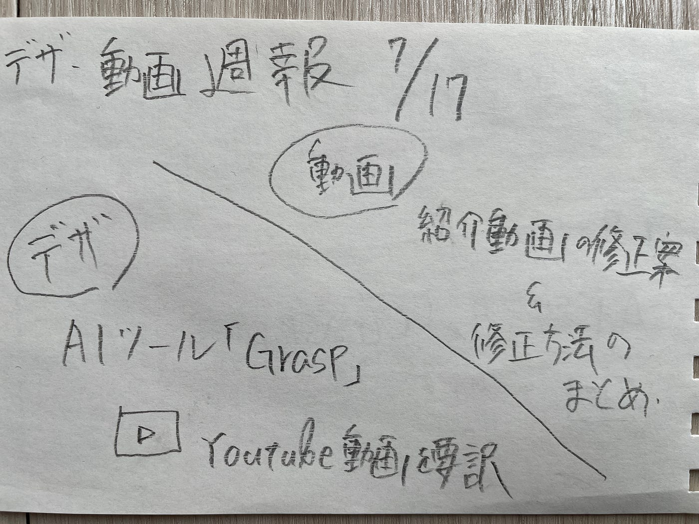

### **デザ 動画 週報**

こんにちは、3年の深水です。

デザ部と動画部の報告を行います。

｜デザイン部

デザ部では、2週連続で古橋研の活動に役立つAIを用いたツールを紹介してきました。

今回は第3弾として、[Glasp](https://glasp.co/youtube-summary)を紹介します。

Glaspは、[ChatGPT](https://chat.openai.com/)を使って[YouTube](https://www.youtube.com/)の動画を要約してくれるツールです。[GoogleChrome](https://www.google.com/chrome/)の拡張機能として無料で使うことができます。

このツールを使えば、授業の動画を見て取り組む課題を素早く終えることができます。

要約はデフォルテで英語になりますが、日本語にもしてくれます。

ぜひ使ってみてください。

｜動画部

動画部としては、ゼミ紹介動画の改善点をまとめ、どうやって編集を加えるのかを検討しました。

まず、コメントの中から実際に改善する点を、①音量、②ライセンスの明記、③写真の追加と④字幕を付けることの4つに絞りました。

①の音量については、変化のタイミングや音量の増減を調節することにしました。

②のライセンスについては、最後のシーンで研究室のロゴと一緒に表示して、概要欄にも表示することにしました。

③の写真については、なるべくゼミの活動内容が分かるものを追加しようと考えています。

④字幕については、YouTubeにアップロードしたあと、[YouTubestudio](https://studio.youtube.com/)の編集機能を用いて字幕を付けることにしました。

以上です。

｜グラレコ

