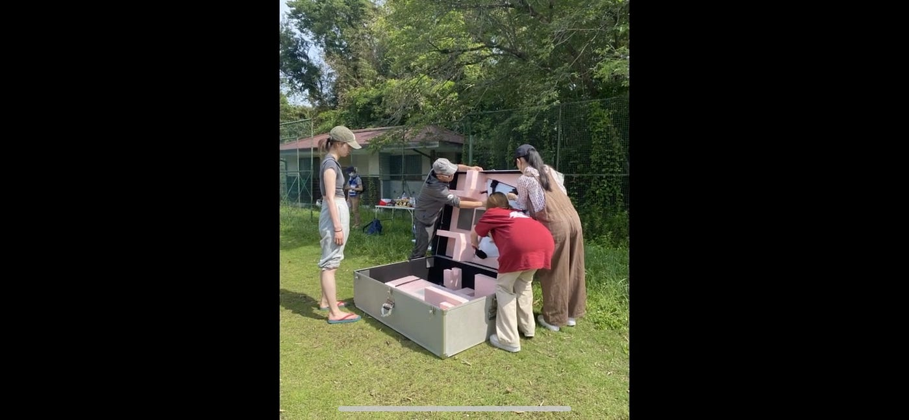
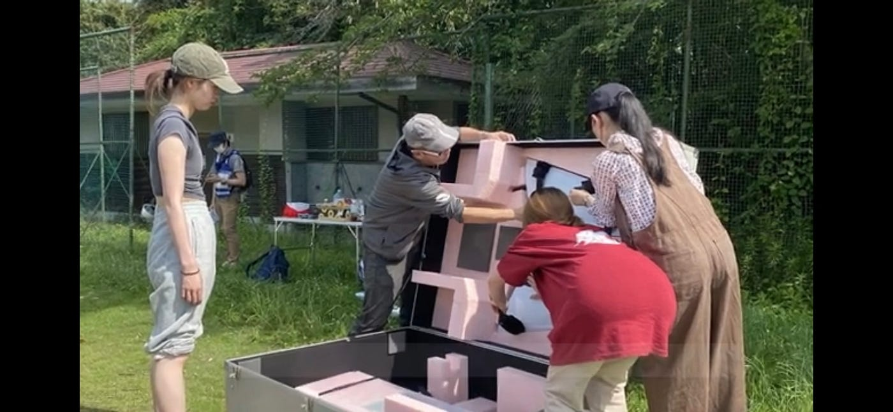
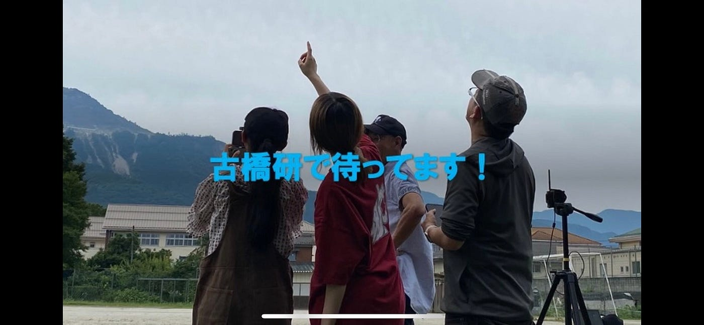
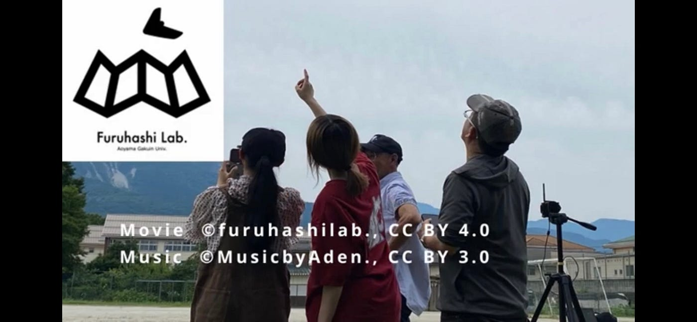
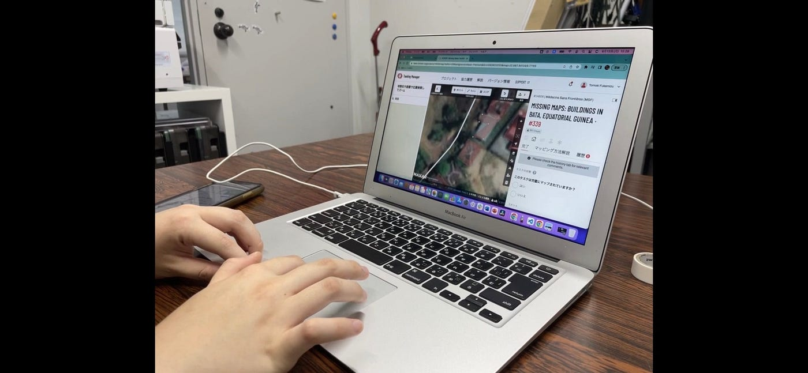
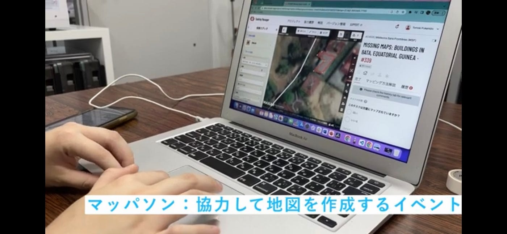
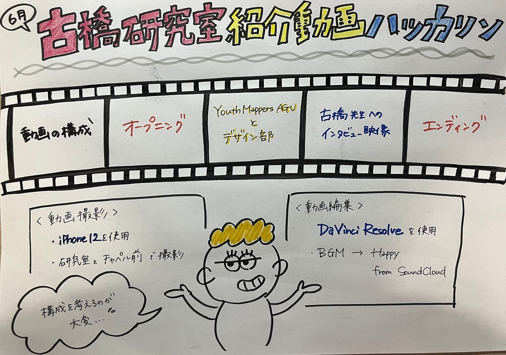

### ゼミ紹介動画

こんにちは！3年の石井です🙋‍♀️❗️

6月に行ったゼミ紹介動画制作ハッカソンの最終報告です。

> ルール

・3年生のみで作成する

・30秒〜2分程度に収める

・[DaVinci Resolve](https://www.blackmagicdesign.com/jp/products/davinciresolve/)を用いて編集する

・資料を[Github](https://github.com/furuhashilab/welcome2furuhashilab2023)に残す

> 動画撮影

撮影にはiPhone12を使用し、古橋先生や太佑さんへのインタビュー映像や、これまでの活動写真を取り込みました。

作成にあたっては、30秒〜2分という限られた時間の中で構成の逆算が難しいと感じました💦

> 動画編集

編集には[DaVinci Resolve](https://www.blackmagicdesign.com/jp/products/davinciresolve/)を使用し、BGMにはSoundCloudからHappyを選曲したため、明るい雰囲気の動画になったと思います😆

> 修正箇所

中間報告後、古橋先生と先輩方からのFBを受け、

①音量

②画面サイズ

③ライセンス表記

④字幕

の4点を修正しました。

①音量

場面が変わるときの音の変化が急すぎた点を滑らかに聞こえるよう修正しました。

②画面サイズ

動画素材、画像素材のサイズがバラバラだったため、均一に修正しました。

③ライセンス表記

使用した音楽データと古橋研オリジナル映像コンテンツのライセンス表記を動画の最後に追加しました。

④字幕

どんな会場でも伝わるよう、字幕をつけました。

> 完成動画

完成動画は[こちら](https://youtu.be/fERybO47fYM)です💁‍♀️

撮影に協力してくださった古橋先生、太佑さん、ご意見くださった先輩方、本当にありがとうございました！

[Google スライド](https://docs.google.com/presentation/d/1-_Ro1SmEgsQ0ol4WyxLM68NTCzI3ylnUd2IWvaRsR2k/edit)

グラレコ

