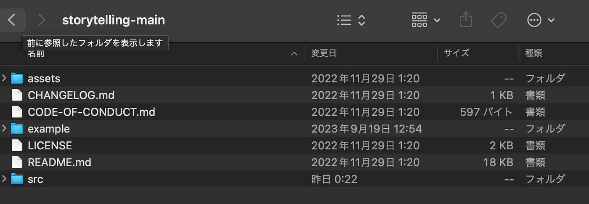
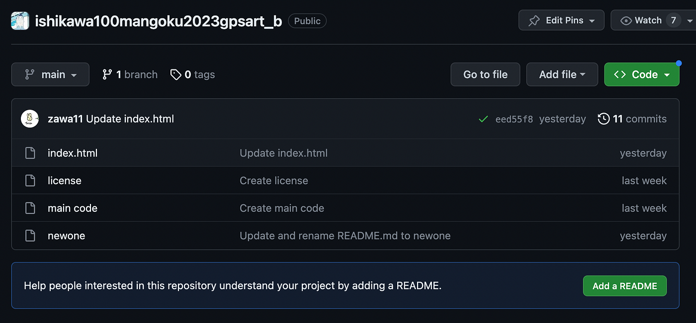
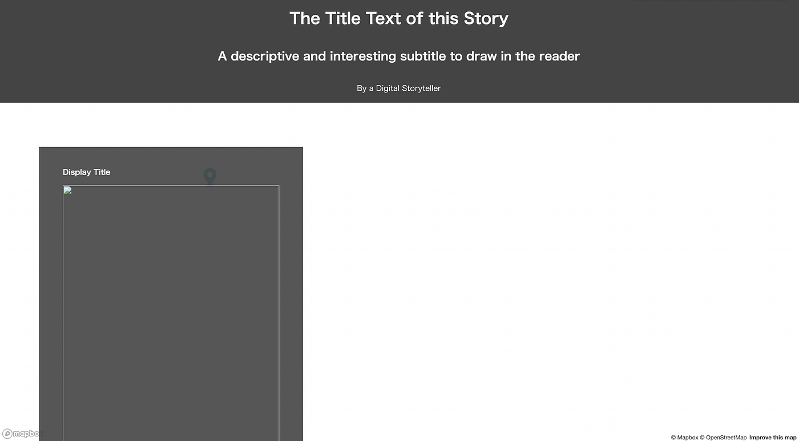
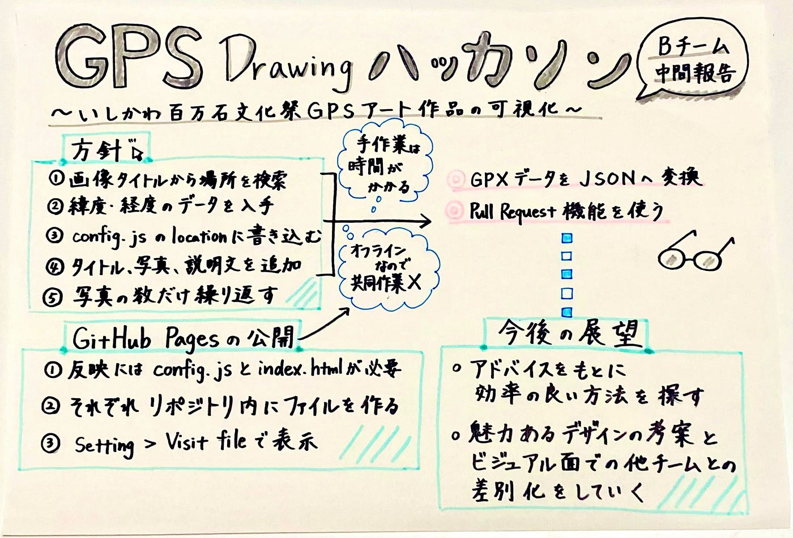

### チームB Mapboxストーリーテリング

お疲れ様です、今回はMapbox ストーリーテリングハッカソンbチームの進捗報告を行います。

現在、わたるが共有してくれた手順や、わたるに聞いたりを繰り返して、config.js のコードや、index.htmlのダウンロードは行うことができました。またそれをGitHubに移行しました。

[https://github.com/furuhashilab/ishikawa100mangoku2023gpsart_b](https://github.com/furuhashilab/ishikawa100mangoku2023gpsart_b)

また、GitHub Pagesの立て方も、前回のゼミの方法やGoogleで調べたりChat-GPTに聞いた方法だけでは分からなかったので物凄く苦戦しました。

[https://furuhashilab.github.io/ishikawa100mangoku2023gpsart_b/](https://furuhashilab.github.io/ishikawa100mangoku2023gpsart_b/)

しかし、全ての座標データを一つ一つ手入力するのはかなり手間がかかり、かつGitHub上で行うと共同作業ができないという問題が発覚し、先生に質問したところ、

①効率化：GPX→GeoJSONに変換し、②共同作業：GitHub上でPull Requestを行う

という回答を頂きましたが、現状全く理解できていないので、これから頑張ります。

> グラレコ

