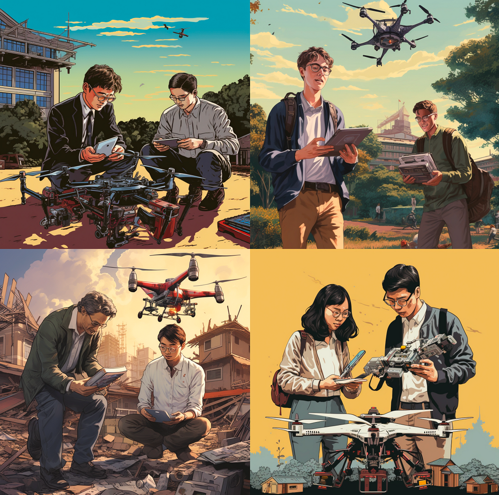
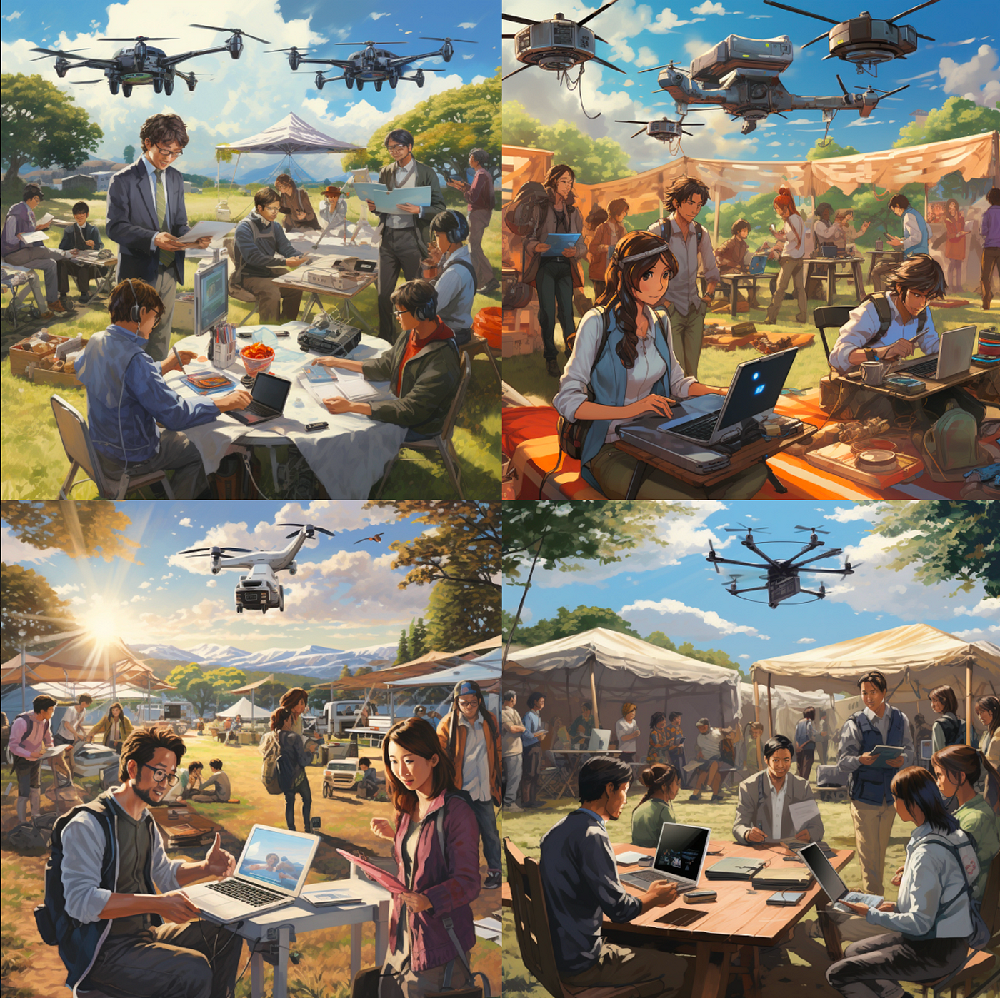
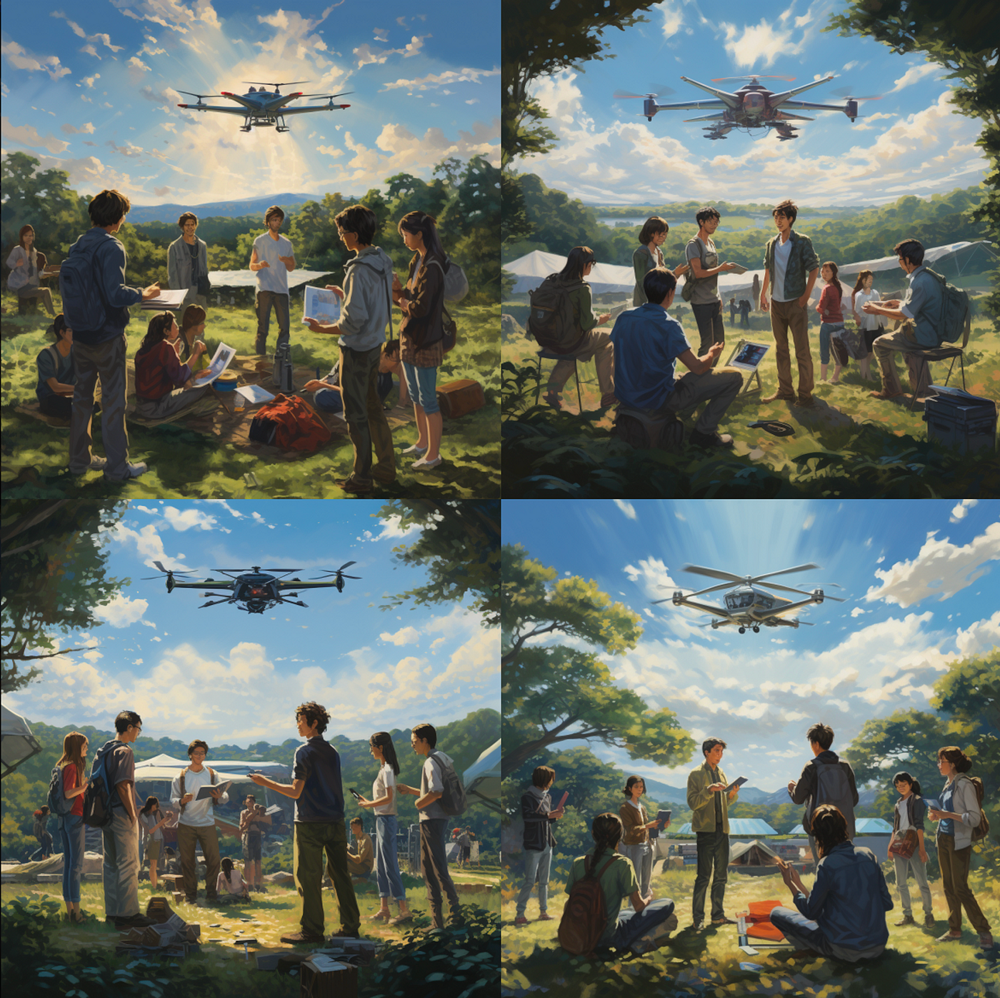
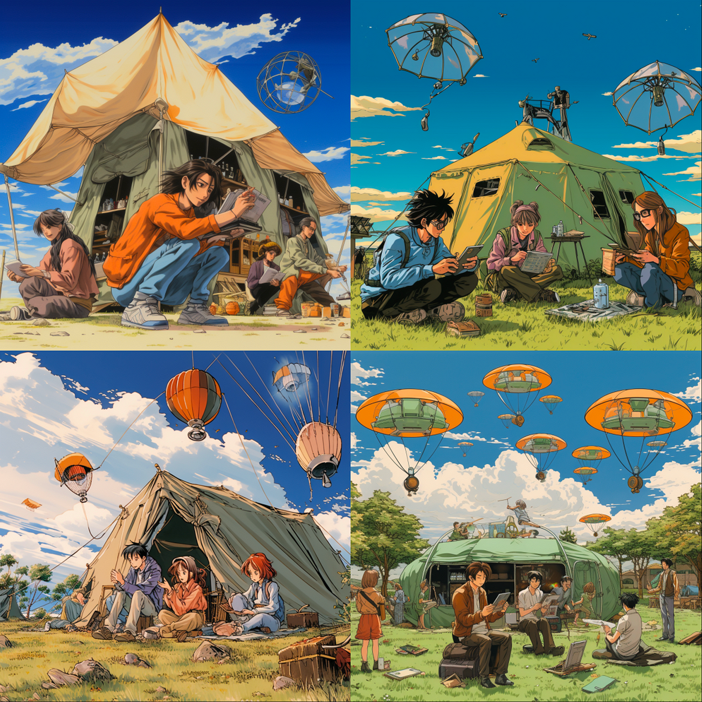

### デザイン部 週報

こんにちは、デザイン部の小澤です。
今週は、画像生成AIを中心にゼミのデザインについて活動している小澤の活動進捗を報告させて頂きます。

今回は、「ゼミ生が教授とドローンを操縦している絵」を作成しました。

An outdoor scene featuring multiple Japanese students and a professor operating drones together, with various tents in the background.” This prompt aims to be specific enough to capture all the important elements: the multiple students, the professor, the activity of operating drones, and the background setting with tents.

上記のpromptで作成した絵が、以下になります。

テントの感じと、人数規模が古橋研と違う感じがしたので、以下に変更しました。

Outdoor scene with five Japanese students and one professor collaboratively flying a drone, with a few small tents in the background.” This prompt narrows down the number of people to approximately five and specifies the size of the tents as “small,” to better align with your vision.

そこで最近、画像を作ってる中で、とてもセンスを感じるpromptを発見しました。それが、

「**90s vintage manga still,」をつけるpromptです。自分がdiscordで見つけたのは、ブロンズ少女の昭和感のある画像でしたが、他のシチュエーションでもいい感じになる気がして、作ってみました。**

**90s vintage manga still,Outdoor scene with five Japanese students and one professor collaboratively flying a drone, with a few small tents in the background.” This prompt narrows down the number of people to approximately five and specifies the size of the tents as “small,” to better align with your vision.**

思ったよりいい感じになりました。ただ、ドローンまで90年代に合わせてくるのが面白いなと思いました。笑

まだ理想とまではいかないので、引き続き作成します。

グラレコ
