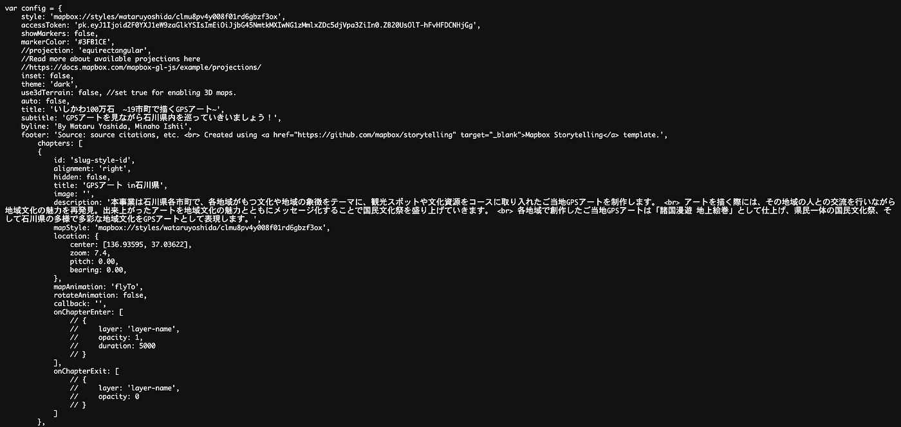
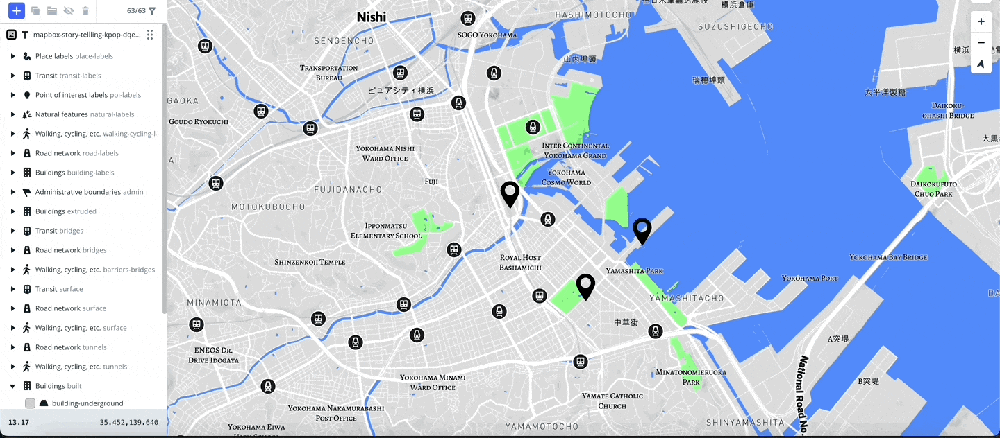
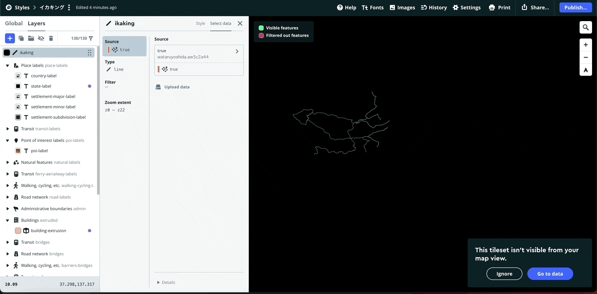
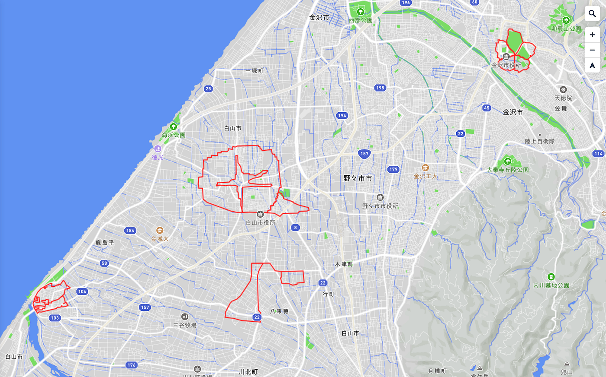
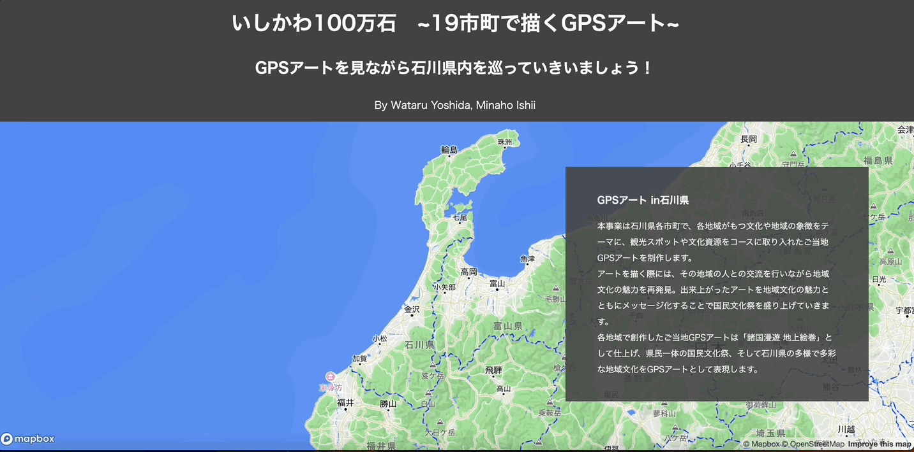
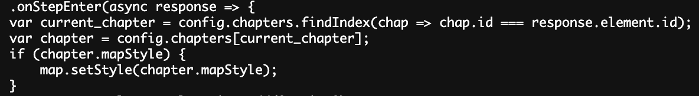
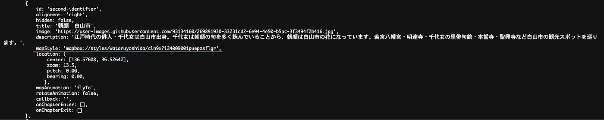
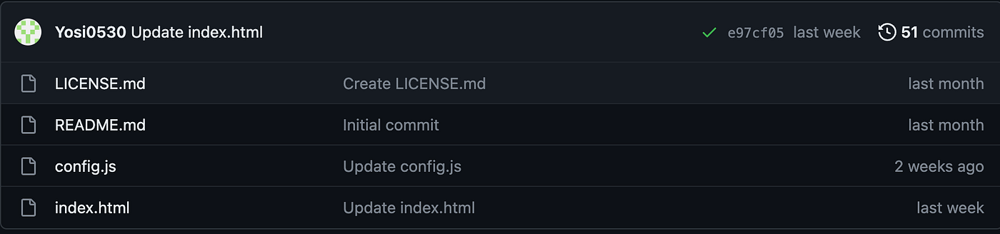
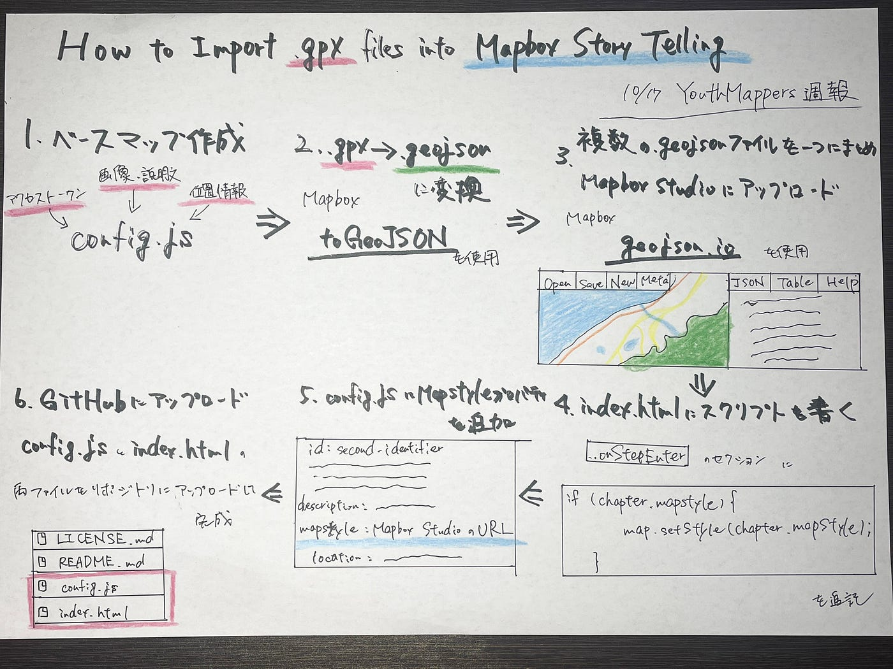

### How to use Mapbox Story Telling

#### **10/17 YouthMappersAGU週報**

こんにちは。吉田です！

9月のGPS Drawing ハッカソンで[Mapbox Story Telling](https://github.com/mapbox/storytelling)に.gpxファイルをインポートする作業に苦戦している人が多かったので、今回はその方法を紹介していきたいと思います！

私が紹介する方法は**「[Mapbox Studio](https://studio.mapbox.com/)に.geojsonファイルをインポートすることでGPSアートを表示させる**」方法です。

> _**ストーリーテリングのベースマップ作成_**

テンプレートのダウンロード方法からベースマップの作成までは**[こちら**](https://www.mapbox.jp/blog/how-to-build-a-scrollytelling-map)の記事やGitHubのMapbox storytelling **[リポジトリ**](https://github.com/mapbox/storytelling)を参考にしてください。

まずは、ダウンロードしたconfig.jsにMapboxアカウントのアクセストークンや画像、説明文、位置情報等を書き込み、GPSアートを入れるストーリーテリングマップのベースをつくります。



> _**GPSアートをストーリーテリングマップに挿入する手順_**

**.gpxファイルを.geojsonファイルへ変換**

.gpxファイルをMapbox Story Tellingにインポートするには、.geojsonファイルへの変換が必要になります。

Mapboxの**[toGeoJSON**](https://mapbox.github.io/togeojson/)や等のGeoJSON変換ツールで.gpxファイルを.geojsonファイルに変換します。

**.geojsonファイルをMapbox Studioにインポート**

1. LayersのAdd new layerからcostom layerを選び、.geojsonファイルを挿入



2. Select dataを選択しTypeを「Line」に設定し、Styleに移動して色とLineの幅等を設定する



以上の手順で.geojsonファイルをMapbox Studioにインポートできます。

#### 複数の.geojsonファイルをまとめてインポートしたい場合

多くのファイルを持っている場合、それぞれを個別にインポートするのは時間がかかります。また、Mapboxは従量課金制を導入しているため、Mapbox Studioを無料で使おうとすると月に20レイヤーしか追加できません。

そのような場合、**[geojson.io**](https://geojson.io/#map=2/0/20)を使用して複数の.geojsonファイルを一つにまとめることが可能です。


「Open」でインポートするファイルを選択し、インポートが完了したら「Save」でGeoJSONを選択しファイルをダウンロードします



3. セクションごとにマップレイヤーが変更されるように**index.html**にScriptを書き込む

Mapbox Studioで作成したマップレイヤーを、次のセクションに移行するごとに変更されるようにしたいため、index.htmlに新たにスクリプトを書き込みます。

index.htmlはダウンロードしたZipファイルの中のsrc内の”index.html”からダウンロード可能です。

もしsrc内の”index.html”からダウンロードできない場合は以下の手順でも取得可能です。

画面を右クリックして「検証」を選択し、ソースコードの最上部の<html>をクリックし左に表示された・・・をクリック。

copy→copy elementを選択したらソースコードのコピー完了です。



```xml
.onStepEnter(async response => {
    var current_chapter = config.chapters.findIndex(chap => chap.id === response.element.id);
    var chapter = config.chapters[current_chapter];
```

このスクリプトに続けて以下のスクリプトを書き込みます。

```xml
if (chapter.mapStyle) {
        map.setStyle(chapter.mapStyle);
    }
```



4. **config.js**で​​各セクションの設定にmapStyleプロパティを追加し、それぞれのセクションで使用するMapboxスタイルのURLを指定する



以上の手順で.gpxファイルをMapbox Story Tellingに表示させることができます。

> _**GitHubにアップロード_**

Mapbox Story TellingをGitHub Pagesで公開するためには、config.jsとindex.htmlの両ファイルをリポジトリにアップロードする必要があります。



SettingsからGitHub Pagesをホスティングして、リポジトリにconfig.jsとindex.htmlをアップロードできれば完成です。

吉田が作成したストーリーテリングマップは**[こちら**](https://furuhashilab.github.io/ishikawa100mangoku2023gpsart_c/)

> _**グラレコ_**


