### V&F,デザ週報

お疲れ様です。深水です。

### ｜V＆F

今回は動画生成AIを使ってみました。

今回使用したのは[kapwing](https://www.kapwing.com/ja/%E3%83%84%E3%83%BC%E3%83%AB)というツールです。

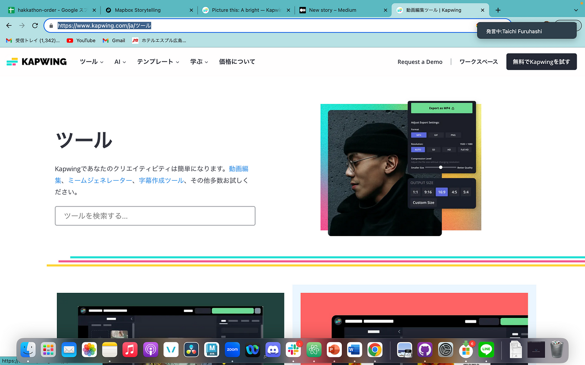

テキストからAIが動画を生成してくれるようなので

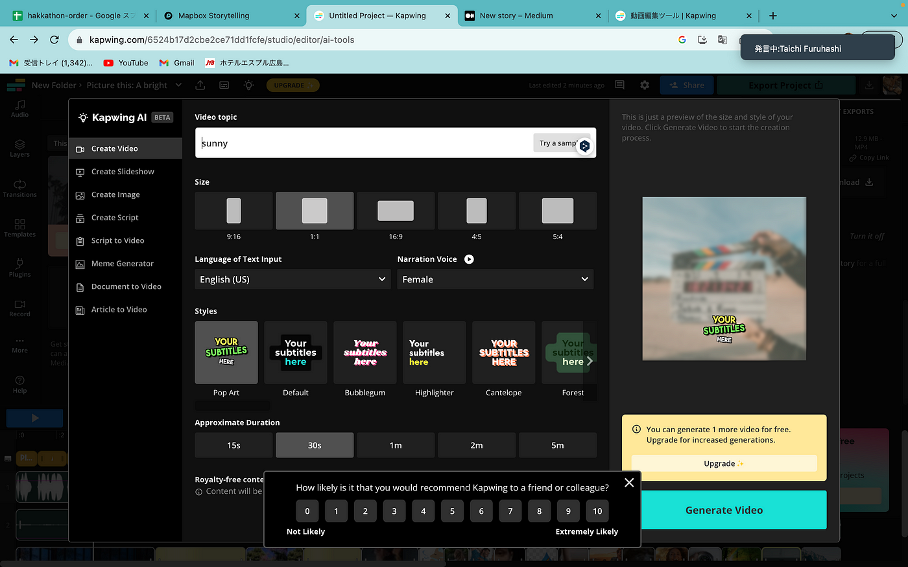

適当に単語を入力すると

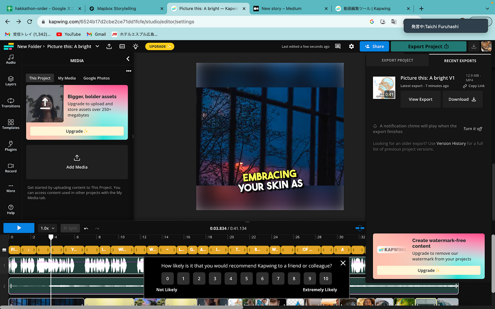

動画が生成されました。

今回生成した動画は[こちら](https://www.kapwing.com/videos/6524b17d2cbe2ce71dd1fcfe)です。

無料で使えるので、是非使ってみてください。

グラレコ

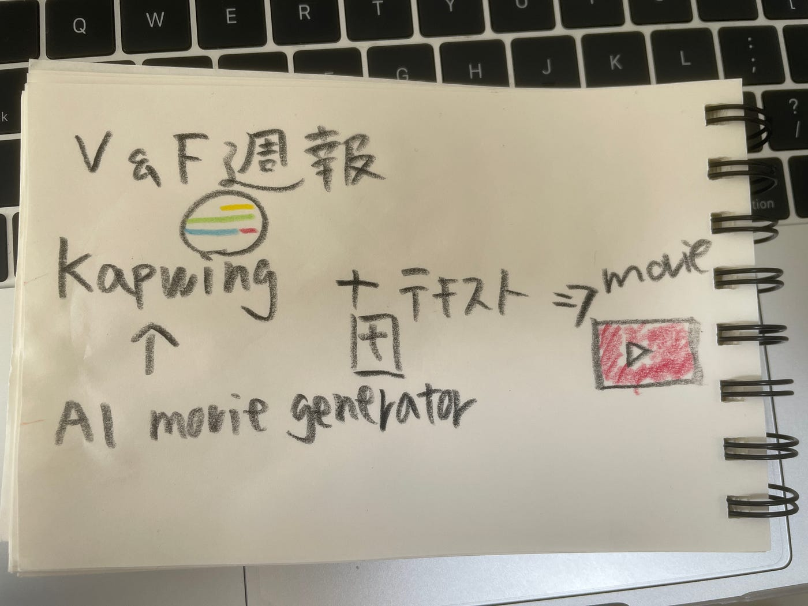

### ｜デザ部

自分のポートフォリオを改善しようと思い、チャットGPTに相談しました。

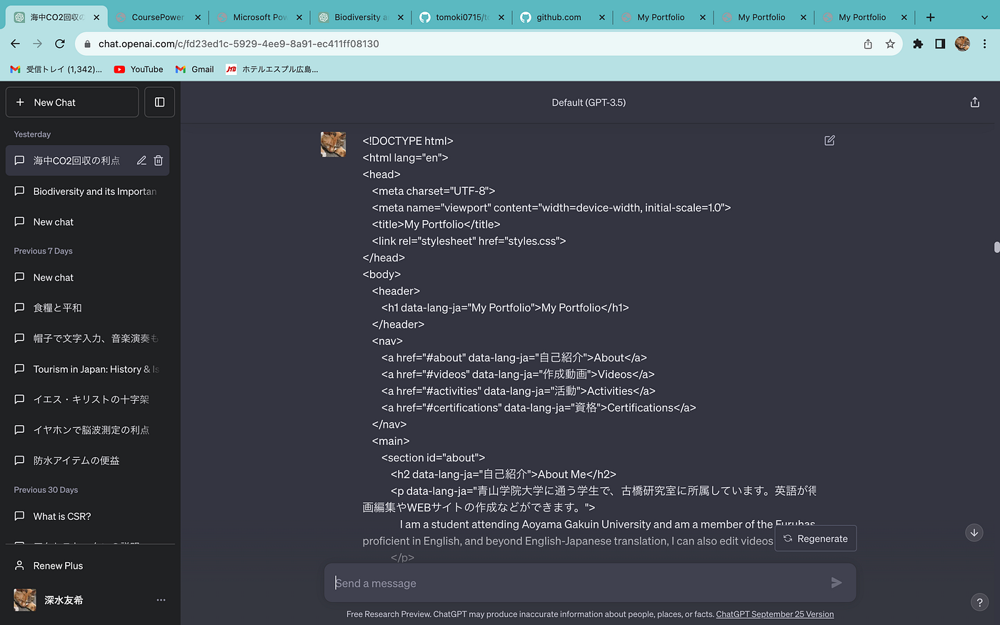

ポートフォリオのコードを送って

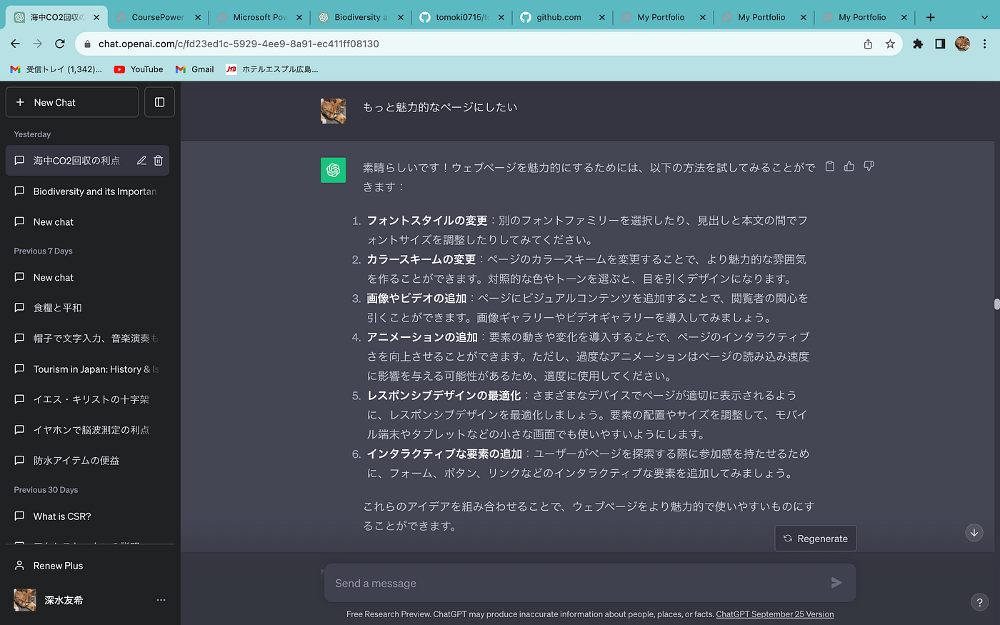

魅力的なページにしたいと相談すると、いくつか案を出してくれたので

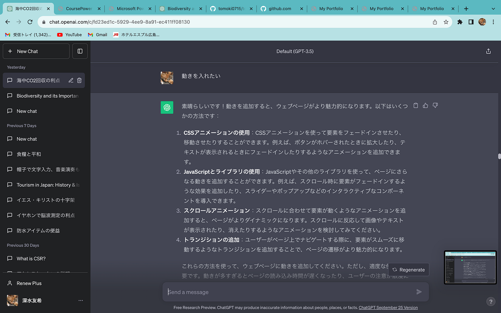

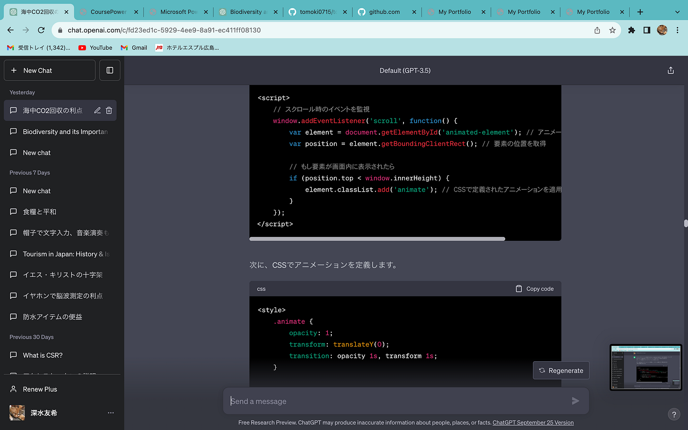

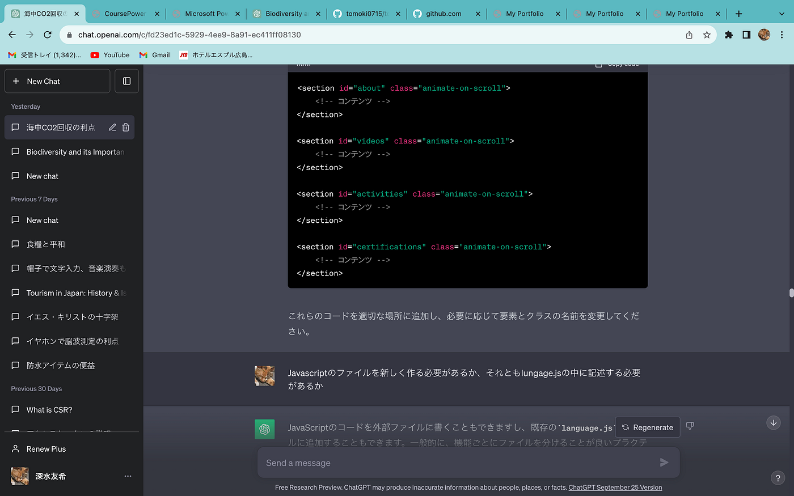

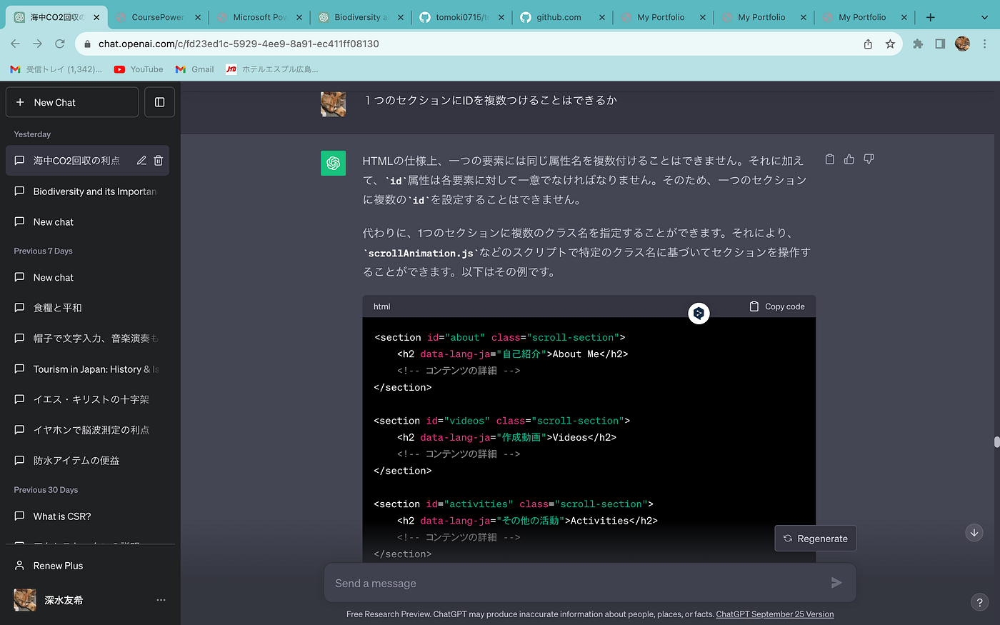

質問にも答えてくれたのですが、結局動きが出なかったので、改善案を探しているところです。

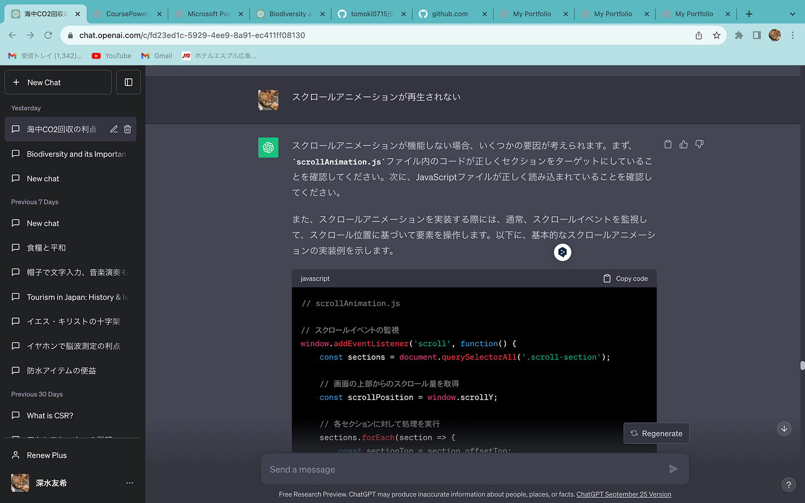

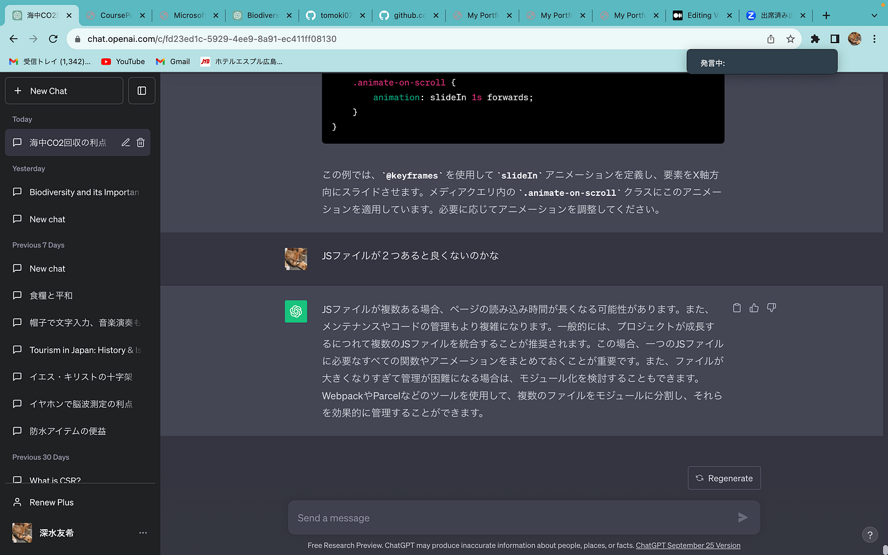

JSファイルを二つ作ってしまっているので、まずはそれを統合したいと思います。

グラレコ
