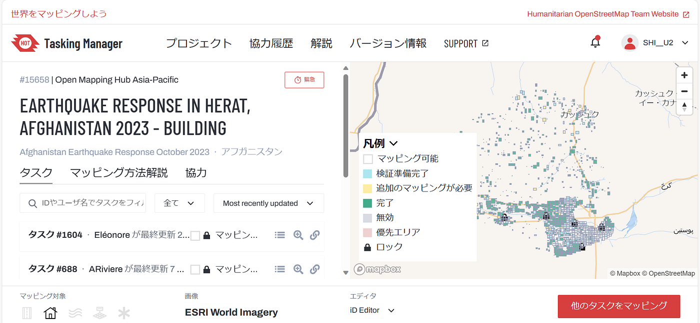
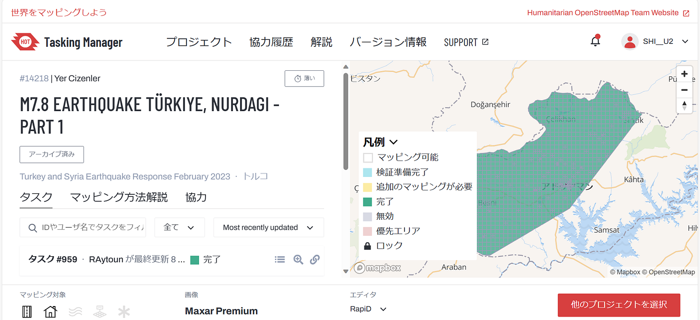
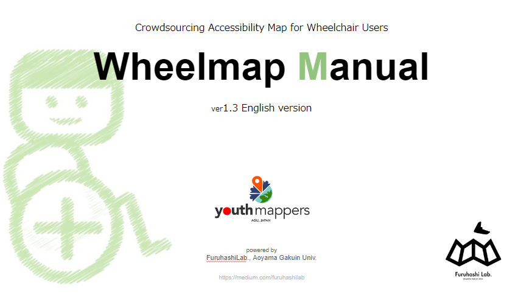
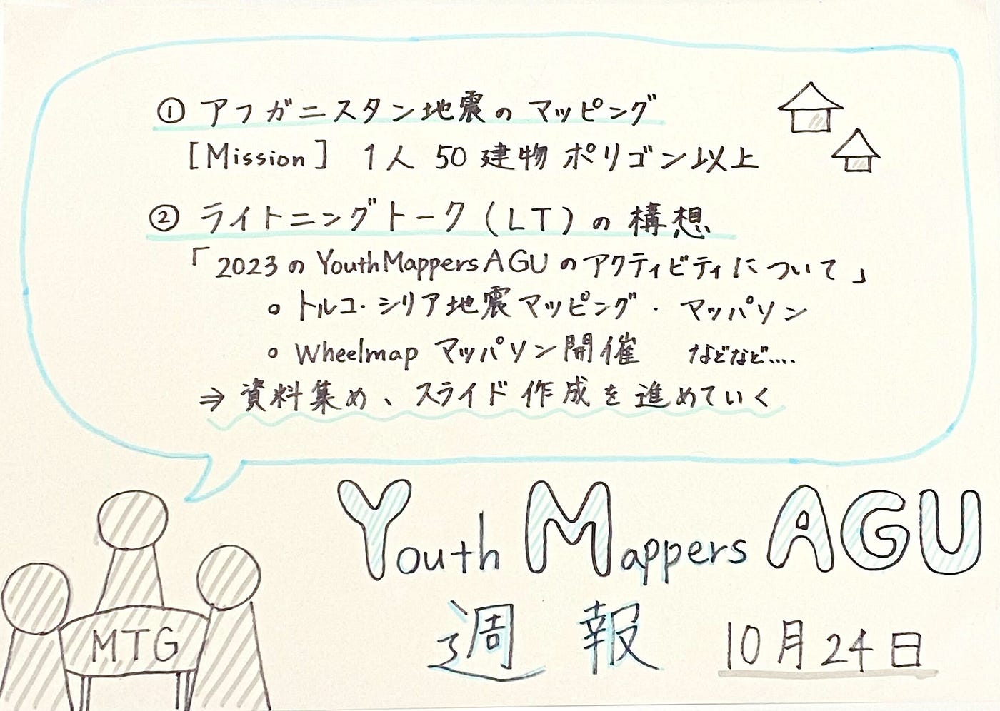

### Youth 週報 10/24

こんにちは！3年の上原です。
急に寒くなってしまったため、服装にとっても困っています。

さて、今週はアフガニスタン地震のマッピングとSotM AsiaのLTについての報告をいたします！

> アフガニスタン地震のマッピング

2023年10月7日から発生しているアフガニスタン西部ヘラート州の地震。[Hot Tasking Manager](https://tasks.hotosm.org/)でクライシスマッピングが進行中です。
古橋ゼミに課せられたMissionは**「1人50建物ポリゴン以上」**のマッピングをすることです。

[HOT Tasking Manager
Tasking Manager is a the tool for coordination of volunteers and organization of groups to map on OpenStreetMap.tasks.hotosm.org](https://tasks.hotosm.org/projects/15658)

〈感想〉
建物が複雑でマッピングのし甲斐がありました。壁に囲まれている構造の建物が多く、どこまでを建物としてカウントしてよいか迷うものもあり、難しかったです。

> SotM Asiaライトニングトーク（LT）の内容検討

2023年11月16～18日に開催が決まっている、[SotM Asia, Bangkok Thailand](https://stateofthemap.asia/#/)にて、YouthMappersAGUはライトニングトークをします！発表テーマは**「2023年度の活動について」**です。メンバーで共有している Google Drive内の活動履歴を参照しながら、Activity Reportを作っていきたいと思っています。

〈今期活動内容〉
- [トルコ・シリア地震クライシスマッピング](https://tasks.hotosm.org/projects/14218/tasks?search=1801&page=1)活動/ マッパソン開催
- 企業の方へ向けた[Wheelmap](https://wheelmap.org/search)のマッパソン開催
-[ 6th Annual Humanitarian Mapathon](https://docs.google.com/presentation/d/1KnCsG6wBPZHYwSleRipqzxJnTF_M1n1MV0Nul7AO6q4/edit#slide=id.p)への参加(赤道ギニアのマッピング) 麗澤大学・UCLA・USC・FAU大学との合同マッパソン
- [いしかわ百万石文化祭ハッカソン](https://github.com/furuhashilab/README/issues/35#issuecomment-1700663238)での[Mapbox Storytelling](https://www.mapbox.com/solutions/interactive-storytelling)作成 等

参考までに、去年のSotM Asiaで使ったスライドは[こちら](https://docs.google.com/presentation/d/16pyEKBD6LvJTJcD2aKFmIiZHabsSxzU-KKFKDpYr0VA/edit?usp=sharing)です。

今後は、資料集めやスライド作成など、引き続き発表に向けた準備を進めていきます。

> グラレコ

