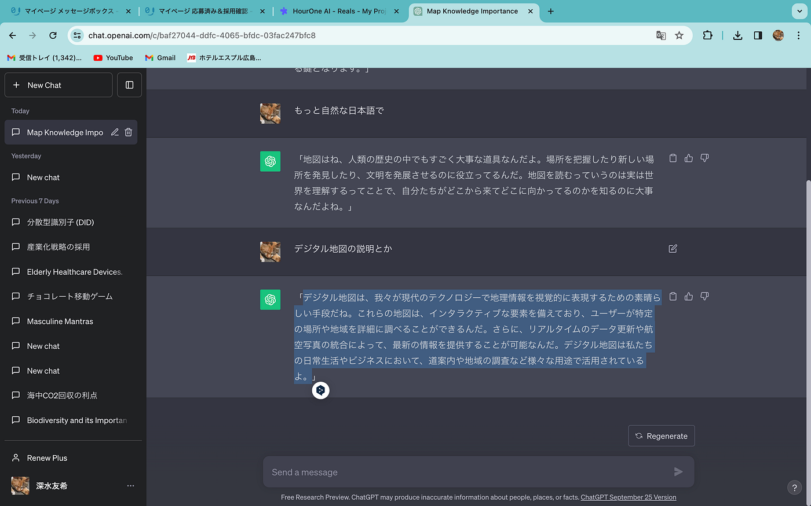

### **V＆F週報**

こんにちは。深水です。

先日紹介したAI動画ジェネレーターの[Kappwing](https://www.kapwing.com/user/6524b17bfe22600fc6e87fb1)について書きたかったのですが、二つ目の動画からは課金が必要とのことで断念しました。

今回は、画像を動画に変換するツール（[Cutout](https://www.cutout.pro/ja/photo-animer-gif-emoji/upload)）を使ってみました。

画像は古橋先生の写真を使わせていただきました。

この画像をしゃべっている風に動かせば、オンライン授業などに使えそうだと思ったので、[chatGPT](https://chat.openai.com/)が生成した文を[AI](https://elevenlabs.io/)に読ませて、[Canva](https://www.canva.com/)で編集してみました。

出来上がったものがこちらです。

先生が専門的なことを説明している動画を作ってみてもいいかなと思いました。

グラレコ
