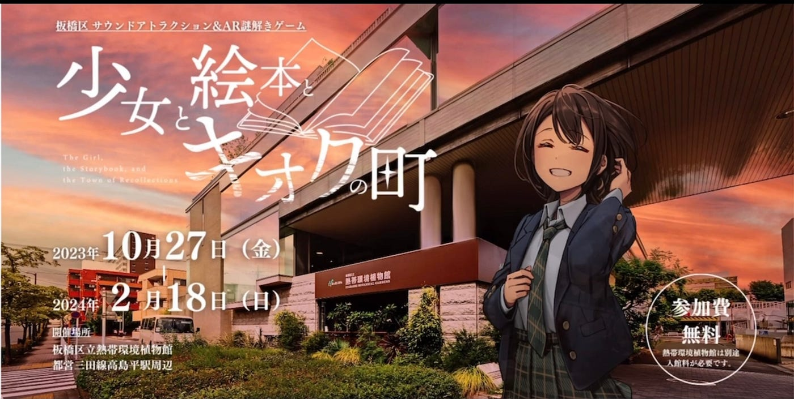
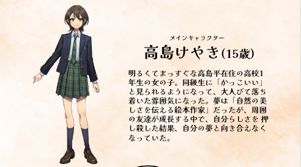
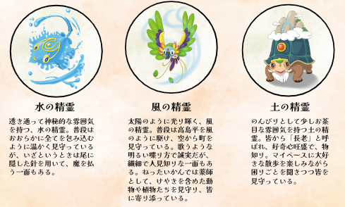
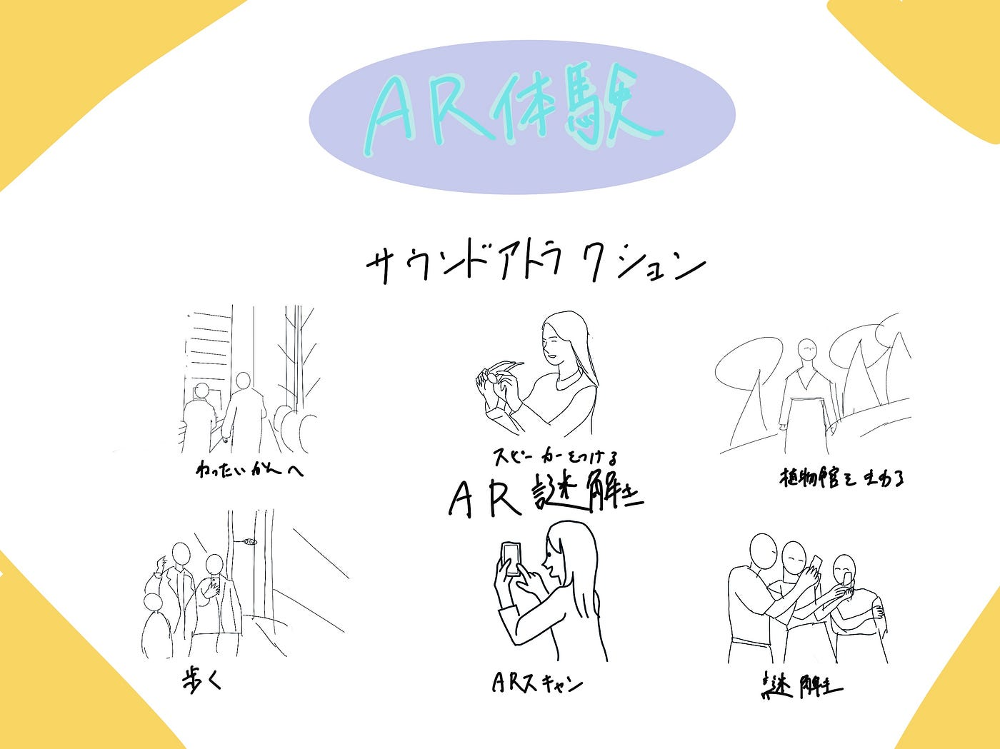

### 宣伝です！

こんにちは、４年植松です。

現在インターン先の企業で企画、開発したAR体験イベントが10/27日(金)からリリースされますので宣伝です。

↓ イベント特設ページ

[板橋区 サウンドアトラクション＆AR謎解きゲーム
スマートシティプロジェクトの一環として、板橋区高島平エリアで2つのXR体験イベントを開催します！ar-itabashi.jp](https://ar-itabashi.jp/)

熱帯環境植物館を巡る音響体験と高島平駅周辺を巡る謎解き体験の2つのイベントをご用意しており、どちらか1つだけでも体験できます！

簡単に内容をご説明すると

**サウンドアトラクション**

熱帯環境植物館にいる生き物をモチーフにしたキャラクターの音声を聞きながら、 音声AR(音声拡張現実)体験ができる参加型ボイスストーリーです。スピーカー内蔵のメガネ型デバイスを着用して館内周を巡ると、特定のポイ ントでキャラクター音声が流れてAR体験ができます。館内にいる淡水エイ・インコ・リクガ メがそれぞれオリジナルキャラクター (精霊)になって登場します。

**AR謎解き**

高島平の町を探索しながら、ダウンロード したアプリを使い、スマートフォン内に表示されるAR(拡張現実)をヒントに様々な謎を解き、ゴールをめざすゲームです。高島平駅から スタートし、自分のスマートフォンを使って、 街中の様々なスポットを巡りながら謎解きします。

植物園にて開催される音響エンターテイメントは日本初です。またメインキャラクターのデザインには、ラブライブ!の公式イラストレーター火照ちげ氏を起用し、幅広い世代のデジタル化推進と板橋区高島平地域の活性化を目指します。

ぜひご来場ください

グラレコ

