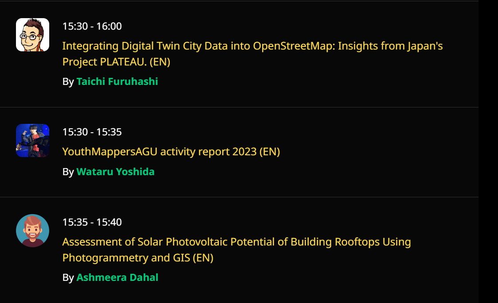
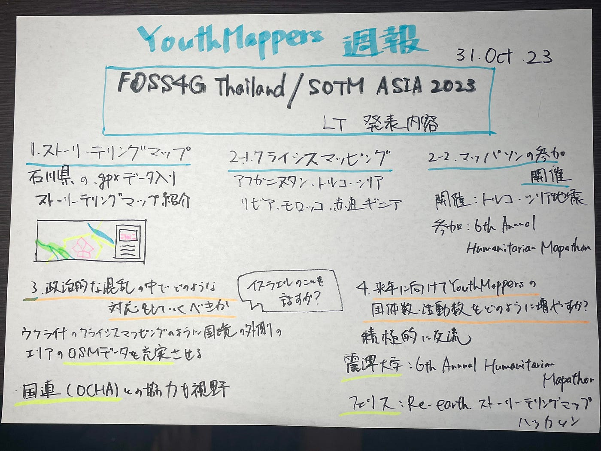

### Youth週報 10/31

こんにちは。

4年の吉田です。

先週末ITパスポートの試験を終え、解放された気分です。

今回は、[前回の週報](https://medium.com/furuhashilab/youth-週報-10-24-3d6638d5a3b1)でもあった[FOSS4G Thailand 2023/SOTM Asia 2023](https://2023.foss4g.in.th/)で発表するLTの内容を、先生のフィードバックを基に再整理していきます。

ちなみにYouthMappersAGUの発表日時は11月17日15:30~15:35 in TrackBでした。

> _**内容_**

1. **ストーリーテリングマップの紹介**

石川県で作成された.gpxデータをストーリーテリングマップ上で可視化した。

**2–1. クライシスマッピング活動**

アフガニスタン、トルコ・シリア地震、リビア洪水、モロッコ地震におけるクライシスマッピング活動

トルコ・シリア地震における、[マッパソン](https://medium.com/furuhashilab/youthmappers-agu-japan-held-mapathon-in-support-of-turkey-and-syria-b141649a4269)の開催

**[2-2. 6th Annual Humanitarian Mapathon](https://docs.google.com/presentation/d/1KnCsG6wBPZHYwSleRipqzxJnTF_M1n1MV0Nul7AO6q4/edit#slide=id.p)への参加(赤道ギニアのマッピング)**

**with 麗澤大学・UCLA・USC・FAU大学**

[6th Annual Humanitarian Mapathon
UCLA, USC, Reitaku University, FAU, and MaptimeLA join forces to host the 6th Annual Humanitarian Mapathon.mapathon.la](https://mapathon.la/en/)

4月19日（水）、20日（木）、21日（金）の3日間、麗澤大学・UCLA・USC・FAU大学と青山学院大学の5校で赤道ギニアのマッピングを行った。

この3日間で消化しきれなかった地域はYouthMappersAGUを中心に、青山学院大学の学生と一緒にマッピングして無事に全地域のマッピングを終えることができた。

**3. 政治的な混乱の中でYouthMappersはどのような対応をしていくべきか**

ウクライナにおけるクライシスマッピング(難民の避難・救助のためにウクライナの周辺国をマッピング)のように、国境の外側のエリアのOSMのデータを充実させる

[イスラエルのことを話すか？？(ラファ検問所～エジプト)の難民の移動を予測し備え、エジプト北部のマッピングを行う。]

・国連(OCHA)との協力も視野

OCHA：現時点で、イスラエルでは物資の輸送等にマッピングしたデータが使われている

[occupied Palestinian territory-Israel Hostilities
FTS publishes data on humanitarian funding flows as reported by donors and recipient organizations. It presents all…data.humdata.org](https://data.humdata.org/event/opt-israel-hostilities)

**4. 来年に向けて日本のYouthMappersの団体数、活動数をどのように増やしていくか**

最近設立した麗澤大学のYouthMappers等と積極的に交流(マッパソン等)し、活動数を増やしていく

麗澤大学：**[6th Annual Humanitarian Mapathon**](https://docs.google.com/presentation/d/1KnCsG6wBPZHYwSleRipqzxJnTF_M1n1MV0Nul7AO6q4/edit#slide=id.p)

フェリス女学院大学：Re:earthストーリーテリングマップハッカソン

> _**グラレコ_**

